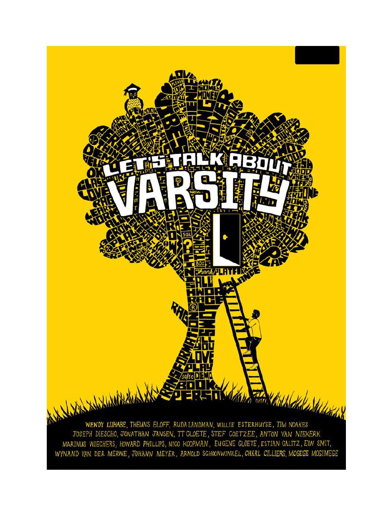

{.book-cover fig-alt="Let's Talk About Varsity cover – a tree made of words on a yellow background"}

Welcome to the free online edition of *Let's Talk About Varsity*. First published in 2009
by Gabbema Books, it is a practical, generous guide for anyone thinking about going to
university in South Africa – and for anyone already there who wants to make the most of it.

The book brings together some of the country's most experienced academics, deans and public
figures. Each writes plainly about their own field or their own hard-won advice, across four
themes: **getting started**, **making the right choice** of degree, **making the most of
university**, and **making your world a better place**. I edited the volume with Willem
Fourie; the chapters belong to the contributors who wrote them.

More than fifteen years on, the prospectuses have changed but the questions have not: *Why
university? What should I study? How do I cope, budget and lead? And what is it all for?* I
am making the book free to read here because those questions still matter, and because good
advice should not go out of print.

::: {style="margin:1.5rem 0;"}
[Download the original 2009 edition (PDF)](lets-talk-about-varsity.pdf){.download-btn}
:::

## How to read this book

- Use the **sidebar** to move between the four parts and their chapters, or the **search**
  box (top of the sidebar) to find any topic, field of study or name.
- Each chapter is a self-contained essay by its contributor; read in any order you like.
- Prefer paper? **Download the full original edition** as a PDF using the button above.
- Toggle **reader mode** (top-right) for a distraction-free view.

## How to cite this edition

> Fourie, Johan and Willem Fourie (eds). *Let's Talk About Varsity*. Gabbema Books, 2009.
> Free online edition, johanfourie.com/LTAV. Accessed [date].

::: {.licence-notice}
**About this edition.** *Let's Talk About Varsity* was first published in 2009 by Gabbema
Books. This online edition reproduces the book's content chapters and is free to read and
download. © Johan Fourie and the individual contributors; each chapter remains the work of
its named author. The original interview features ("Seven questions to …") are not included
in this online edition.
:::
