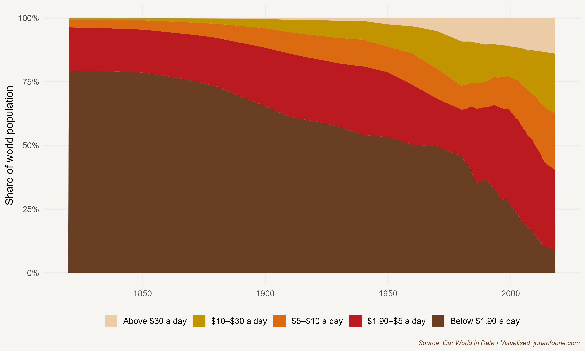

When Marvel Studios released its superhero film Black Panther in 2018, kids across the continent of Africa began to salute one another Wakanda-style. They crossed their arms (in a gesture like the pharaohs of ancient Egypt, who were laid to rest with their arms on their chests) and would end the greeting with the words 'Wakanda forever'.

Wakanda, of course, is a fictional country. It was created, so the story goes, when a massive meteorite made up of an equally fictional metal, vibranium, crashed into a location somewhere in East Africa. Understanding the value of vibranium, the leaders of Wakanda concealed this rare and valuable energy-giving resource. Many of the best scholars of Wakanda were sent to study abroad and, on their return, their work turned Wakanda into one of the world's most technologically advanced countries. Although Wakanda appears from the outside to be a poor developing country, it is actually prosperous beyond belief.

We want to believe the story of Wakanda because it is so different from the reality of many African countries. All ten of the poorest countries on earth are in sub-Saharan Africa. According to the World Bank, sub-Saharan Africa has an average annual income of one-seventh of the world average.

This book is about understanding why this is so. We want to know why because we want to see things improve. We want to see all Africans thrive, much like the Wakandans in their technologically advanced city. We want to understand what the roots of Africa's prosperity will be, and what policies could help to achieve that.

How will we do that? In our search for answers, we turn to the study of global economic history. The logic is simple: we can learn from other places and from other times to help us understand why Africa has lagged behind these regions -- and what can be done to accelerate Africa's fortunes.

Economic history is, as the name suggests, a combination of economics and history.[^8] Economics is not just about money or wealth: it is about how humans behave and interact with one another. Much as natural scientists develop theories about how the natural environment works, and medical scientists about how the human body works, so economists construct theories about how society works. History is our laboratory. History provides the raw data that allows us to test our theories; it is the evidence upon which our theories are accepted and survive or are refuted.

But humans are complicated beings. We do not all behave in the same way. We have different preferences, beliefs and biases. That is why, unlike natural or medical scientists, we cannot always find answers that are easily replicable. It is also why we need to continually test our theories in different settings and time periods. Our 'cures' for society are contingent on time and place, and so the same problem won't always have the same solution. It is the job of the economic historian to understand what solutions worked in the past, and why.

The good news is that many economic historians are now beginning to study African economic history to find ways to solve the continent's challenges. The rest of this book will review some of this exciting new work, but first it is important to understand where research in African economic history started. The present renaissance in African economic history builds on previous generations of scholars, each of whom developed their own theories to explain Africa's fluctuating fortunes. Anthony Hopkins, one of the leading scholars of African economic history, has identified six schools of thought that characterise the field since its establishment in the 1950s.[^9] Let us briefly review how each of these schools understood African development.

African economic history only became a serious field of study after most African countries had gained independence from colonial rule. The first school of thought, modernisation theory, assumed a sharp distinction between 'traditional' and 'modern' societies.[^10] Adherents of this approach proposed that if 'successful' policies that had been implemented in the West were simply transferred to or replicated in the newly independent African societies, they would inevitably lead to development and prosperity. However, the actual transfer of policies took place without considering the history and politics particular to each region. When, by the early 1970s, many African economies had not transformed sufficiently or, in some cases, had stagnated, modernisation theory was found wanting.

The dependency school replaced modernisation theory. The two stand in diametric opposition to each other. The new school maintained that the solutions to Africa's underdevelopment were not to be found in the West -- indeed, the West was to blame for Africa's condition. The arguments in Walter Rodney's seminal book *How Europe Underdeveloped Africa* were attractive to many African scholars.[^11] Since it suggested that foreign capitalism had created underdevelopment, the policy response was to sever ties with the West. The dependency school allowed African governments to craft their own solutions without learning from other places in the world. Yet despite their contrasting views, dependency theory ultimately fell into the same trap as modernisation theory. Hopkins remarks that 'the emphasis on external influences obliged adherents to adopt the position that indigenous societies had only a limited ability to shape their own history'.[^12] In other words, because Africa's malaise was entirely the fault of the West, it suggested that Africans were not (or, worse, could not be) the agents of their own destiny.

Marxism, the third school, rightly shifted the focus to Africans and their own modes of production. Marxist historians, by the 1970s, were ploughing their way through African archives in search of evidence that would show the pre-colonial roots of class conflict. They then tried to fit the evidence into a preconceived Marxist framework. They soon ran into difficulties, though, as the complexity of African societies that they were uncovering in the archives was soon at odds with their preconceived ideas. African history simply did not square well with the class structure that Marxism required.

The good thing about the Marxist school was that it shifted the attention to those on the margin of society or, put differently, to a history from below -- a history of ordinary people. By the 1980s the *Annales* school, associated with the style of an earlier generation of French historians, attracted interest too. Their approach was to focus on long-term social history that included groups usually excluded from conventional history, such as women and children. It also incorporated unconventional topics such as demography, climate and disease. Yet, even though the *Annalistes* wrote about the oppressed, they did not necessarily write for them; whereas Rodney's book was a call to political action, the *Annalistes* were more 'concerned to understand the world rather than change it'.[^13]

This lack of political ambition meant that the *Annalistes* were soon displaced by the postmodernists, the fifth school. But the focus with postmodernism was different: instead of material reality, attention turned to cultural history. As Hopkins explains: 'Unlike its predecessors, postmodernism made no contribution to economic history. Its focus on textual images, its scepticism about the concept of reality, and its limited interest in causality provided methodological grounds for avoiding some of the central preoccupations of historical enquiry.'[^14]

By the early 2000s, then, with African economies on the rise, there was a renewed interest in understanding Africa's fluctuating fortunes. Two interwoven branches emerged within the quantitative school, both of which we will encounter in this book. Since its inception the descriptive approach has been interested in using quantitative sources -- trade statistics, tax records, military attestation forms -- to provide new empirical facts about Africa's economic past. On the other hand, the cliometricians, led by economists using new statistical tools, are most interested in understanding the persistent impact of historical events on contemporary outcomes.[^15] Both groups are responsible for a revival in the study of African economic history.[^16]

One concern, and one additional reason for writing this book, is that much of this renaissance has been the work of scholars based outside Africa.[^17] While their initiative is commendable, the risk is that the lessons learned from this new wave of scholarship are not internalised on the continent, either in research or in policy.

What are these lessons? There are many, and this book hopes to cover most of them. One of the first lessons from studying economic history is that the answers we look for depend very much on the questions we ask. Just as citizens in sub-Saharan Africa are, on average, poorer than those in the rest of the world, there are also significant income differences within Africa. Even within cities and towns, neighbourhoods and families, we find large differences in income. The most popular question is to ask why it is that people are poor. That is a good question for certain situations, but, as I hope to persuade you in this book, perhaps it is not the most historically appropriate question. Only five hundred years ago, around 1500, the world was very different. Almost everyone was what we would today consider to be impoverished. Even the emperors of China or the caesars of Rome or the pharaohs of ancient Egypt generally lived short, unhealthy lives. The ones we remember were the exceptions.

Throughout history, humans have always been poor. Poverty is the historical norm. Put differently, wealth and high living standards are historical outliers. It is incredibly difficult to create and sustain a prosperous society. If you build a house but then neglect to maintain it, it will become dilapidated within a few years and, ultimately, crumble and collapse; entropy, a gradual move towards chaos, is the natural order of things.

So, it is instead more historically accurate to ask: why is it that people are rich? And what are the causes of prosperity, economic growth, and high living standards? When we switch the question in this way, our focus turns to the mechanisms of economic development. Once we understand the mechanisms, we can ask how we can use them to power African development.

{.book-figure fig-alt="Share of the world population living between different poverty thresholds, 1820--2018"}

::: {.figure-caption}
Figure 1.1 Share of the world population living between different poverty thresholds, 1820--2018
:::

The world has seen significant increases in living standards over the last two hundred years. We have already discussed the massive improvements in our prosperity, health and well-being. Another way to summarise this, as Figure 1.1 illustrates, is to show the remarkable decline in absolute levels of extreme poverty, especially in the last three decades.[^18] Because it is so deceptively simple, look carefully at this graph. The share of people living below the extreme poverty line (\$1.90 per day) has fallen from 44 per cent in 1980 to less than 10 per cent in 2018. That may seem like just another statistic. But think of it this way: a newspaper editor could have printed the following headline every day between 1990 and 2020, and it would have been true: 'The number of people in extreme poverty fell by 128,000 since yesterday.' It is a fact so outrageous that it is almost impossible to believe.[^19]

And yet, we never see this headline in newspapers. That is because good news tends to occur over years, while bad news tends to occur suddenly. As humans, we have evolved to be risk-averse, which means we are attracted to bad news that might threaten our survival. This book wants to restore balance.[^20] It wants us to pay attention to the good news too and learn from it by asking: how have we grown so remarkably affluent? How can we sustain this incredible newspaper headline into the future?

Figure 1.1 helps us to dream about a world -- and a continent -- where poverty is a thing of the past. If we learn from history, that world is indeed possible. But, as the Nobel-winning economist Robert Shiller reminds us, it depends on the stories we tell ourselves and the next generation.[^21] The real architect of Wakanda, the production designer Hannah Beachler, remarked in an interview with the magazine FastCompany: 'World history is essential to produce an authentic story.'[^22]

I hope the next generation of African economic historians will tell authentic stories of our continent's remarkable history -- stories in service of our quest for a prosperous future.

[^8]: The next two paragraphs are loosely based on Anton Howes's introductory lecture at King's College London. Howes writes a fantastic newsletter on innovation during the Industrial Revolution, which you can subscribe to on his website: antonhowes.com.
[^9]: Hopkins, A. G. \"Fifty years of African economic history.\" Economic History of Developing Regions 34, no. 1 (2019): 1-15.
[^10]: Lewis, W. Arthur. \"A review of economic development.\" The American Economic Review 55, no. 1/2 (1965): 1-16.
[^11]: W. Rodney, How Europe Underdeveloped Africa (Dar es Salaam: Tanzania Publishing House, 1972).
[^12]: Hopkins, Fifty years, 6.
[^13]: Ibid., 8.
[^14]: Ibid.
[^15]: Fourie, Johan. \"The data revolution in African economic history.\" Journal of Interdisciplinary History 47, no. 2 (2016): 193-212.
[^16]: Johan Fourie and Nonso Obikili, Decolonizing with data: The cliometric turn in African economic history, in Handbook of Cliometrics, edited by Claude Diebolt and Michael Haupert (Heidelberg: Springer Reference, 2019), 1--25.
[^17]: Fourie, Johan. \"Who writes African economic history?.\" Economic History of Developing Regions 34, no. 2 (2019): 111-131.
[^18]: Moatsos, M. (2021), \"Global extreme poverty: Present and past since 1820\", in How Was Life? Volume II: New Perspectives on Well-being and Global Inequality since 1820, OECD Publishing, Paris, https://doi.org/10.1787/e20f2f1a-en.
[^19]: This does not mean, of course, that poverty is history; \$1.90 is still a very low level of income. To get a fuller extent of the income distribution, consider that half of all humans (in 2017) lived on less than \$6.70 per day; 85 per cent of the global population earn less than \$30 per day. I would venture to guess that most readers of this book are in the top 4 per cent of global income earners, earning more than \$70 per day.
[^20]: I am, of course, not the first to do so. See also Johan Norberg's Progress (London: Oneworld Publications, 2016); Steven Pinker's Enlightenment Now (New York: Viking, 2018); and Hans Rosling's Factfulness (New York: Flatiron Books, 2018).
[^21]: Shiller, Robert J. Narrative economics: How stories go viral and drive major economic events. Princeton University Press, 2020.
[^22]: M. Wilson, Meet the designer who created Black Panther's Wakanda (2018), www.fastcompany.com/90161418/meet-the-designer-who-created-black-panthers-wakanda.
