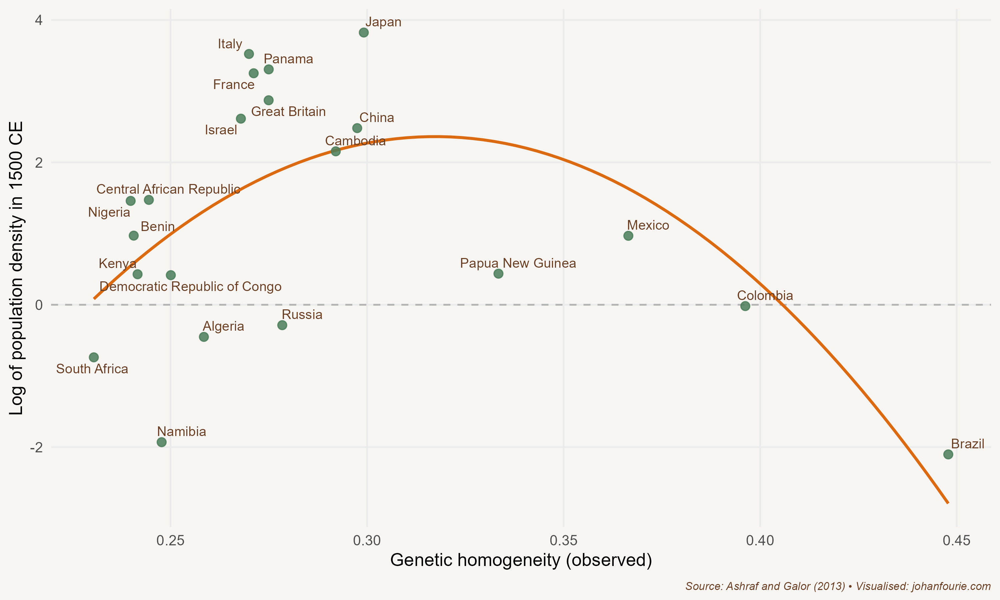

About 300 kilometres from Cape Town on the south-west coast of South Africa is a cave that overlooks the Indian Ocean. Archaeologists have been digging at Blombos Cave since 1991. What they have found has changed our view of human evolution.

Anatomically modern humans evolved in Africa. Homo sapiens is a species of the hominid family, the great apes. Genetic evidence suggests that apes diverged from other mammals around 85 million years ago; the earliest fossils we have of apes are from around 55 million years ago.

There are two things that make humans unique from other apes: bipedalism and language. Bipedalism, our ability to walk on two legs, also resulted in other skeletal changes, to the pelvis, the vertebral column, feet and ankles, and the skull, including an increase in the size and structure of the brain. These evolutionary changes to our brain made social learning and language acquisition in children possible, two traits which we developed about 2 million years ago.

The reason we evolved to walk on two feet, scientists suggest, was to take advantage of environmental change in Africa. As the climate changed, the jungle (a natural habitat for our ape-like ancestors) gave way to the open savannah. It meant that we had to find alternative sources of food, and as a result new technologies such as speech and making fire were developed. These new technologies affected human evolution: because cooking doubles the energy we can extract from our food, our command of fire allowed our ancestors' teeth, stomach and gut to shrink and the brain to grow bigger.

None of this was a linear process ending with Homo sapiens, as the well-known caricature would have it. Human evolution should rather be seen as a web. Before Homo sapiens came Homo erectus, and before Homo erectus came Homo habilis, and each of these had various other branches as well. Some of these subspecies were more successful than others; what determined success, to a large extent, was their ability to migrate and create a minimum viable population (MVP). In short, as Cat Bohannon writes in *Eve*, they needed to make lots of babies.[^23]

But this is not what Homo sapiens, and our Homo ancestors, were (and are) particularly good at. Babies are biologically expensive. Compared to other apes, human women have a really small pelvic opening and our babies have really big heads -- a consequence of our evolutionary switch to bipedalism and language. Babies also require years of nourishing and nurturing. Bohannon argues that it was the invention of gynaecology -- midwives -- that allowed Homo erectus and especially Homo sapiens populations to reach the MVP.

Homo erectus left Africa maybe two million years ago, spreading as far as Asia; the last remaining populations date to around 100,000 years ago in Java. But it would be the evolution of Homo sapiens in Africa that sparked another, far more successful migration out of Africa. The evidence does not yet allow us to pin down precisely when this happened. There are different theories about when and how humans migrated, and scientists are continually updating these theories on the basis of new genetic or archaeological evidence. The latest genetic evidence shows that there was a single migration from Africa between 50,000 and 65,000 years ago, a very short period of time on the evolutionary timeline. All non-African humans are thus descended from these migrants. A second theory is that there were two migrations. One early wave of humans exited Africa around 75,000 years ago from the Horn of Africa (modern-day Somalia) when sea levels were much lower, populating the Indian subcontinent and Asia, and a second wave migrated across the Persian Gulf, populating the Middle East and Europe.

These migrants interbred with other hominid species in the new regions they settled. For example, there is evidence that almost all humans share genetic material with Neanderthals, a species that roamed Eurasia from 400,000 to around 40,000 years ago.[^24] Those of us with sub-Saharan and Western European heritage tend to have the lowest levels of shared genetic material, while Indigenous Americans, Asians and Aboriginal Australians and Papuans tend to have substantially more. Scientists are still unravelling the mysteries of when and where this exchange (or exchanges) of genetics happened.

Regardless of when exactly we left and who we mated with, humans evolved in Africa. Africa today is thus home to the greatest variation in human DNA anywhere on the planet. Humans would, over thousands of years, trek to all places on earth, reaching South America around 15,000 BCE and the island of New Zealand around the year 1300 CE. The people who reached these far-off places at the end of this millennia-long journey had relatively low genetic diversity.

{.book-figure fig-alt="Observed genetic diversity and population density, 1500 CE"}

::: {.figure-caption}
Figure 2.1 Observed genetic diversity and population density, 1500 CE
:::

A few years ago the economists Quamrul Ashraf and Oded Galor posited that this variation in genetic diversity in different parts of the world explains something about the distribution of income today.[^25] Their theory has been called the Out-of-Africa hypothesis. According to this theory, in places with a lot of human genetic diversity there will be many new and competing ideas, which is good for innovation and economic growth. In places with low human genetic diversity there will be very few new ideas, which is bad for growth. But they also argue that in places with high human genetic diversity coordination and trust will be low, which is bad for economic growth. By contrast, places with low human genetic diversity will have high levels of coordination and trust. This results in a goldilocks effect: you want some human genetic diversity but not too much.

The two economists then took the distance from Addis Ababa, the capital of Ethiopia, as a proxy for how much human genetic diversity each present-day country has, and plotted this against the income levels of those countries. What they found is an inverted-U curve as in Figure 2.1, which is exactly what their hypothesis predicted. This, they argue, supports the claim that distant events -- such as the human migration out of Africa -- still affect living standards today.

Their paper has come under severe criticism. One excellent critique, published in Current Anthropology, notes the many errors their research makes.[^26] These include misattributing genetic diversity to migratory distance, misconstruing the link between genetic diversity and diversity of ideas, selecting and reporting factually inaccurate data, and making simplistic assumptions about the nature of human behaviour. The authors of the critique warn economists and other social scientists about the dangers of working with genetic data: 'It is crucial to remember that nonexperts broadcasting bold claims on the basis of weak data and methods can have profoundly detrimental social and political effects.'[^27]

What Ashraf and Galor's 'Out-of-Africa' research, and the critiques that followed, show is that the scientific process, although sometimes slow and frustrating, does move our understanding of the world forward. Ashraf and Galor had an idea that they tested against the evidence. Other scientists judged their evidence to be insufficient to support their hypothesis. Very few economists or other social scientists now believe that wealth and poverty differences today are the result of migratory patterns that occurred 50,000 years ago. And even fewer, if any, would suggest policies to create an 'optimal level' of genetic diversity in a society. We will meet many old and new theories in the rest of this book. It is the job of natural and social scientists to identify which are the ones with merit and which are the ones, like Ashraf and Galor's Out-of-Africa hypothesis, that do not stand up to the evidence.

Let us return to Blombos Cave. What did the archaeologists find there that overturned our previous ideas about human evolution? For a long time, scientists believed that the early humans who exited Africa (whether in one or in two waves) were very limited in their speech and other cultural attributes. One indicator of modern human cognition and behaviour is the ability to produce abstract or descriptive artworks. Before the discovery of Blombos, the earliest human paintings known to archaeologists were located in caves in southern France, produced around 40,000 BCE. This would mean that the artwork in France was produced only after the emigration from Africa. However, the archaeologists who excavated Blombos Cave found 'a cross-hatched pattern drawn with an ochre crayon on a ground silcrete flake recovered from approximately 73,000-year-old Middle Stone Age levels'.[^28] It means that this art pre-dates any other known artwork in the world by more than 30,000 years. The implication is that the humans who inhabited Africa before the migration from the continent had all the features of human cognition and behaviour that we associate with humans today. In fact, the most likely genesis of our Homo sapiens ancestor is in southern Africa, between 70,000 and 100,000 years ago. A small group of them then migrated to eastern Africa, and then, a few thousand years later, they migrated into Europe, Asia and, finally, North America.

Humans evolved in Africa and spread across the globe. They settled in all parts of the world, adjusting to the diverse environments they would come to inhabit. But there is no plausible evidence that such human genetic diversity as exists leads to different economic outcomes today. Genetics does not explain why some societies are rich, and others poor. We need to continue our search for other explanations.

[^23]: Cat Bohannon, Eve: How the Female Body Drove 200 Million Years of Human Evolution. Alfred A. Knopf: New York, 2023.
[^24]: R. M. Wragg Sykes, Kindred: Neanderthal Life, Love, Death and Art (London: Bloomsbury, 2020).
[^25]: Q. Ashraf and O. Galor, The 'Out of Africa' hypothesis, human genetic diversity, and comparative economic development, American Economic Review, 103 (1), 2013, 1--46.
[^26]: J. D. A. Guedes, T. C. Bestor, D. Carrasco, R. Flad, E. Fosse, M. Herzfeld, C. C. Lamberg-Karlovsky, C. M. Lewis, M. Liebmann, R. Meadow and N. Patterson, Is poverty in our genes? A critique of Ashraf and Galor, 'The "Out of Africa" hypothesis, human genetic diversity, and comparative economic development', American Economic Review (forthcoming), Current Anthropology, 54 (1), 2013, 71--79.
[^27]: Ibid., 71.
[^28]: C. S. Henshilwood, F. d'Errico, K. L. van Niekerk, L. Dayet, A. Queffelec and L. Pollarolo, An abstract drawing from the 73,000-year-old levels at Blombos Cave, South Africa, Nature, 562 (7725), 2018, 115--118, at 115.
