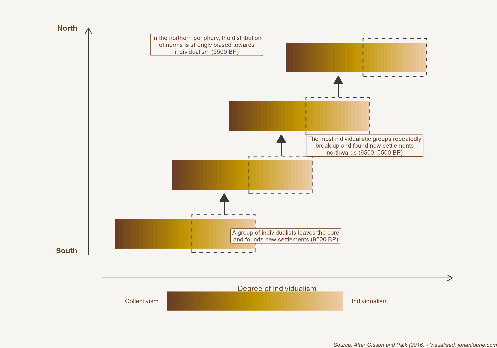

In his bestselling book Sapiens, Yuval Noah Harari writes: 'We did not domesticate wheat. It domesticated us.'[^29] This statement captures a fundamental truth about the Neolithic Revolution, sometimes also called the Agricultural Revolution, which began about 10,000 BCE. This was a period in history when humans transitioned from a lifestyle of hunting and gathering to one of farming and settlement.

For most of our history, humans have lived nomadic lives. We would cluster into small bands of between 30 and 150 people -- and roam the countryside looking for animals to hunt, and seeds, berries and fruits to gather. We know something about this lifestyle of our nomadic ancestors by observing the few groups of people that still live in this way. In southern Africa we are most familiar with the San, although most San people today have now switched to a sedentary lifestyle.

Life as hunter-gatherers was tough. In periods when food was plentiful there was ample time for leisure and procreation. But because hunter-gatherers are nomadic, there were limited opportunities to save and accumulate for the proverbial rainy day. When resources were scarce, this could quickly lead to famine and conflict. A large proportion of men in hunter-gatherer societies died violently.

Humans were hunter-gatherers for many thousands of years and then, quite suddenly, we we adopted agriculture. We did so in at least seven different locations all around the world, from the Middle East, West Africa, East Asia to Central America. The obvious question is: why, after at least 150,000 years as hunter gatherers, did we do so?

What is even more surprising is that we seemingly did so against our will. There is now enough evidence to suggest that the first farmers did not live materially better lives than their hunter-gatherer counterparts.[^30] Farmers were substantially shorter than hunter-gatherers, for example, suggesting that their living standards were much lower. Why did hunter-gatherers switch to farming, then, if their lives did not materially improve?

Until now (and in earlier versions of this book), our only answer had been climate change. The timing of this shift correlates with the end of the last Ice Age: as sea levels rose because of warmer climate, the argument goes, access to animals they were hunting or the fruits they were gathering had dwindled. In order to survive, people had to find an alternative source of sustenance. Grains such as wheat and barley offered one.

But the economic historian Andrea Matranga has a different hypothesis. In a 2024 paper, he proposes that increased climated seasonality caused hunter-gatherers to adopt a sedentary lifestyle and store food for the season of scarcity.[^31] The story goes like this: Because of oscillations in the shape of the earth's orbit around 10,000 BCE, the difference between winter and summer temperatures -- seasonality -- increased substantially. For astronomical reasons, this happened only in the Northern Hemisphere. The larger temperature gaps between seasons forced farmers to accumulate food for the season of scarcity. But to store things, they had to settle down. And when they settled down, they started developing rudimentary agricultural technologies, notably the domestication of certain crops, that turned them into, well, farmers. In his paper, Matranga uses archaeological and paleoclimatic data to show that agriculture appeared earliest in those regions where seasonality increases were the largest.

Fascinatingly, this also helps to explain why the northern hemisphere enjoyed a distinct technological lead for most of human history. Says Matranga:

> Today, countries such as New Zealand, Australia, South Africa and Argentina have climates very similar to those where agriculture originated. Why did these southern temperate areas not invent agriculture during the Neolithic? The shock to seasonality that triggered the transition happened only in the northern hemisphere. As a result, these areas never experienced the extreme seasonality affecting the populations that actually invented agriculture. This likely delayed the invention of agriculture at latitudes south of 30◦S, even where conditions were otherwise favourable.

Once farming became the primary source of food, life changed considerably. For one thing, farmers are more productive than hunter-gatherers. This allows them to produce a surplus beyond their daily needs. The combination of surplus production and sedentary living enabled these early farmers to begin to accumulate 'capital'; not only could they now store surpluses for the season of scarcity, but they could also 'invest' and 'trade' those surpluses. Instead of searching for food (or, when food was plentiful, using their time for leisure), they could now allocate part of their time to constructing things like irrigation systems that would make them even more productive, allowing for even larger surpluses and even more investment and capital accumulation.

One reason that farming was not immediately attractive was that the varied diet hunter-gatherers found in their environment was replaced by the monotonous diet of starches farmers produced. But because farmers were producing a surplus, they could trade away their surplus for other food types or household goods. Farmers could, for example, specialise in harvesting wheat or rye, produce more than they needed for themselves and their immediate families, and trade their surplus with a specialist in another field, such as a fisherman or a potter or a blacksmith. This allowed them to obtain products that they could not produce themselves. The blacksmith, for his part, could now specialise in making knives or spears and trade with the farmers to obtain food. Specialisation and trade are key components of how societies become prosperous; we discuss the consequences of these new trade routes in the next chapter.

Another important advantage of the greater surpluses produced by farmers was a higher fertility rate. This meant that farming not only allowed specialisation between households but also within the household. Because of the physical strength required, men were more likely to be engaged in arable farming, whereas women could 'specialise' in having and raising children.

The extent of this 'specialisation' depended on the type of farming. Shifting agriculture -- also known as slash-and-burn -- uses handheld tools like the hoe and the digging stick. Plough agriculture, by contrast, needs much more upper body strength and bursts of power to pull the plough or control the animal that pulls it. This helps to explain, according to the Danish economist Ester Boserup, the specialisation of women in the household traditionally: she argues that in societies that traditionally practiced plough agriculture, men tended to work in the fields while women specialised in activities within the home, including raising children.[^32] And, she continues, this shapes beliefs about the appropriate role for women in society, beliefs that may persist until today long after those societies have moved out of agriculture.

Alberto Alesina, Paola Giuliano and Nathan Nunn, in a 2013 paper, tested Boserup's hypothesis.[^33] The first show that traditional plough use is positively correlated with attitudes reflecting gender inequality and negatively correlated with female labour force participation, female firm ownership and female participation in politics, just as Boserup predicted. Of course, there might be something different about places with plough use compared to those that use tools such as the hoe and the digging stick; in other words, this is mere correlation and not causation. To get around this, the authors study the children of migrants to the United States and Europe: there should be no location-specific reasons why they should have different gender norms than the children of non-migrants. And yet, writes Alesina, Giuliano and Nunn, we 'find that individuals from cultures that historically used the plough have less equal gender norms and that women from cultures that used the plough participate less in the workforce. These results provide evidence that part of the importance of the plough arises through its impact on internal beliefs and values.'

Agriculture did not only shape our beliefs about gender but also about freedom. Bigger surpluses meant higher fertility rates in agricultural societies compared to hunter-gatherer groups. Over time, as farmer numbers grew, they would encroach on the territories of hunter-gatherers, and either displaced them or incorporated them into their new communities.

This process of agricultural expansion explains, according to the economic historians Ola Olsson and Christopher Paik, why northern Europeans are today more likely to be individualistic than their southern European counterparts.[^34] They begin by defining collectivist norms as the preference to conform, to value duty, honour, tradition and leadership. People who adhere to more collectivist norms consider it important for children to be obedient to their parents and are more willing to accept hierarchies and social structures. By contrast, individualism is associated with independence, openness to new ideas, and egalitarianism.

So, what does agriculture have to do with collectivist norms? The argument goes like this. The people living in places where agriculture emerged were the first to develop highly collectivist norms. This happens because, as we have just seen, agriculture requires a far more complex social hierarchy than that of hunter-gatherer societies. Within such social hierarchies, the traits associated with collective norms -- such as honour, tradition, leadership and obedience -- would be likely to culturally evolve.

Around 10,000 BCE these early farming societies first emerged in the Fertile Crescent. From there agriculture spread, over several millennia, across southern Europe and then into northern Europe. How it spread is important for our story.

{.book-figure fig-alt="How individualised norms spread through migration"}

::: {.figure-caption}
Figure 3.1 How individualised norms spread through migration
:::

Imagine a society with a range of people, some having very collectivist norms and others more individualistic norms. It is very likely that the individualistic ones would move away because they do not tolerate the strong norms of the other members of their group. Once they moved, they would establish a new farming community. After several generations this new community would again contain some members with more collectivist norms and others with more individualistic norms, and once again the more individualistic ones would pack their belongings and leave in order to establish a new society. The same process would be repeated until ultimately northern Europe was reached -- where only the most individualistic would end up. The process is demonstrated in Figure 3.1. That is what Olsson and Paik think happened in Europe several thousand years ago.

How do we know if this is true? The two authors argue that these norms persist until today. We should thus expect that northern Europeans are more individualistic in comparison with southern Europeans, who should have more collectivist norms. And that is exactly what the authors find when they use contemporary survey data. The Danes are more individualistic, it seems, because they acquired agriculture much later than the Greeks or the Italians or the Spanish.

In a 2020 paper these two authors go one step further.[^35] They argue that the timing of the Neolithic Revolution not only affects modern-day norms but could also explain contemporary political systems and income levels. For most of human history, agriculture was the dominant sector of production. As we've seen, collectivist norms flourish in such systems. But such norms lead to more autocratic regimes and discourage innovation. It explains why, until around 1500, the Middle East and the southern part of Europe were more affluent than the north.

But because individualistic norms reward creativity and risk-taking, these norms became more beneficial, the authors argue, once market economies arose. Individualistic norms are also more likely to favour democratic institutions. There thus occurred a reversal of fortunes in Europe after around 1500, with the north growing richer than the south. Using an updated map of all Neolithic sites in Europe and the Middle East and correlating that with income levels today, the authors find a robust negative relationship between the number of years since the transition to agriculture and income levels both across and within countries today. Whereas the ancient (agricultural) civilizations of the Assyrians, Babylonians, Egyptians, Greeks and Romans were all located in the Middle East and southern Europe, today the wealthiest countries are in northern Europe. The Danes are not only more individualistic, but it seems they are also wealthier and more democratic as a result.

Just how much our distant transition from hunting and gathering to agriculture still affects us today remains a subject of contention -- and surely the focus of future research. What we do know is that these new farming communities transformed not only their mode of food production, but our norms and beliefs. A planet that was inhabited by small groups of hunter-gatherers had become, from around 10,000 BCE, a place with far greater numbers of farmers producing a surplus. It is from these humble beginnings that, as we'll see in the next chapter, the first cities and civilisations would emerge. Wheat not only domesticated us; it made us the demigods of this planet.

[^29]: Y. N. Harari, Sapiens: A Brief History of Humankind (London: Random House, 2014), p. 91.
[^30]: J. C. Scott, Against the Grain: A Deep History of the Earliest States (New Haven: Yale University Press, 2017).
[^31]: Andrea Matranga, The Ant and the Grasshopper: Seasonality and the Invention of Agriculture, The Quarterly Journal of Economics, 2024;, qjae012, https://doi.org/10.1093/qje/qjae012
[^32]: Boserup, Ester. Woman's Role in Economic Development, London: George Allen and Unwin Ltd, 1970.
[^33]: Alesina, Alberto, Paola Giuliano, and Nathan Nunn. \"On the origins of gender roles: Women and the plough.\" The quarterly journal of economics 128, no. 2 (2013): 469-530.
[^34]: Olsson, Ola, and Christopher Paik. \"Long-run cultural divergence: Evidence from the neolithic revolution.\" Journal of Development Economics 122 (2016): 197-213.
[^35]: Olsson, Ola, and Christopher Paik. \"A Western reversal since the Neolithic? The long-run impact of early agriculture.\" The Journal of Economic History 80, no. 1 (2020): 100-135.
