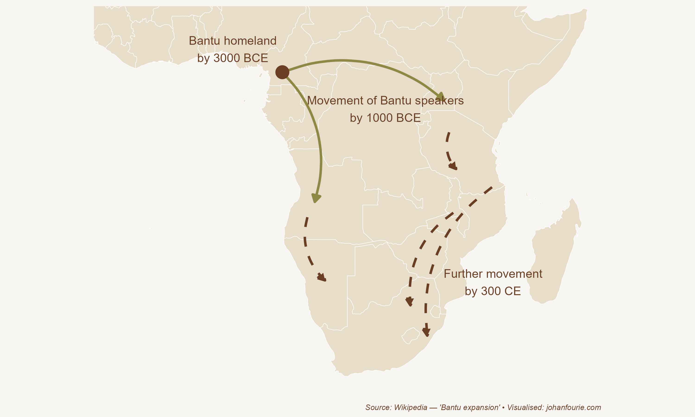

Long-haul tourists visiting South Africa are always fascinated by the clicks of isiXhosa. Foreign to their ears, the eighteen click consonants can be grouped into three types: the 'c' is a dental click made by the tongue at the front of the mouth, the lateral 'x' is made by the tongue at the sides of the mouth, and the alveolar 'q' is made by the tip of the tongue on the roof of the mouth.

IsiXhosa is part of the Nguni language group, which also includes Zulu and southern and northern Ndebele. Yet few of these or the other South African vernacular languages have clicks, and those that do use them far less. How did isiXhosa come to use clicks so commonly?

One clue comes from the other languages of southern Africa that also use. Although they are not well known, the Ju\|'hoan language, spoken by an estimated 10,000 people in Botswana and Namibia, has 48 clicks, and the Taa language, spoken by only 4,000 speakers in Botswana, has 83. The implication is that those Nguni speakers who acquired clicks -- what later became isiXhosa -- must have been in close contact with the people who spoke click-heavy languages. As we will see, this integration of people at the southern tip of Africa came at the end of what has become known as the Bantu expansion (or the Bantu migration). It is the largest-known human migration and transformed the demography and economy of central, eastern and southern Africa over the last five thousand years.

As we discussed in Chapter 2, humans evolved in Africa and then spread across the globe. Africa has thus always had remarkable human diversity. To tell a coherent story, we will simplify this diversity into five major human groups that inhabited the continent before the Bantu migration. These were what we would now know as Bantu-speaking Africans, Berbers, Central African foragers ('Pygmies'), Khoesan and Asians.

Now let us imagine Africa around 3000 BCE. The northern coastal zone next to the Mediterranean Sea would soon be inhabited by Amazigh-speaking (Berber) people, the ancestors of modern-day Libyans, Algerians and Moroccans who are not descended from the Arab conquests of the eighth century. As explained in the previous chapter, they, just like the Egyptians at the time, share Ethiopian ancestry, though there were, of course, frequent opportunities over thousands of years for cultural and genetic exchange with the Levant and southern Europe.

The Sahel (the savannah region below the Sahara Desert) and the tropical regions of West Africa were inhabited by Bantu-speaking Africans. The Central African tropics were inhabited by foragers, also known as the Batwa or 'Pygmies', a hunter-gatherer people of short stature. All of eastern and southern Africa was inhabited by the Khoesan, a combination of pastoral Khoe and hunter-gatherer San people. We will learn more about them in Chapter 14. Finally, the island of Madagascar, 400 kilometres off the eastern coast of Africa, was entirely devoid of humans in 3000 BCE. It is believed that the island was only settled by humans -- Asians who had migrated from the island of Borneo several thousand kilometres to the east -- between 200 BCE and 500 CE.

Around 3000 BCE something happened in West Africa that would change African history forever: the domestication of African yams, a plant that grows large tubers which look a bit like sweet potatoes. The latest evidence from plant genetics shows that Bantu-speaking farmers located in present-day Nigeria and Cameroon acquired this new 'technology'. Yams allowed the farmers to produce larger surpluses and increase their population size, giving them an advantage over their hunter-gatherer neighbours.

Tubers, though, have different properties than the grains domesticated in the Middle East and elsewhere. Tubers such as yams and patotoes are grown underground, making it hard for external parties, like tax collectors or marauding soldiers, to expropriate them. Tubers also usually have good storage capabilities that do not require sophisticated storage technologies, meaning they can be kept for personal use over extended periods of time. Thirdly, tuber production is labour-intensive but does not necessarily benefit from economies of scale. Production tends to be on self-sufficient family units rather than large estates or plantations that make it easier for a state to control.

It is for this reason, argues economic historian Nonso Obikili, that the domestication of the yam did not result in the larger civilizations and centralised states that emerged in ancient Mesopotamia and Egypt.[^44] Using an extensive series of tests, he shows that West African yam farmers were likely to be more politically fragmented historically compared to regions that farmed with grains.

What is more, those political differences persist into the present. Here, too, social norms explain this persistence: just like the individualism of the Danes we encountered in Chapter 3, West Africans living in areas with yam cultivation developed cultural traits that support the idea of keeping extra goods and political power local and distributed -- rather than centralised. Using recent surveys, Obikili shows that people who identify with ethnic groups that were historically tuber cultivators are more likely to reject rule by either one man, one party, or the military.

{.book-figure fig-alt="Map of migration of Bantu speakers in Africa"}

::: {.figure-caption}
Figure 5.1 Map of migration of Bantu speakers in Africa
:::

Although the yam did not lead to centralisation, the surpluses it generated did allow a series of migrations in two directions. As shown in Figure 5.1, one route went south, through the tropics, down the west coast of Central Africa. Another route went east, around the Central African tropics, to the east coast and then south, through the Great Lakes region and into southern Africa. This was a slow migration, almost imperceptible in time; each generation would simply move a few miles, until, over a thousand years and more, Bantu-speakers had moved through or around the tropics.

Around 2000 BCE these Bantu-speaking migrants invented ironworking. The latest archaeological evidence shows that Africans were the first to produce iron. An intriguing hypothesis suggests that this innovation stemmed from a combination of the high-iron lateritic soil found in the savanna belt and the practice of making pottery.[^45] As potters fired their ceramics in pits dug into the earth, they incidentally produced small quantities of iron due to the high temperatures involved. This might also explain why the trade in copper and tin, necessary for the rise of civilisations, never emerged on the continent: Africans already had iron!

The combination of agriculture and ironworking allowed Bantu-speakers to speed up their colonisation of southern Africa. Archaeological evidence shows that they crossed the Limpopo River, the northern border of modern-day South Africa, around 300 CE. The final outcome of this massive migration was that almost all of central, eastern and southern Africa became the home of Bantu speakers.

What happened to the people who had lived there before? It seems that most of them were displaced, either being subjugated or pushed into environments where farming was not viable, such as the forests or the deserts. Central African foragers moved deeper into the forests. Today there are very few of them remaining. Their own languages are gone; each forager band adopted the language of the neighbouring Bantu-speaking farmers. The same is largely true for the Khoesan. Most were displaced by the incoming Bantu-speaking farmers. Those who remained moved into the deserts (of Namibia, South Africa or Botswana), with one exception.

The one place where Bantu speakers did not settle was the region with a Mediterranean climate at the southern tip of the continent, roughly today's Western Cape of South Africa. Here Khoesan people would continue to thrive until, several centuries later, European settlers arrived. It is interesting to consider why Bantu speakers did not migrate further south and west, all the way to Table Mountain, and why their slow march halted roughly at the Fish River in today's Eastern Cape. The answer requires us to look at geography.

Jared Diamond is a geographer who has written one of the most influential books on development. In *Guns, Germs and Steel* he argues that there were two reasons why Eurasians were lucky in their location, and that it is this 'luck' that helps to explain why civilisations emerged first in Eurasia, despite the fact that humans evolved originally in Africa. The first reason is that Eurasia, notably the Fertile Crescent, was fortunate to have many of the plants and animals that could be domesticated. (As we discussed in Chapter 3, they were also 'fortunate' to experience greater seasonality, forcing them to store food for the season of scarcity.) These domesticable plants included wild wheat and pulse species that are still the staple diet of most people around the world, such as wheat, barley, chickpeas and lentils. These are all winter-rainfall crops. By contrast, sub-Saharan Africa had far fewer domesticable plants. Sorghum and pearl millet were probably domesticated in the summer-rainfall Sahel region, and yams, palm oil and kola nuts in the wet tropics of West Africa. There is also evidence that melon and watermelon were domesticated in northeastern Africa; an image of a large, striped, oblong fruit on a tray, reminiscent of a watermelon, has been found in an Egyptian tomb around 2000 BCE.[^46] Yet none of these crops would be as nutrient-rich as wheat, barley, rye and oats, or rice (in China) and maize or corn (in the Americas), the most common staples in the rest of the world.

Why did wheat not travel to Africa? The answer links to the second reason why Africa was 'unlucky'. Africa is a 'vertical' continent, longer than it is wide, while Eurasia is 'horizontal', wider than it is long. This is important because climatic zones vary a lot longitudinally (vertically) but not latitudinally (horizontally). For example, a crop domesticated in the Fertile Crescent could easily be transported west to southern Europe or east to the Indian subcontinent or even further to southern China, because all these regions fall roughly in the same climatic zone. Wheat was grown in Egypt, of course, because that country also had a Mediterranean climate, but it could not travel the long journey south through the Sahara Desert, the summer-rainfall savannah of the Sahel, the tropics of Central Africa, the (summer-rainfall) highlands and savannah of eastern and southern Africa, and finally to where it could adapt -- the winter-rainfall Mediterranean climatic region along the southern tip of the continent. It was only after 1650, when Europeans settled, that wheat would be grown in the Cape.[^47]

The same was true of animals. To domesticate a wild animal, says Diamond, it must be sufficiently docile, submissive to humans, cheap to feed, immune to diseases, able to grow rapidly, and breed well in captivity. Although Africa is the continent of big mammals, none of these large beasts could be domesticated, as not one fulfilled all the criteria Diamond mentioned. An elephant can be tamed, yes, but its offspring will be genetically similar to an elephant that roams in the wild. Even today, with all our modern technology, we still cannot domesticate any of Africa's large mammals. The only exception is the donkey, domesticated from the African wild ass.[^48] Although cattle were the first domesticated animal to arrive on the continent, spreading across the Sahara with pastoralists between 8,000 and 7,000 years ago, as the climate grew drier, pastoralists had to move more frequently. Cattle, needing frequent watering, were not ideal for transport in the desert. Wild asses, adapted to the harsh environments, required less water and could digest coarse grasses due to their efficient metabolic and water-sparing mechanisms. Evidence suggests that African wild asses were domesticated by herders, as their remains are found in pastoral regions far from the Nile. From Africa, they spread across the globe.

Yet even today, donkeys Dare normally kept in low numbers and are rarely eaten. Cattle, horses and sheep are far more numerous. For that reason, people living in the Fertile Crescent and elsewhere in Eurasia had a very different experience with their animals, using them as a source of food and clothing, for transport, and for pulling ploughs. Even though North Africans acquired these animals quite early, tropical African diseases, notably the tsetse fly, delayed the spread of livestock further south. The low yields of yams compared with wheat, barley, rice and corn, and the delayed access to large, domesticated mammals, are two of the most important reasons why Africans south of the Equator never produced the large civilisations Eurasia did.

The Khoesan, who lived south of the tropics, were simply unlucky not to live in a region with many domesticable plants and animals. Once Bantu speakers had domesticated yams in western Africa and discovered ironworking, they could easily displace or, in a few cases, absorb the existing Khoesan people on their southern migration.

And that is why isiXhosa has clicks in it. The Bantu-speaking migrants, with their ironworking tools and summer-rainfall crops, moved all the way south until they reached the borders of a region that had a Mediterranean, winter-rainfall climate. Here their crops could not grow, and they could not displace the Khoesan entirely. Over hundreds of years they instead integrated with eastern Khoesan clans, adopting (some of the) clicks into their language. The fact that the Bantu migration came to a halt roughly at the Fish River in the Eastern Cape allowed the various Khoesan clans to remain in the small, winter-rainfall region at the south-western tip of the continent, trading, marrying and sometimes warring with their more technologically advanced Bantu-speaking neighbours to their north-east. This is the situation European explorers found when they first sailed round the Cape of Good Hope, in approximately 1500 CE. The guns, germs and steel that the European explorers brought with them had nothing to do, as Diamond notes, 'with differences between European and African peoples themselves'. Rather, they were due to 'accidents of geography and biogeography'.[^49] The luck of geography helps to explain part of the global income distribution today.

[^44]: Obikili, Nonso, Tubers and its Role in Historic Political Fragmentation in Africa. Available at SSRN: https://ssrn.com/abstract=4462687 or http://dx.doi.org/10.2139/ssrn.4462687
[^45]: Ehret, Christopher. 'Ancient Africa: A Global History to 300 CE'. Princeton: Princeton University Press, 2023.
[^46]: Paris, H.S., 2015. Origin and emergence of the sweet dessert watermelon, Citrullus lanatus. Annals of botany, 116(2), pp.133-148.
[^47]: A 2021 paper by economist Arthur Blouin finds empirical support for Diamond's hypothesis. Blouin reports that those Africans 'whose ancestors could consistently keep livestock and produce traditional dry-crops throughout their multigenerational migration journey are more likely to engage in these activities today'. See A. Blouin, Axis-orientation and knowledge transmission: Evidence from the Bantu expansion, Journal of Economic Growth, 26, 2021, 359--384.
[^48]: The only two animals to be domesticated south of the Sahara are the guinea fowl (around 0 CE) and the hedgehog (in the 1980s). For those wondering, ostriches can only be tamed (or partially domesticated), and this was done on a large scale about 150 years ago in South Africa. Ostriches that are farmed are still very close to their wild ancestors, as any ostrich farmer would attest to.
[^49]: Diamond, Guns, Germs and Steel, 401.
