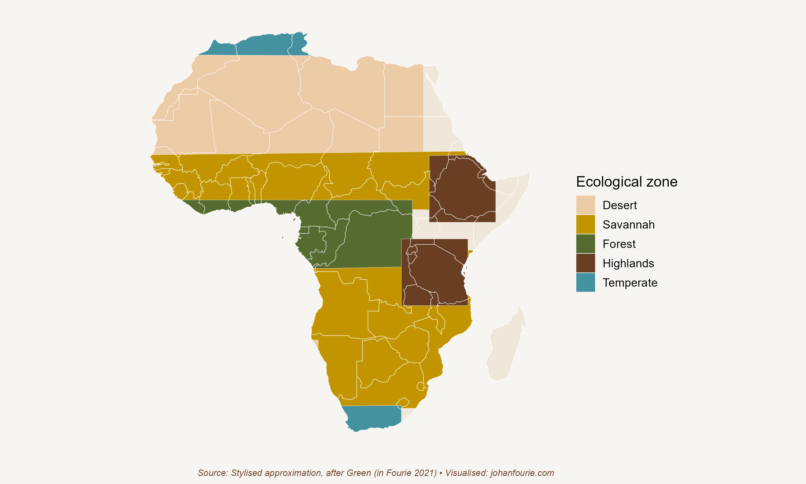

Africa is a massive continent. One could fit all of Western and Eastern Europe (including the UK), India, Japan and China, and the United States into the continent, and still have space left. Africa, of course, has far fewer people. In 2023 an estimated 1.45 billion people lived on the African continent. The combined number for those other countries was a startling 3.8 billion people.

This makes Africa a land-abundant continent. In other words, Africa has a low labour-to-land ratio -- there are about 48 people for every square kilometre in Africa as compared to 159 people, on average, in those other regions. The numbers for Japan (325), the Netherlands (422) and India (464) are much higher.[^62]

This high land--labour ratio is not a new phenomenon. Africa has historically also had an abundance of land relative to the number of people who can work it. As we will see in this chapter, it has shaped the types of production systems and institutions that developed on the continent.

Our story begins around 1000 CE. This is roughly when the Bantu expansion had reached the Eastern Cape of South Africa and when Islam had spread to most of North Africa. Although there were some societies, notably in West Africa, that specialised in mining and light manufacturing, notably textiles, most African societies were predominantly agricultural. There are three main reasons for this. The first we've already encountered in Chapter 5: Africans were unlucky that they did not have access to domesticable plants and animals, as Eurasians did, which meant that the agricultural surpluses that could sustain large towns and cities were absent. The second reason is the high land--labour ratio.[^63] It is this ratio that also explains the type of farming most prevalent: most Africans practised extensive agriculture; that is, they did not use a lot of inputs to keep the land fertile. Once the soil became depleted, they picked up their things and moved on. There was thus little incentive to invest in capital goods such as irrigation or storage and transport infrastructure. The third reason is the harsh environment. Many parts of Africa are not only characterised by poor soil conditions but also have high disease burdens. These include the tsetse fly, malaria and sleeping sickness.

{.book-figure fig-alt="Africa's five ecological zones"}

::: {.figure-caption}
Figure 8.1 Africa's five ecological zones
:::

Of course, these are broad generalisations. It helps to be more specific, and to do that we follow the economic historian Erik Green and divide the continent into five ecological zones. These are the tropical rainforest, the savannah, the highlands, the deserts and the temperate zones.[^64] Figure 8.1 shows the location of these zones. Because most Africans traditionally lived in only three of these -- the rainforests, savannah and highlands -- we will continue to discuss the economic systems of only those three.

The forests of West and Central Africa were both a blessing and a curse. Yams, palm oil and plantains (a type of banana) were the most popular crops, not only because they produced high yields in the fertile soil, but also because they did not require a lot of labour. The curse of the forests was disease. Malaria affected -- and still affects -- many people, and the tsetse fly, unique to Africa, killed animals, making cattle breeding almost impossible. Research by the economist Marcella Alsan shows that ethnic groups that lived in tsetse-fly areas were less likely to use domesticated animals and the plough and, as a consequence, had lower population density.[^65] Those who inhabited the rainforests thus had to balance the benefits of the labour-saving, high-yield crops with the costs of debilitating diseases that affected the productivity of humans and animals.

The savannah was usually less fertile than the forests but had the benefit of a lower disease burden. Here the most common crops were millet and sorghum, but these were limited to those places with good access to water, notably around lakes and rivers. The areas of the savannah far from water were usually uninhabited. Population density in the savannah was thus much lower than in the forests.

The highlands, found in northern Tanzania, central Kenya and Ethiopia, were the only regions where Africans developed intensive agriculture. It is useful to pause for a moment here to understand why that is so. The highlands were not only very fertile, they were also free from most of the diseases that plagued the forests and the savannahs. This allowed African farmers to invest in irrigation and other ways of preserving the land, such as terracing or manuring. In some cases, such as the highlands of Ethiopia, the plough was introduced, which further boosted agricultural productivity. Fertile land, combined with capital investment, produced larger surpluses, greater population density and more complex political systems. It is thus not entirely surprising that Ethiopia was one of the few African countries never to be colonised by Europeans.

The geography of Africa affected not only its production systems, but also the social, political and cultural institutions that developed alongside them. The shortage of labour and abundance of land meant that the most valuable commodity was never land, as in Western Europe and India, for example. It was people. Warring neighbours had little incentive to steal land from each another -- that was the abundant resource. Instead, they stole people. The high land--labour ratio gave rise to indigenous African slavery long before the emergence of the Atlantic slave trade.

Labour shortages also meant that family members were often the only source of labour. Social status was therefore closely associated with the number of children in a household. Men thus competed intensively for women, which gave rise to the social institution of bride price, the practice by which a husband's family paid compensation to the family of the bride for the loss of her labour and company. Polygamy, the practice of having more than one wife, was another social institution that emerged as a consequence of the labour shortage.

Similar institutions would not emerge in parts of the world with low land--labour ratios. India, for example, has the practice of dowry payments, in which there is a transfer of money or gifts from the wife's family to the husband's upon marriage. In Africa, with its high land--labour ratio, institutions such as lobola, as bride price is known in South Africa, became commonplace.

All of this may give the impression of a very unchanging pre-colonial economy and society. But it would be a mistake to come to that conclusion. Pre-colonial African economic systems were diverse and dynamic. The diversity can be attributed to the varied ecological environments we have described above. The dynamism was largely a consequence of the availability of new technologies. We've already seen, in Chapter 4, how Iron Age tools allowed Bantu-speaking migrants to displace Stone Age Khoesan. But the most important 'technology' of the pre-colonial era was new crop types. One, in particular, stands out. Maize (corn or 'mealies') was domesticated in the Americas, as we shall see in Chapter 10. How it reached Africa remains unclear, but it was first mentioned by the Portuguese traveller Alvarez in 1520, less than three decades after Columbus had arrived in the New World.

We know about this Portuguese traveller because the economic historians Edward Kerby, Alex Moradi and Hanjo Odendaal have digitised and analysed a corpus of more than 3,000 firsthand traveller accounts to document the spread of maize across the continent.[^66] They first uncovered the diverse nomenclature for maize across Africa, compiling a dictionary of 147 synonyms. They then show that by the end of the seventeenth century, the number of mentions of maize exceeded those of other grains, dominating the diets of Africans by 1700. African farmers preferred maize over other crops because of its high energy yield, its low labour requirements, and its short growing season. Some even began exporting maize. In 1688, for example, the Dutch explorer William Bosman, on a voyage to Guinea, wrote in his travel diary: 'This land is so populous, it is very rich in gold, slaves, and all sorts of necessities of life; but more especially corn, which they sell in large quantities to the English ships.'

The adoption of maize had long-term consequences. We have already seen how the internal African slave trade was an institutional response to the high land--labour ratio on the continent. What maize did was to boost population growth significantly. Two economists, Jevan Cherniwchan and Juan Moreno-Cruz, show that in places that were suitable for maize agriculture, notably West Africa, population growth increased after the introduction of maize.[^67] They then show that it was also here that slave shipments to the Americas increased most rapidly.

Maize had one important detrimental quality: it was not very resistant to drought. This meant that production could vary enormously depending on the weather. In good years the surplus was large, but bad years could lead to famine. As a result, African farmers had to diversify their production across a variety of crops. Erik Green summarises this best:

> From what we know about the forest and savannah regions, it seems likely that hunger was common, and famines occurred quite regularly. Diversification rather than specialisation was the most important strategy for coping with hunger crises and famines. People grew a variety of crops and tried, as far as possible, to exploit a variety of environments. Cultivation of drought resistant crops like cassava continued to be an important strategy despite the spread of maize, and people invested in livestock even where there was a shortage of grazing land.[^68]

Africans were unlucky to live on a continent with low-yielding crops and a harsh environment. This meant that they had to diversify their production, which in turn reduced their surpluses and kept population sizes small, leading to a high land--labour ratio. This gave rise to institutions that entrenched property rights in people rather than in land. Elements of both institutions -- slavery and bride price -- persist into the present.

[^62]: Numbers calculated from Worldometer.
[^63]: G. Austin, Resources, techniques, and strategies south of the Sahara: Revising the factor endowments perspective on African economic development, 1500--2000, Economic History Review, 61 (3), 2008, 587--624.
[^64]: The next section relies heavily on Erik Green's Production Systems in Pre-Colonial Africa, ch. 3: The history of African development (online textbook), www.aehnetwork.org/textbook/production-systems-in-pre-colonial-africa/.
[^65]: M. Alsan, The effect of the tsetse fly on African development. American Economic Review, 105 (1), 2015, 382--410.
[^66]: Kerby, E., Moradi, A., and Odendaal, H., 'African time travellers: What can we learn from 500 years of written accounts?', The Economic History Review, (2024), pp. 1-38.
[^67]: J. Cherniwchan and J. Moreno-Cruz, Maize and precolonial Africa, Journal of Development Economics, 136, 2019, 137--150.
[^68]: Green, Production Systems in Pre-Colonial Africa, p 12.
