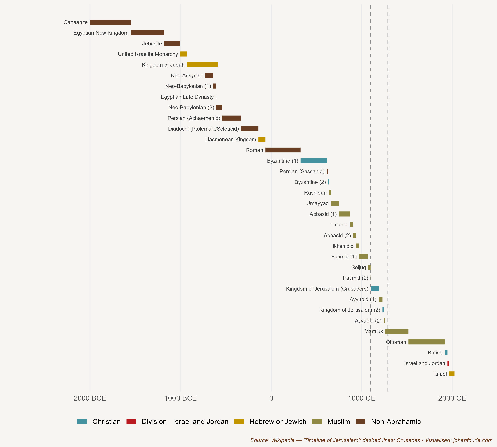

Around 1300 CE, so the legend goes, the king of the Malian empire in West Africa hatched a plan. He believed that the earth was round and wanted to prove it, so he equipped two hundred boats full of men and another two hundred full of gold, water and victuals, and sent them west. After a long time only one boat returned, reporting that 'we have navigated for a long time, until we saw in the midst of the ocean as if a big river was flowing violently'.[^69] Not happy with the answer of the only boat to escape the danger, the king doubled down, and equipped two thousand boats for a second voyage. This time he travelled with them. Just before he left, he put his deputy in charge. The king and his fleet never returned. In 1312 this deputy became the tenth ruler of the Mali empire. His name was Mansa Musa.

In 2015 the online magazine Money compiled a list of the ten richest men in history. Mansa Musa was ranked first. Although it is a somewhat silly exercise given the difficulty of comparing wealth across regions and time periods, there is no doubt that Musa was indescribably affluent. As the story about his predecessor already demonstrates, the source of the Malian empire's wealth was its rich gold and salt mines, whose contents were exported across the Sahara to North Africa and Europe. But Musa was not content to rely on the natural resources of his empire. He embarked on a large construction programme, building mosques and madrasas (centres of learning) in Timbuktu and Gao, including the famous University of Sankoré in the former city, which had one of the largest libraries in the world. He also expanded the Mali empire substantially, adding at least twenty-four cities and their territories. By the end of his rule the Malian empire would include most of modern-day Mali, Senegal, The Gambia, Guinea, Niger, Nigeria, Chad and Mauritania.

Musa was a devout Muslim, and is best remembered for the journey he took in 1324 to Mecca for his hajj pilgrimage. His procession reportedly consisted of 60,000 men, including 12,000 slaves. Thousands of horses and camels carried gold bars and bags of gold dust, silk and other gifts, which he generously donated to the cities and the poor on his way east. Yet his generosity would soon have consequences: because of the influx of gold, the prices of goods and wares became greatly inflated. This was the only time in recorded history that one man directly controlled the price of gold in the Mediterranean.

By the time Musa became king, Islam was well established in Africa, arriving soon after the death of the Prophet Muhammad in 632 CE. It first spread rapidly to Egypt (642 CE) and Libya (647 CE), which were then under Byzantine rule. In 698 CE Muslim Arabs conquered Carthage, in what is now Tunisia, expanding the Umayyad caliphate to all of North Africa. In the first two decades of the next century the caliphate would also occupy most of Iberia, modern-day Spain and Portugal, so that its empire extended from the Atlantic coast in the west to Pakistan and Uzbekistan in the east, an area including approximately 33 million people, making it one of the largest empires in history.

The caliphate ruled over a multi-ethnic population. Christians, who were still the majority of the population, and Jews were allowed to continue practising their faiths, but had to pay a poll tax from which Muslims were exempt. This, as economic historian Mohamed Saleh shows, helps us to understand income differences between Christians and Muslims in Egypt today.[^70]

Saleh asks why it is that Copts (Egyptian Christians) were far more affluent in the nineteenth century than Egyptian Muslims; 33 per cent of Copts, for example, worked in white-collar jobs, compared to only 14 per cent of Muslims. That Copts were so much more affluent than Muslims is all the more surprising because before the Arab conquest of Egypt in 642 almost everyone was Christian, and there has been little in- and out-migration since then. Saleh argues that the Copts' relative affluence can be ascribed to the head tax imposed after the conquest. It worked like this: because the poll tax was a regressive tax -- in other words, it affected the poor more than the rich -- it incentivised poorer Egyptians to convert from Christianity to Islam. Because this happened over more than 1,200 years, by the end almost all the Copts that remained were rich compared with the much larger but poorer Muslim population. There was thus nothing inherently different between Christians and Muslims in nineteenth-century Egypt; the reason why Copts were wealthier was religious self-selection over more than a millennium.

Islam travelled across the Sahara and into West Africa with Arabic traders. The first to convert, by the middle of the tenth century, were the inhabitants of the Sahara, the Berbers. Thereafter it spread into the Senegambia region, Mali, Chad and, later, Hausaland in northern Nigeria. Although some African kings tried to resist its influence, Islam spread rapidly for at least four reasons: it accepted many of the African customs (such as polygamy), it provided access to formal education and scientific knowledge, it was often used as justification for war (jihad), and it advanced long-distance trade by reducing transaction costs between peoples of different ethnicities.[^71]

{.book-figure fig-alt="Timeline of Jerusalem's history, showing the start and end of the Crusades"}

::: {.figure-caption}
Figure 9.1 Timeline of Jerusalem's history, showing the start and end of the Crusades
:::

At the same time that Islam began to expand throughout West Africa, Christians in Western Europe were joining the Crusades in an attempt to reclaim the Holy Land from Islam. Figure 9.1 shows the various empires that ruled over Jerusalem from 2000 BCE to 2000 CE. Note the turn to Islam from the seventh century. The Crusades were a series of religious wars between Christians and Muslims from the eleventh to the fifteenth centuries that had some initial successes for the former. But the Crusades did not only comprise church-sanctioned wars against Muslims. Several Crusades involved campaigns against pagans and heretics, or simply opportunistic attempts to gain political or territorial advantage. One branch of the Crusades was aimed at conquering the Iberian Peninsula (present-day Spain and Portugal) from the Muslims. Some 780 years after the Umayyad conquest of Iberia, the Nasrid kingdom of Granada -- one of the longest-ruling Muslim dynasties in the region and the builders of the still awe-inspiring Alhambra palace complex -- finally fell in 1492 to the expanding Christian Spanish kingdoms of Castile and Aragon.

Economic historians Lisa Blaydes and Christopher Paik argue that the Crusades may help us to understand why it was that Western Europe, a relatively poor and backward region by 1000 CE, began to discard the feudal institutions that we discussed in Chapter 7.[^72] They first identify the geographical origins of each of the crusading forces in the Holy Land. They then show that, after taking into account underlying levels of religiosity and economic development, regions where large numbers of crusaders were recruited experienced increased political stability, a higher probability of establishing parliamentary institutions, higher downstream levels of tax revenue, as well as greater urbanisation after their return.

The reason for these developments, according to Blaydes and Paik, is that the Crusades impelled Europeans to abandon the personal relationships that characterised feudalism and move towards the creation of increasingly impersonal and consolidated states. 'European monarchs began to enjoy greater political power over what had previously been a loose network of decentralised local elites.' This is important for two reasons. First, economic historians have always dated the emergence of representative political institutions in Europe to events after 1500; the research of Blaydes and Paik shows that events that occurred much earlier were also important in the process. Second, their study demonstrates that Europe did not create these institutions in isolation: developments in the Islamic world, much of it in North and West Africa, are critical to understanding the evolution of European political institutions.

[^69]: M. Hamidullah, Muslim discovery of America before Columbus, Journal of the Muslim Students' Association of the United States and Canada, 4 (2), 1968, 7--9.
[^70]: M. Saleh, On the road to heaven: Taxation, conversions, and the Coptic--Muslim socioeconomic gap in medieval Egypt, Journal of Economic History, 78 (2), 2018, 394--434.
[^71]: Paul Lovejoy makes a similar point for nineteenth-century long-distance kola trade between the Asante and the Sokoto caliphate. See P. E. Lovejoy, Long-distance trade and Islam: The case of the nineteenth-century Hausa kola trade, Journal of the Historical Society of Nigeria, 5 (4), 1971, 537--547.
[^72]: L. Blaydes and C. Paik, The impact of Holy Land Crusades on state formation: War mobilization, trade integration, and political development in medieval Europe, International Organization, 70 (3), 2016, 551--586.
