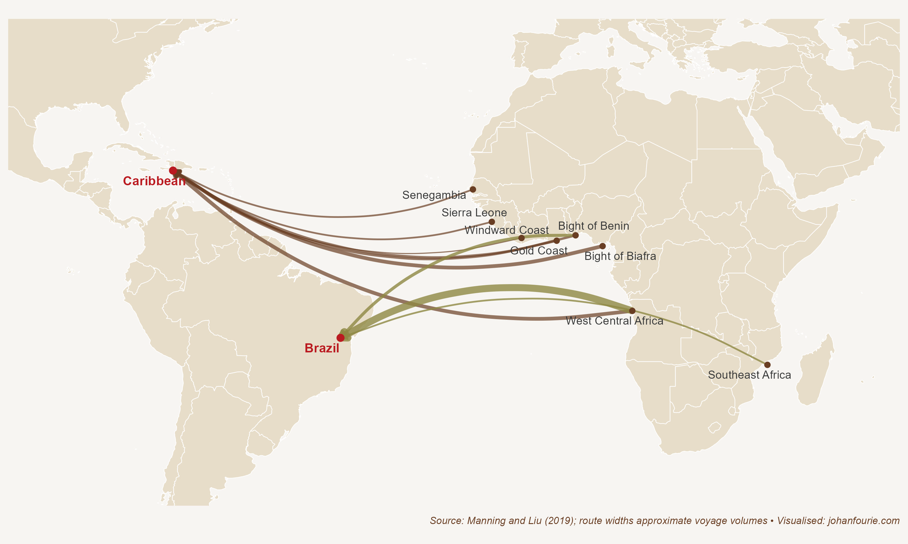

Gorée is a small island off the coast of Dakar, Senegal. Enjoying an exquisitely grilled filet de saint pierre in one of the harbour restaurants as the sun sets, it is easy to imagine the place as a summer resort for the West African rich and famous. But below its serene exterior lies a dark history.

On 27 June 2013 one of the descendants of the people who suffered under this dark history recounted her visit:

> We saw the dark, cramped cells where dozens of people were packed together for months on end, with heavy chains around their necks and arms. We saw the courtyard where they were forced to stand naked while buyers examined them, negotiated a price, and bought them as if they were nothing but property. And we saw what is known as 'The Door of No Return', a small stone doorway through which these men, women and children passed on their way to massive wooden ships that carried them across the ocean to a life of slavery in the United States and elsewhere -- a brutal journey known as the 'Middle Passage'.[^86]

Michelle Obama, the former First Lady of the United States, is a descendant of Africans who were shipped to the Americas to be sold as slaves. In total, about 13 million people were forcibly shipped across the Atlantic from Africa between the sixteenth and nineteenth centuries. An estimated 1.5 million of them died en route.

How did such a cruel system arise? As we've seen in Chapter 8, Africa has always had a high land--labour ratio. Because of the high demand for labour, women's ability to reproduce and men's ability to work the land were reflected in the cultural institutions that prevailed, such as bride price and slavery. Warfare in Africa was constantly a fight for labour, not land. Slavery was thus endemic to the continent, but, as economic historian Patrick Manning reminds us, it was small in scale.[^87] Slavery can only exist if the captors have substantial resources and incentives to motivate their system of oppression. And it can only expand where there is significant demand for labour. Various factors can give rise to it, such as the presence of strong rulers with the ability to use force, the existence of markets for slave-produced goods, or the efforts of purchasers to transport captives some distance to where these conditions are met.

Although long-distance slave routes out of Africa had existed for centuries -- such as the trans-Saharan route, the Red Sea route into Arabia, or the Indian Ocean route -- all three conditions were only met after the Columbian Exchange -- the transfer of products, people, plants and parasites across the Atlantic -- had been established in the fifteenth century. By then, European traders had connected the fertile lands of the Americas with European demand for products such as sugar and coffee. To produce these commodities in the New World, the European conquerors needed labour -- and Africa's existing institutions of slavery provided the answer.[^88] European slave traders did not have to create completely new institutions. With the assistance of African slave traders, often in exchange for guns that further facilitated the capture of people deeper into the interior -- what some scholars have called a vicious 'gun--slave cycle' -- Africans were walked to the coast, to the slave ports where European slave ships would dock, waiting for their next shipment.[^89] It was under these harrowing conditions in the sixteenth century that the largest and most violent slave trade in human history was born. It would continue until deep into the nineteenth century, for a period of more than 300 years.

The Atlantic slave trade, as Chapter 10 explains, shaped the development trajectory of the Americas in profound ways, giving rise to severe inequality in Latin America as well as institutions of exclusion that remain today. Far fewer Africans ended up in the United States -- as demonstrated by Figure 12.1, which maps the ten largest slave Atlantic slave routes. But even in the USA the legacies of the slave trade persist into the present. In 1870 the income of African Americans was 25 per cent of that of white Americans; by 2015 the number was higher, but still a distant 65 per cent.[^90]

{.book-figure fig-alt="The top ten slave routes, with number of known voyages, 1650s--1860s"}

::: {.figure-caption}
Figure 12.1 The top ten slave routes, with number of known voyages, 1650s--1860s
:::

It is useful to ask to what extent slavery contributed to US development. As can be imagined, this is a fraught, and highly politicised, debate. On the one side, slavery is understood to have underpinned American prosperity. As historian Sven Beckert explains, slave labour was the largest input in cotton production, and raw cotton was the most important input into textiles, the leading sector of the Industrial Revolution. The cheap, uncompensated labour of enslaved Africans, he argues, not only made slaveholders wealthy, but was the catalyst for American (and global) industrial take-off.[^91]

There are two concerns with Beckert's hypothesis. First, as the economic historians Alan Olmstead and Paul Rhode note, one should not equate unfree labour with cheap labour.[^92] Just like the African continent, the USA was a land-abundant and labour-scarce country: 'just because slaves did not capture the benefits of their scarce labour does not mean that they were cheap'.[^93] This means that America's comparative advantage in cotton production was not the result of cheap labour, but was rather the result of a succession of new cotton varieties that made cotton farming more productive than elsewhere in the world.[^94] Biological innovation rather than labour expropriation seems to best explain cotton's success.

Second, economic historian Gavin Wright notes that although cheap cotton was undoubtedly important for the growth of textiles and for its contribution to the Industrial Revolution, cheap cotton did not require slavery.[^95] How do we know this? Consider that after five years of civil war in the USA, which culminated in the abolition of slavery, cotton prices returned to their pre-war levels. Output increased after the Reconstruction. Coercion was not a necessary input into the production process.

A different interpretation of the contribution of slavery to American prosperity, then, is that the institution of slavery, with its unfathomable hardships and injustice, retarded the South's economic dynamism. Southern farmers grew prosperous not because of access to cheap labour, or because of more sophisticated techniques of repression, as Edward Baptist has argued, but because of access to fertile land, high cotton prices and new crop types.[^96]

But once cotton varieties had improved and all available land had been settled, labour productivity stagnated. This was because the institution of slavery did not incentivise labour-displacing innovation. Adam Smith already noted this in his 1776 treatise: 'slaves ... are very seldom inventive; and all the most important improvements, either in machinery or in the arrangement and distribution of work which facilitate and abridge labour, have been the discoveries of freemen'.[^97] Smith did not mean that slaves do not have the ability to be inventive. He meant that, because they do not own the returns from their ideas and labour, they have no reason to be inventive. It would be the North, where slavery was illegal, rather than the South, that would lead America's industrialisation.

A more comparative approach supports this view. If slavery was indeed the driving force of American prosperity, then surely other countries that received large numbers of slave shipments would also have prospered. Brazil, as we've seen, was the largest recipient of enslaved Africans, and therefore provides a good comparison. Slaves constituted one-third of the Brazilian population in 1822, when the country became independent from Portugal. Yet Brazil was a poor country, and remained largely agricultural until the twentieth century. A recent study confirms that slavery was detrimental to rather than helpful for Brazilian development: 'Rather than promoting economic growth and development, the evidence shows that slavery held back industrialisation in Brazil.'[^98]

Although it is important to understand the consequences of slavery in the Americas, it is equally important to know how the Atlantic slave trade affected the development trajectory of the Africans who remained behind on the continent. Manning has estimated that Africa's population would have been twice as big as it was by 1850 had it not been for the slave trade.[^99] That is clearly a large shock, but just how these demographic changes affected Africa's present-day fortunes remained difficult to measure until economist Nathan Nunn used a novel approach to do so. Nunn asked whether African countries that suffered greater population losses because of the slave trade are poorer today than others.[^100] The novelty of his research lies in the causal claim of the question. Nunn not only showed a correlation between high slave export regions and underdevelopment today, but also demonstrated that the slave trade caused the underdevelopment.[^101]

Saying that slavery caused underdevelopment does not answer the question why. Nunn addresses that in two follow-up papers. The first, written with economist Diego Puga, argues that land ruggedness may be an important explanation.[^102] To protect themselves from the slave trade, Africans preferred to live far from the trade routes that were easily accessible from the coast. This meant that many lived in rugged and inhospitable areas. While this may have protected them against the slave trade, it also meant that they could not easily trade the surpluses that they were producing. As we have seen several times in this book, specialisation, surplus production and trade are essential to a thriving economy. Africans, through the very sensible decision to hide from slave traders, were constrained by geography, even after the slave trade ended.

The second explanation for the persistent effects of the slave trade on Africa's development is trust. Africa's own slave trade was unique in that, unlike that in other places and time periods, individuals of the same or similar ethnicities would often enslave one another. Nunn and Leonard Wantchekon use contemporary survey data to show that people whose ancestors were most affected by the slave trade in the past have lower levels of trust today, several hundred years later.[^103] This includes trusting relatives, neighbours, people of the same ethnicity and even local government. Such a lack of trust has costs: in Chapter 6 we discussed how important trust is to the process of solving the economic problems of production and distribution through the market system. Without trust between Africans there could be little trade and investment. Nunn and Wantchekon argue that the slave trade created these antagonistic cultural values and beliefs, which were passed on from one generation to the next, with detrimental consequences for Africa's long-run development.

Although Nunn's work has inspired others to investigate the consequences of the slave trade in Africa -- with evidence emerging that it has caused political fragmentation and reduced access to credit for households and firm -- Nunn's work is not without its critics.[^104] One important concern is the 'compression of history', the idea that there is simply too much history between what happened five centuries ago and today to assign any meaningful causal effect to slavery.[^105] One example will suffice: although Nunn finds that the slave trade caused lower levels of development in the year 2000, when the same analysis is done for the year 1950, the correlation disappears.[^106] Why the effect of the slave trades would become larger across time is unclear. Perhaps there is simply too much history to consider.

Even if the exact causal mechanism between the past and the present remains murky, there is little doubt that the Atlantic slave trade radically altered Africa's development trajectory. Reflecting on her experience of visiting Gorée, Michelle Obama wrote: 'People who came through this island could never have imagined how history would unfold. And they certainly could never have imagined that someone like me -- a descendant of slaves -- would come here with her own family and look out through that door of no return .'[^107] The Atlantic slave trade not only shaped the futures of the New World countries that the enslaved would later come to call home, but also irrevocably hurt the economic prospects of the continent they left behind.

[^86]: Available at obamawhitehouse.archives.gov.
[^87]: P. Manning, Slavery and African Life: Occidental, Oriental, and African Slave Trades (Cambridge: Cambridge University Press, 1990).
[^88]: It helped that Africans were also more resistant than Europeans to many of the tropical diseases, notably malaria.
[^89]: W. C. Whatley, The gun--slave hypothesis and the 18th century British slave trade, Explorations in Economic History, 67, 2018, 80--104.
[^90]: M. H. Wanamaker, 150 years of economic progress for African American men: Measuring outcomes and sizing up roadblocks, Economic History of Developing Regions, 32 (3), 2017, 211--20.
[^91]: Beckert, Sven. \"Cotton and the global origins of capitalism.\" Journal of World History 28, no. 1 (2017): 107-120.
[^92]: A. L. Olmstead and P. W. Rhode, Cotton, slavery, and the new history of capitalism, Explorations in Economic History, 67, 2018, 1--17.
[^93]: Ibid., 5.
[^94]: A. L. Olmstead and P. W. Rhode, Biological innovation and productivity growth in the antebellum cotton economy, Journal of Economic History, 68 (4), 2008, 1123--71.
[^95]: G. Wright, Slavery and Anglo‐American capitalism revisited, Economic History Review, 73 (2), 2020, 353--383.
[^96]: E. E. Baptist, The Half Has Never Been Told: Slavery and the Making of American Capitalism (London: Hachette, 2016).
[^97]: A. Smith, An Inquiry into the Nature and Causes of the Wealth of Nations, edited by E. Cannan (London: Methuen & Co., 1904), IV.7, 46.
[^98]: N. Palma, A. Papadia, T. Pereira and L. Weller, Slavery and development in nineteenth century Brazil, Capitalism: A Journal of History and Economics, 2 (2), 2021, 372--426.
[^99]: Manning, P.,'African population: projections, 1850--1960', in K. Ittmann, D. D. Cordell, and G. H. Maddox, eds., The demographics of empire: the colonial order and the creation of knowledge (Athens, O., 2010), pp. 245--75. See E. Frankema and M. Jerven, Writing history backwards or sideways: Towards a consensus on African population, 1850--2010, Economic History Review, 67 (4), 2014, 907--31, for a discussion of historical population estimates.
[^100]: N. Nunn, The long-term effects of Africa's slave trades, Quarterly Journal of Economics, 123 (1), 2008, 139--76.
[^101]: How did he do this? He made use of an instrumental variable approach in his statistical regression analysis. In short, he used the distance from Africa to the Americas as a proxy for the number of slaves exported. He first showed that there is a high correlation between the distance and the number of slaves shipped. That makes sense: the European traders would have wanted to reduce transport costs (it was, after all, a profit-making enterprise) and so would have chosen the shortest route to the Americas. That establishes the first condition of a good instrument. Second, there is no reason why the distance between Africa and the Americas should have any effect on living standards in Africa today. Yet this is exactly what Nunn found in his regression analysis. The result suggests that slavery from the fifteenth to the nineteenth centuries causally explains lower levels of development today.
[^102]: N. Nunn and D. Puga, Ruggedness: The blessing of bad geography in Africa, Review of Economics and Statistics, 94 (1), 2012, 20--36.
[^103]: N. Nunn and L. Wantchekon, The slave trade and the origins of mistrust in Africa, American Economic Review, 101 (7), 2011, 3221--52.
[^104]: N. Obikili, The trans‐Atlantic slave trade and local political fragmentation in Africa, Economic History Review, 69 (4), 2016, 1157--77; L. Pierce and J. A. Snyder, The historical slave trade and firm access to finance in Africa, Review of Financial Studies, 31 (1), 2018, 142--74; R. Levine, C. Lin and W. Xie, The African slave trade and modern household finance, Economic Journal, 130 (630), 2020, 1817--41.
[^105]: G. Austin, The 'reversal of fortune' thesis and the compression of history: Perspectives from African and comparative economic history, Journal of International Development, 20 (8), 2008, 996--1027.
[^106]: This test is performed in a working paper by Marlous van Waijenburg and Ewout Frankema. The test is not included in the published version of the paper. See M. van Waijenburg and E. Frankema, Structural impediments to African growth? New evidence from real wages in British Africa, 1880--1965 (CGEH Working Paper no. 24, 2011).
[^107]: Available at obamawhitehouse.archives.gov.
