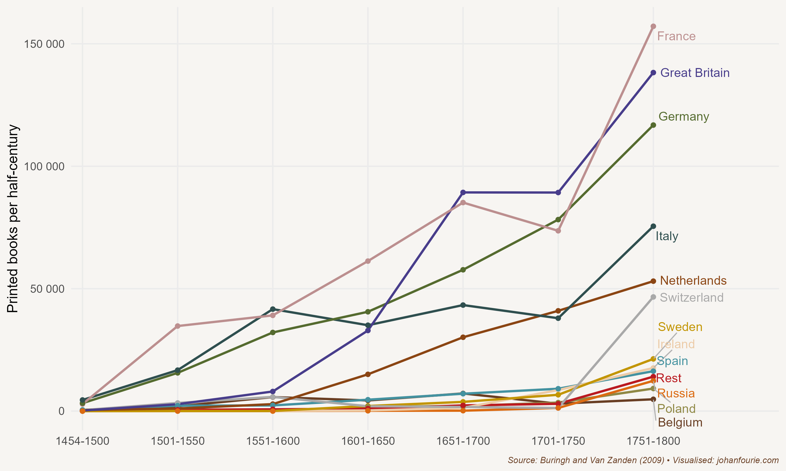

On 31 October 1517 a thirty-three-year-old priest in the small German town of Wittenberg wrote a letter that would change the course of history. Addressed to the bishop of his parish, Martin Luther complained about the Roman Catholic Church's selling of indulgences, the practice by which the Pope would grant remission from the punishment of sin. The more Luther read the Bible, the more he became convinced that it was not by performing good deeds that one obtained salvation, but by faith alone through God's grace. It was wrong to claim, he argued in the Ninety-Five Theses contained in the letter, that indulgences could absolve buyers from eternal punishment and grant them salvation.

These indulgences were, of course, a valuable source of income for the Church, especially at a time when Pope Leo X planned to rebuild St Peter's Basilica in Rome. For this reason Luther's letter upset the Pope, especially those parts, such as thesis 86, that challenged him directly: 'Why does the Pope, whose wealth today is greater than the wealth of the richest Crassus, build the basilica of St Peter with the money of poor believers rather than with his own money?'[^108]

After several public debates, Luther was excommunicated in 1521 and forced into hiding. During this time he translated the New Testament into German and wrote many other books and pamphlets that further developed this new doctrine, spreading what became known as the Protestant Reformation.

Of course, there had been others who had come before Luther with similarly radical ideas. There was the Waldensian movement of the twelfth and thirteenth centuries, John Wyclif in the fourteenth century, and the Prague preacher Jan Hus, who led the Hussite movement in the early fifteenth century. But none of these movements gained the traction that Martin Luther did in the early sixteenth century. Why?

This is where economics can help.[^109] Think of the Catholic Church as having a monopoly on religion in Western Europe before the Reformation. Monopolies that command incontestable markets, as we know from economic theory (and as we saw in Chapter 11), are prone to rent seeking and poor performance. Clerical neglect and corruption certainly characterised the Catholic Church when Luther voiced his concerns, creating demand for a new religious movement.

Another reason for the quick spread of the Reformation may have been the political competition within north-western Europe, where Protestantism took root. Think of the interplay between a ruler and a religion. A ruler can benefit from the legitimacy that a church provides: if the church anoints or sanctions a leader, his subjects could believe that his regime is divinely ordained. In exchange, the church might want to extract certain privileges from a ruler, such as tax exemptions or commercial monopolies or, as was often the case, the grant of feudal land. Where there exists a strong political leader and a monopoly religion, the two strengthen each other, and it is difficult for anyone new to enter and compete. Where there is political competition, however, as was the case in north-western Europe with its many principalities, duchies and small kingdoms, the door is open for competing religions, because rulers may prefer the religion that offers them the most legitimacy at the lowest cost. The privileges that the Catholic Church demanded of rulers may have been one reason why several German states quickly switched to the new religion once it had gained a foothold.

Although these are useful explanations for understanding why the Reformation happened, they struggle to explain why it happened when it did. These same conditions were also true before, when earlier attempts at reformation failed. To help us understand the timing, we need to turn away from demand-side reasons (why people wanted a new religion) to supply-side reasons (what allowed the new religion to spread easily).

Technology is the most obvious candidate here. And the story begins with Johannes Gutenberg, who introduced the printing press to Europe. Gutenberg was trained as a goldsmith, and it remains unclear how he discovered the idea of mechanical movable type. The Chinese had, of course, discovered the printing press several centuries earlier, having developed woodblock printing, which appeared as early as the 7th century during the Tang Dynasty, and movable type printing, innovated by Bi Sheng during the 11th century in the Song Dynasty. What we do know is that in 1455 Gutenberg printed 180 copies of his forty-two-line Bible in his workshop in Mainz, Germany. The Gutenberg Bible is an example of an incunabulum, the Latin word for a book printed before 1501. There are about 30,000 distinct incunabula known today, and they are very valuable. This is even more true of the Gutenberg Bible, of which only twenty-one complete copies survive. The last sale of a complete copy took place in 1978. Eight leaves of the book of Esther from an original copy were sold by Sotheby's in June 2015 for \$970,000.

{.book-figure fig-alt="Growth in the production of printed books per half-century (in thousands of books), 1454--1800"}

::: {.figure-caption}
Figure 13.1 Growth in the production of printed books per half-century (in thousands of books), 1454--1800
:::

Although Gutenberg was a poor businessman and lost his workshop to his creditor and business partner, his creation sparked a transformation in how information was disseminated. The printing press spread to more than two hundred cities in Europe within a few decades, and the number of printed book volumes rose from about 20 million in the first fifty years of its existence to almost 200 million in the next century. Figure 13.1 shows the growth in numbers of books by region until 1800.[^110]

The printing press made the Reformation possible. Even Luther admitted the role the printing press played in spreading his message, calling it 'God's highest and ultimate gift of grace by which He would have His Gospel carried forward '.[^111] The economist Jared Rubin wanted to know whether this was true: did the printing press really aid the spread of Protestantism?[^112] Much like Nathan Nunn in Chapter 12, Rubin employed an econometric technique known as instrumental variable analysis to identify the causal relationship. A good 'instrument' should be correlated with the spread of the printing press but should have no reason to be correlated with the spread of the Reformation. Rubin used the distance from Mainz, the town in which Gutenberg first printed his Bible, as his instrument, and showed that a city with a printing press in 1500 was 29 percentage points more likely to adopt Protestantism by 1600 than one that did not have one.

The cities that adopted Protestantism also became more affluent than the cities that remained Catholic. The reason for this, according to the German sociologist Max Weber, was that the states that accepted Protestantism also adopted a new work ethic, what he called the Protestant ethic.[^113] The beliefs of Protestantism -- especially in its Calvinist form -- encouraged hard and honest work. It was sinful to be seen as lazy or, worse, unemployed. Work brought one closer to God, the Protestants believed. This meant that they were more likely than their Catholic counterparts, according to Weber, to accumulate money and build wealth.

Calvinists also believed in predestination, the doctrine that holds that only a select few would go to heaven. One way to discern who these fortunate ones were, of course, was to observe how people lived. Wasting one's hard-earned money and purchasing luxuries was considered sinful. Donating money to the poor was discouraged because it promoted begging. Poverty was the result of laziness; only work could glorify God. Hard work and frugality were thus two qualities that many of the Reformed aspired to.

Weber's Protestant ethic has attracted much attention as an explanation for the emergence of capitalism. But its causal claims remain tenuous. Was it Protestantism that caused capitalism or capitalism that caused people to adopt Protestantism? Or was it some other factor that caused both capitalism and Protestantism? If only we had a laboratory where we could assign some the Protestant faith and others the Catholic faith, and see what happens over time!

Actually, we can. But because we cannot test our theories in a laboratory, we turn to history to find real-life experiments -- what in the economic history literature are called 'natural experiments'. Our first 'natural experiment' comes from South America. By the seventeenth century, following the exploits of the conquistadores, whom we encountered in Chapter 9, European missionaries were arriving in South America to win souls for the Catholic Church. The Jesuit order was one of the first to set up mission stations in the forests of what are today the countries of Argentina, Brazil and Paraguay. The economic historian Felipe Valencia Caicedo set out to test whether the Jesuit mission stations, established among the Guaraní from 1609 until 1767 (when the missionaries were expelled), had any long-run effects.[^114] (The Mission, a 1986 film starring Robert De Niro and Jeremy Irons, is set in the final Jesuit mission years. The soundtrack is one of the most recognisable movie scores in film history.) The Jesuit missionaries built schools and introduced formal education to their followers. After they were expelled, many of these stations were abandoned. Yet Valencia Caicedo found that, despite the absence of mission activity in the two centuries after the missionaries were expelled, districts with a former Jesuit presence within the Guaraní region have 10--15 per cent higher educational levels today, and about 10 per cent higher incomes, than places where there were no mission stations. Somehow, the norms and knowledge the Jesuit missionaries had brought to the Guaraní were transmitted from generation to generation, even after the mission stations were abandoned. It is a remarkable story of educational and income persistence.

But that is a story only of Catholic missions. What about the Protestants? For them, we turn to Africa. By the nineteenth century, European missionaries were establishing mission stations across the African continent. Some of these were Protestant and others were Catholic. By looking at the difference between these mission stations today, we can get a sense of whether Protestant beliefs promoted better outcomes. The answer seems to be both yes and no. Some scholars find that regions with larger numbers of Protestant missions are today more educated than regions with Catholic mission stations.[^115] The reason, though, is not the Protestant ethic, as Weber proposed, but rather competition. In places where Catholic missions competed with Protestant missions, the former had similar outcomes to the latter. Many Catholic regions, however, did not allow Protestant missions in their territories. In those places, Catholic stations performed significantly worse in educating their followers.

Several scholars, however, caution against an overly optimistic view of missionaries. There are three concerns. First, converting to Christianity and learning to read uprooted many of the traditional systems and beliefs, and not always for the better; today, for example, those living closer to mission stations have a higher likelihood of HIV infection and have lower levels of interpersonal trust.[^116] Second, while the positive effects are often attributed to European missionaries, much of the work at mission stations was performed by African converts. Many Africans also set up their own mission stations, settlements that are usually excluded from the mission atlases used in these types of analysis.[^117] Finally, some have more fundamental concerns about the nature of these 'natural experiments': upon their arrival in Africa, European missionaries did not just settle randomly -- a necessary assumption if we are to measure the causal effects. Instead, missionaries settled in healthier, safer, more accessible, and more developed regions.[^118] This suggests that the large effects we attribute to missionaries might actually be a consequence of some other omitted factor.

What we do know is that the missionaries did not only convert souls but also bolstered formal education. It is this education that is key to understanding the consequences of the Reformation, in Europe and elsewhere. The printing press and Protestantism -- the belief that one must read and study the Bible on one's own without the mediation of the Church -- were the main reasons that literacy and education spread rapidly across north-western Europe and then, in the footsteps of the missionaries, to the entire world. And it would be literacy and education that proved instrumental in the emergence of the Age of Enlightenment, the Scientific Revolution and, in turn, the Industrial Revolution, a topic we turn to in Chapter 17.

[^108]: Available at: https://www.luther.de/en/95thesen.html (Accessed 1 May 2024)
[^109]: Here I rely on S. O. Becker, S. Pfaff and J. Rubin, Causes and consequences of the Protestant Reformation, Explorations in Economic History, 62, 2016, 1--25.
[^110]: J. Baten and J. L. van Zanden, Book production and the onset of modern economic growth, Journal of Economic Growth, 13 (3), 2008, 217--35.
[^111]: Rubin, Jared. Rulers, Religion, and Riches: Why the West got rich and the Middle East did not. Cambridge University Press, 2017. P. 129
[^112]: J. Rubin, Printing and Protestants: An empirical test of the role of printing in the Reformation, Review of Economics and Statistics, 96 (2), 2014, 270--86.
[^113]: Weber, Max \"The Protestant Ethic and The Spirit of Capitalism\" (Penguin Books, 2002) translated by Peter Baehr and Gordon C. Wells.
[^114]: F. Valencia Caicedo, The mission: Human capital transmission, economic persistence, and culture in South America, Quarterly Journal of Economics, 134 (1), 2019, 507--56.
[^115]: F. A. Gallego and R. Woodberry, Christian missionaries and education in former African colonies: How competition mattered, Journal of African Economies, 19 (3), 2010, 294--329.
[^116]: J. Cagé and V. Rueda, Sex and the mission: The conflicting effects of early Christian missions on HIV in sub-Saharan Africa, Journal of Demographic Economics, 86 (3), 2020, 213--57; D. Okoye, Things fall apart? Missions, institutions, and interpersonal trust, Journal of Development Economics, 148, 2021, 102568.
[^117]: R. Jedwab, F. Meier zu Selhausen and A. Moradi, Christianization without economic development: Evidence from missions in Ghana, Journal of Economic Behavior and Organization, 190, 2021, 573--96.
[^118]: Jedwab, Remi, Felix Meier zu Selhausen, and Alexander Moradi. \"The economics of missionary expansion: Evidence from Africa and implications for development.\" Journal of Economic Growth 27, no. 2 (2022): 149-192.
