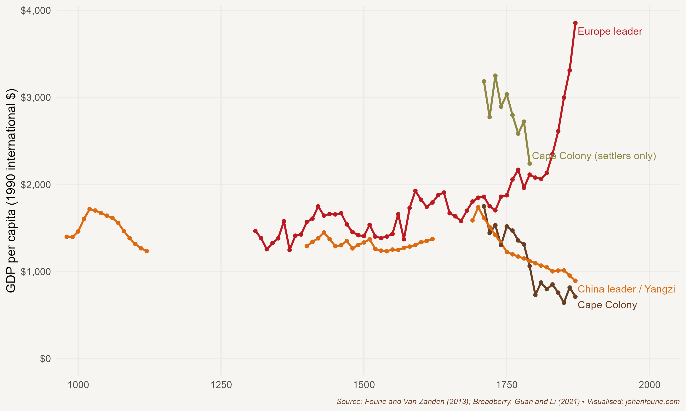

At least two decades before the arrival of the first European colonists at the southern tip of Africa, Autshumao, the chief of the Gorinhaikonas, settled in Table Bay. Although Europeans had sailed past the Cape in 1488, the volume of ships only increased after the establishment of the VOC in 1602 and the expansion of the spice trade between Europe and the East Indies. For many a ship captain Table Bay offered a place of refuge and replenishment, where they could find fresh water, wood for fuel, and meat purchased from the Gorinhaikonas, the Khoesan clan who lived in and around the bay. But communication for the purpose of trade proved difficult and so, in 1630, Autshumao was taken aboard a Dutch ship to Bantam in present-day Indonesia, where he learned Dutch and English. Two years later he opened a trading post on Robben Island, delivering letters for European ships, before moving back to the mainland in 1640.

When officials from the VOC arrived on 6 April 1652 in Table Bay to establish a permanent settlement that would help to replenish the company's ships, Autshumao was well placed to serve as interpreter and trader. To facilitate this process, he took his twelve-year-old niece to work for the commander of the fort, Jan van Riebeeck. Her name was !Goroǀgôas or, in the Dutch pronunciation, Krotoa. At the fort she was christened Eva.

Autshumao would soon fall out of favour with the Dutch. When the fort could not produce enough food to eat, van Riebeeck released nine company servants, in 1657, to become settlers: they would farm for themselves but sell their surplus to the company. But they struggled to farm in the windswept Cape Peninsula and, just one year after they set up on their own, they stole cattle from the Gorinhaikonas. War broke out, and Autshumao was captured and sent to Robben Island, the first person to be imprisoned there. After escaping on a rowing boat and with the war ended, Autshumao again applied for and received permission to work as interpreter for the Dutch. He died in 1663, one year before Krotoa married Pieter van Meerhof, a Danish surgeon, becoming the first Khoe to marry according to Christian custom.

But such a marriage was the exception rather than the rule. After another series of conflicts between the settlers and the much stronger Khoesan group, the Cochoqua, in the 1670s, the Dutch settlement expanded rapidly into the fertile valleys west of the mountain ranges that surround the Cape Peninsula. The Khoe who survived the conflicts either had to flee or join the colonial economy as farm labourers. Their numbers further collapsed in 1713 after a severe smallpox epidemic ravaged the colony. Just as European settlement would devastate indigenous populations in the Americas and Australia, European guns and germs left large tracts of Cape land available for further European settlement.

As European settlers entered these lands, first north and then east along the mountains that hugged the south coast, the colony's borders rapidly expanded. Settler numbers were boosted when about 180 Huguenots joined after fleeing persecution in France. But it was the settlers' high fertility rates -- in the order of seven surviving children per woman -- that mostly boosted their colonisation of the interior. The first Fourie to settle in the colony, for example, had twenty-one children and ninety-nine grandchildren.[^119]

Historians have long subscribed to the idea that although these settlers were productive in the bedroom, they were not very productive farmers. Some have described the colony as 'more of a static than a progressing community' which 'advanced with almost extreme slowness'. It was especially the settlers who migrated deeper into the interior who lived 'for the most part in isolated homesteads' and 'gained a scanty subsistence by the pastoral industry and hunting'.[^120]

This view was predominantly informed by letters of complaint that the settlers had written to the VOC shareholders in Amsterdam. Because the company had founded the Cape, it was ruled not by a colonial government but by shareholders half a world away. These shareholders had little interest in the welfare of the settlers or, for that matter, the other inhabitants of the colony; they cared only about profits. Their decisions were thus shaped by what was best for the company -- not the colony. This resulted in a string of strange economic institutions. Although the settlers were 'free' to farm what they wanted, they were only allowed to sell their produce to the company, and at fixed prices. They were not allowed to sell manufactured goods -- and only a few, those who purchased the monopoly concessions from the company, were allowed to bake bread or brew beer. Most importantly, they were not allowed to trade with the passing ships or with the Khoesan. It was an economy devoid of any economic freedom.

To compensate them for these restrictive institutions, the company gave them cheap loans to purchase agricultural inputs and, most importantly, allowed them to participate in the slave trade to obtain labour. The Cape was thus a slave economy. In Chapter 15 we return to this aspect of the colonial economy.

Despite these concessions, Cape farmers complained frequently and vehemently to the company shareholders, asking for the relaxation of several onerous restrictions, but to no avail. European visitors who travelled into the interior would often repeat the farmers' complaints in their accounts, noting the poverty they sometimes observed.

There is no doubt that some of these farmers were indeed very poor, but the confidence placed by historians in the observations of a few angry farmers and potentially prejudiced travellers seems misplaced. And so, when I was a graduate student in the late 2000s, I came across an obscure paper from 1987 that piqued my interest. In it, the historians Robert Ross and Pieter van Duin, after assembling a lot of statistics concerning eighteenth-century Cape agricultural output, remarked: 'While signs of dynamism in the nineteenth century Cape have been recognised by those few authors who have worked on the period, the backwardness of the colony at the end of the eighteenth century has yet to be fully challenged, or indeed fully investigated.'[^121] Here was a challenge for an eager student. And I accepted it.

My PhD dissertation, completed in 2012, asks the simple question: how affluent were these settler farmers?[^122] It turns out that the Cape settlers were some of the wealthiest humans on the planet at the time. How do I know this? For my analysis I used more than two thousand eighteenth-century Orphan Chamber probate inventories (lists of possessions the settlers owned when they died). Households at the Cape owned, I found, on average 54 cattle, 6 horses and 350 sheep, and about 3 buckets, 10 chairs and 5 paintings.[^123] A poor household living just above subsistence level could not have had so much wealth. In fact, I showed that the numbers of buckets, chairs, books and paintings, to name just a few household items, were higher than those owned by the average household in England, and the Netherlands, the two richest countries at the time. In later work with economic historian Frank Garmon, I used tax censuses collected by company officials to show that Cape settlers were also more affluent than American settlers in Maine, Massachusetts and Virginia.[^124]

But if settlers at the southern tip of Africa were more affluent than their counterparts in Europe and America at the end of the eighteenth century, when did Europe (and its offshoots) become the affluent place it is today? This is a big question in economic history, one that has become known as the Great Divergence debate. In 2000 the historian Kenneth Pomeranz wrote a seminal book -- The Great Divergence -- in which he argued that differences in income between Europeans and Asians only arose in the nineteenth century rather than, as many scholars believed at the time, a few centuries earlier.[^125] Although China under the Song dynasty (960--1279) is widely acknowledged to have had the highest standard of living in the world, most scholars had thought that the Chinese lost their advantage in the fourteenth century after their inward turn. Pomeranz questioned this assumption. Using scattered data that covered only parts of the economy, he argued that some regions of China maintained their higher standards of living over Europe until after the industrial take-off in Europe.

Economic historians have, however, developed a rich set of tools to test this hypothesis. Our most important tool is historical reconstructions of GDP. Pioneered by economic historian Angus Maddison, historical GDP estimates require painstaking data collection and calculation to allow comparisons across time and space.[^126] Probably the most reliable comparison comes from economic historians Stephen Broadberry, Hanhui Guan and David Li.[^127] In order to test Pomeranz's Great Divergence hypothesis, they calculate GDP per capita in the Yangzi Delta (the wealthiest part of China) and compare it with that of the Netherlands and England (what they call the European frontier). They show that the gap opens at the beginning of the eighteenth century, not as late as Pomeranz argues but also not as early as the Eurocentric writers of an earlier generation believed.

It is this same GDP per capita that confirms that the Cape was affluent. With the economic historian (and my former supervisor) Jan Luiten van Zanden, I show that GDP per capita at the Cape was above that of England, the Netherlands and the early American Republic.[^128] Figure 14.1 plots the upper estimates of GDP per capita for the Yangzi region in China, the European frontier (the Netherlands until the 1790s, and England to the 1860s) and the Cape Colony. For the Cape, one GDP per capita estimate includes the enslaved and Khoesan. A second only shows the GDP per capita for the European settlers.

{.book-figure fig-alt="GDP per capita (in 1990 dollars) for Yangzi, European frontier and Cape Colony, 1400--1860"}

::: {.figure-caption}
Figure 14.1 GDP per capita (in 1990 dollars) for Yangzi, European frontier and Cape Colony, 1400--1860
:::

How could Cape settlers become so wealthy given the constraints the Dutch East India Company imposed on them? Let's first think of the demand side: thousands of soldiers and sailors arrived at the Cape every year in need of fresh food and, in particular, wine and brandy. This created a ready market for the Cape's agricultural output, a market with no competitor.[^129] On the supply side, there were at least three reasons for the settlers' wealth. I have already mentioned the relatively inexpensive land that, once the threat of the Khoesan had been reduced, allowed farmers to practise extensive mixed farming, producing wheat and wine close to Cape Town and raising livestock beyond the mountains. Cheap labour helped too. Khoesan men and women who did not flee from the advancing settlers were ultimately incorporated, sometimes violently, into the farming economy. It was especially in the pastoral districts on the frontier, several months' travel from Cape Town, that Khoesan labour was an essential input in the production process. Closer to Cape Town, slaves acquired from the Indian Ocean slave trade was the dominant source of labour. Although slave labour did not come cheap, it offered other advantages to the settlers, as we'll see in the next chapter. A third reason was the skills the settlers brought from Europe, notably in wine making.[^130]

Why did this wealthy eighteenth-century society not experience an industrial revolution like its counterpart in north-western Europe?[^131] To answer this, we again turn to institutions. In Chapter 10 we examined the Engerman--Sokoloff hypothesis, which attributed the differences in income between North and South America today to the high levels of inequality and the concomitant institutions that were established during colonial times. The Cape, much like Latin America, was a highly unequal society, with institutions that evolved to protect the elite. These institutions removed the freedoms -- such as access to private property, education and representative government -- that are so essential to broad-based economic development. Instead, the institution of slavery (and indentureship of the Khoesan, a system very similar to slavery) prevailed at the Cape. And as we explained in Chapter 12, once the institution of slavery is embedded in a society, the incentives for innovation and capital investment in the technologies that raise productivity disappear.

The Cape economy was thus rich but unable to develop further; because of its institutions of unfreedom, it had reached a plateau. The only opportunities lay in expanding the frontier eastwards until, by the end of the eighteenth century, the settlers would enter the lands of the Xhosa, a Bantu-speaking group that was more technologically advanced than the Khoesan. This encounter would ignite a series of wars that lasted a century.

What of the Khoesan? Their numbers declined significantly after the arrival of Europeans.[^132] While some maintained their independence by moving away or settling in small villages protected by missionaries, others became part of the colonial economy, working on settler farms. Krotoa's fortunes would mirror that of her people. After marrying Pieter van Meerhof in 1664 she had three children, but when her husband was murdered in Madagascar, she suffered a personal decline and was banished to Robben Island, where she died in 1673.

That is not the end of her legacy, though. Her daughter, Pieternella van de Kaap, went on to marry the VOC vegetable gardener Daniel Zaaijman and have eight children. Today, all South Africans with the surname Saayman/Zaaiman can trace their roots to Krotoa.[^133]

[^119]: I am a descendant of Louis Fourie's twentieth child, ten generations later. To read more about Fourie's story (or is it Faurite?), visit <https://www.ourlongwalk.com/p/the-story-of-louis> (accessed 1 May 2024).
[^120]: M. H. de Kock, Selected Subjects in the Economic History of South Africa (Cape Town: Juta & Co., 1924), 24, 40.
[^121]: P. van Duin and R. Ross, The Economy of the Cape Colony in the 18th Century (Leiden: Centre for the Study of European Expansion, 1987), 1.
[^122]: J. Fourie, An inquiry into the nature, causes and distribution of wealth in the Cape Colony, 1652--1795 (PhD dissertation, Utrecht University, 2012).
[^123]: J. Fourie, The remarkable wealth of the Dutch Cape Colony: Measurements from eighteenth‐century probate inventories, Economic History Review, 66 (2), 2013, 419--48.
[^124]: Fourie, Johan, and Frank Garmon Jr. \"The settlers' fortunes: Comparing tax censuses in the Cape Colony and early American republic.\" The Economic History Review 76, no. 2 (2023): 525-550.
[^125]: Pomeranz, Kenneth. The great divergence: China, Europe, and the making of the modern world economy. Princeton University Press, 2000.
[^126]: After the death of Maddison in 2010, the Maddison Project hosted by the University of Groningen continues to be updated and improved. Visit <https://www.rug.nl/ggdc/historicaldevelopment/maddison/> (accessed 1 May).
[^127]: S. Broadberry, H. Guan and D. Li, China, Europe, and the Great Divergence: A restatement, Journal of Economic History, 81 (3), 2021, 958--74.
[^128]: J. Fourie and J. L. van Zanden, GDP in the Dutch Cape Colony: The national accounts of a slave‐based society, South African Journal of Economics, 81 (4), 2013, 467--90.
[^129]: W. H. Boshoff and J. Fourie, The significance of the Cape trade route to economic activity in the Cape Colony: A medium-term business cycle analysis, European Review of Economic History, 14 (3), 2010, 469--503.
[^130]: J. Fourie and D. von Fintel, Settler skills and colonial development: The Huguenot wine‐makers in eighteenth‐century Dutch South Africa, Economic History Review, 67 (4), 2014, 932--63.
[^131]: J. Fourie, The quantitative Cape: A review of the new historiography of the Dutch Cape Colony, South African Historical Journal, 66 (1), 2014, 142--68.
[^132]: J. Fourie and E. Green, The missing people: Accounting for the productivity of indigenous populations in Cape colonial history, Journal of African History, 56 (2), 2015, 195--215.
[^133]: And given that my great-grandfather married a Zaaiman, I, too, am a descendant of Krotoa.
