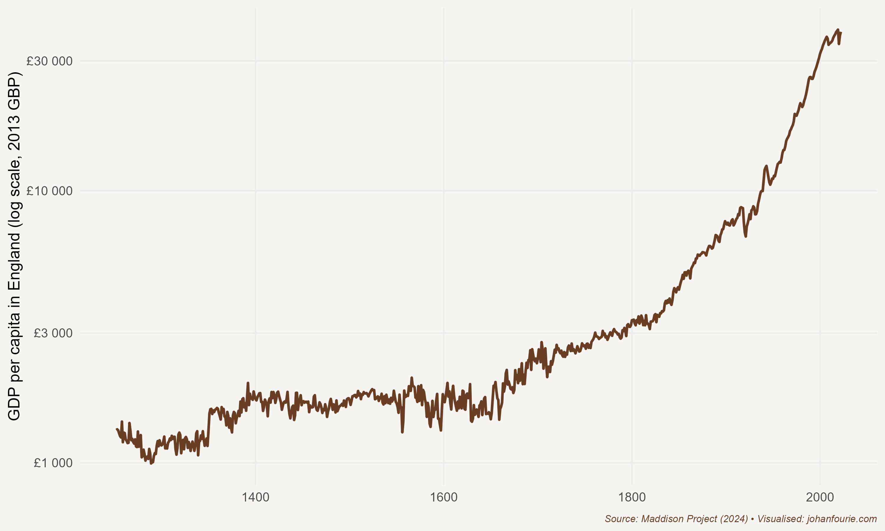

There was nothing special about James Hargreaves. Born in 1721 near Blackburn in Lancashire, England, he never learned to read. As he grew to adulthood, his only job prospect was that open to other Blackburn men of his standing: he became a hand-loom weaver who turned yarn into fabric to make a living. From his meagre salary he supported his wife and thirteen children.

Eighteenth-century England was an important textile producer. To produce fabric from wool or cotton requires three steps: carding, spinning and weaving. At the time, it usually took three carders to provide the roving for one spinner, and three spinners to provide the yarn for one weaver. To increase the amount of fabric, one needed to speed up the process early in the chain of production. And so, in 1764, the story goes, Hargreaves was working with a one-thread spinning wheel when it accidentally fell over. Lying on the floor, an idea struck him: if he placed a number of spindles upright and next to each other, he could spin several threads at once, producing far more yarn with the same number of workers. The machine that Hargreaves ultimately invented -- the spinning jenny -- held eight spindles, allowing a single spinner to be far more productive.

Although Hargreaves initially kept his invention a secret, he built a few more machines that he sold to friends. Word got out, and so the amount of yarn that was spun increased rapidly, which had the obvious consequence that its price fell. Given their already poor incomes, many spinners were not happy, and broke into Hargreaves's house and forced him to leave the place of his birth.

The lesson: technology disrupts. As economic historian Joel Mokyr remarks: 'Every invention is an act of rebellion against time-honoured beliefs and deeply entrenched customs.'[^153] Later, a whole movement -- the Luddites -- would organise protest action to destroy textile machines in an attempt to save jobs.

But Hargreaves was not the only one inventing new machines in eighteenth-century England. Richard Arkwright not only improved on Hargreaves's invention with the spinning frame, but also invented a carding engine. John Kay had invented the flying shuttle a few years earlier, improving the process by which yarn becomes fabric. These inventions were not just limited to textiles. Early in the century Thomas Newcomen invented the first commercially successful steam engine, which was further improved by James Watt, and later used by Richard Trevithick and George Stephenson in building the steam locomotive.

Why were all these new machines invented in eighteenth-century England? This is probably the most debated question in economic history -- because the answer helps us understand the origins of our prosperity. Knowing what caused these men to invent new things would explain why it was England, in the eighteenth century, that experienced an Industrial Revolution of a nature and on a scale that no other society had experienced before. Although we call it a revolution, it was very different from political revolutions like the French Revolution of 1789. This was more like an evolution, a slow shift in productivity over several centuries that ultimately lifted the living standards of everyone. Consider Figure 17.1. Per-capita gross domestic product in England was flat for much of the period before 1700. Then, slowly, we see an increase, which accelerates in the nineteenth century and, despite two world wars in the twentieth, rises to levels that would have been unbelievable to even the most optimistic person just a few centuries earlier .

Why had there not been an increase before the eighteenth century? In 1798 the English cleric Thomas Malthus proposed a theory as to why higher wages had never before resulted in a sustained increase in living standards.[^154] It was a rather pessimistic view of humanity. Whenever there is a good harvest, Malthus explained, wages will increase. Higher wages will lead to higher fertility rates which, within a few years, will lead to an increase in the supply of labour. More labourers will suppress wages to below subsistence level, and famine or conflict will inevitably follow. In short, 'the power of population is indefinitely greater than the power in the earth to produce subsistence for man'.[^155]

{.book-figure fig-alt="GDP per capita in England, 1270--2016"}

::: {.figure-caption}
Figure 17.1 GDP per capita in England, 1270--2016
:::

But, ironically, just as Malthus was writing his influential treatise about why living standards will always fluctuate around subsistence levels, England was exiting this Malthusian trap. Average wages were increasing without a concomitant increase in fertility. Why? To answer that, we have to ask another question: What enabled Hargreaves and friends to invent these new technologies that made English manufacturing more productive than any other in history?

There are at least two plausible theories. The economic historian Robert Allen believes it was because it made financial sense for them to do so.[^156] He shows that wages were exceptionally high in England relative to the price of capital. This made it profitable to use the jenny in England but not elsewhere. And since it was profitable to use in England, it was the only place where it was worth incurring the costs of developing it. To put this in economic terms: the reasons these technologies were not invented in France or India was that the rate of return to inventing it was too low there. There was no demand for these technologies outside England. We know this because even after they were invented in England, they were not adopted immediately elsewhere. Despite many supply-side differences between England and the rest of the world that can be used to explain England's exceptionalism, Allen argues it was the favourable relative factor prices in England (the price of labour over the price of capital) that gave British inventors an incentive to invent technologies that replaced expensive labour with cheap capital.

But why did England have a higher relative wage? Allen argues that it was England's higher rates of urbanisation, larger factories and abundance of coal that raised the demand for labour in manufacturing, thereby boosting wages. While this makes sense, it just shifts the question to why England had a higher urbanisation rate and larger factories and could benefit from its supply of coal, and others not. Factor prices that created a demand for labour-saving innovations, although useful in explaining the proximate causes of new technologies, do not seem to tell the entire story.

Joel Mokyr thinks so too. He argues, instead, that the real reason for the Industrial Revolution was the development of a scientific culture. By the eighteenth century, men and women in England began to understand that new innovations such as the spinning jenny could not only make them more productive workers, but that this higher productivity could translate into higher living standards for everyone.[^157] In other words, scientific advancement was the catalyst to building a prosperous society. It was, fundamentally, the widespread adoption of this idea -- this cultural belief, as Mokyr calls it -- that made the modern world possible.

How do economists think about something as fuzzy as cultural beliefs? Let us digress for a moment. Economic historians see formal institutions as the rules and laws of society while informal institutions are the social norms and customs.[^158] Culture is the information that guides this behaviour, the part of our behaviour that is not hard-wired by our genes but is learned through experiences and acquired from others. Or think of it this way: formal institutions are our hardware, informal institutions our software, and cultural beliefs are the updates we download every week.

Back to the Industrial Revolution. Mokyr argues that its origins lie in a realisation of the benefits of science, promoted by cultural entrepreneurs like Francis Bacon and Isaac Newton, and the circulation of these ideas within universities and also the newly established scientific societies and coffee houses where people would gather to discuss the latest inventions. The Republic of Letters was a long-distance intellectual community (in Europe and the United States) that shared ideas about new scientific experiments and progress freely (what we today would call open source). This community of scientists and experimenters could emerge because no European monarch was able to silence them; if they tried to, the learned men would simply move to another country. These communities were especially strong in places like Amsterdam, Paris and London where scientists were offered the most freedom to pursue their endeavours. And, of course, their work was made easier by the invention of the printing press (as we discussed in Chapter 13), which allowed scientific ideas to reach new audiences through books, journals and pamphlets. Coalescing in what came to be known as the European Enlightenment, this intellectual movement had two profound ideas: that a better understanding of nature can and should be used to improve the material conditions of humanity; and that this knowledge should not be limited to the rich and powerful, but extended to society at large.

It was in England, in particular, that these scientific networks flourished. The economic historian Gregori Galofré-Vilà show, for example, that regions in England with a relatively high number of informal networks -- such as the Freemasons' Masonic lodges, friendly societies, libraries, and booksellers − experienced more innovation as measured by new patents and exhibits at the 1851 Crystal Palace World's Fair.[^159] 'The great invention of the nineteenth century was the invention of the method of invention', Alfred Whitehead wrote in 1925.[^160] We can now add: And the diffusion of the method of invention beyond the elite.

For most of human history it was the rich and powerful who had controlled and even stifled new ideas or extracted their proceeds. The institutions this political elite set up were designed to ensure they maintained their privileged position. Innovation often threatened these privileges. But such notions of maintaining privilege were changing in Europe during the seventeenth and eighteenth centuries, and in England in particular. The political changes that led to the Glorious Revolution of 1688 moved England away from an absolute monarchy and towards a more representative government that respected basic civil rights. The bourgeoisie -- the urban middle class -- gained new freedoms, including the freedom to innovate and experiment. The image of the noble soldier was replaced by that of the thrifty entrepreneur.

Of course, this change in beliefs did not happen overnight. Mokyr notes that 'the rise of the Enlightenment in the late seventeenth century was the culmination of a centuries-long process of intellectual change among the European literate elite'.[^161] But although these new beliefs spread predominantly among the intellectual elite, it was not limited to them. As the case of the illiterate James Hargreaves illustrates, once the shift to a scientific and entrepreneurial culture had been embedded in English society, everyone could participate.

Though an openness to science and experimentation was essential, it does not tell the entire story. The new inventions needed workers who could build and make use of these new machines. In *The Mechanics of the Industrial Revolution*, the economic historians Morgan Kelly, Joel Mokyr, and Cormac Ó Gráda argues that it was the availability of high-quality artisanal skills at low wages -- in contrast to Robert Allen's thesis of capital substituting high wages -- that gave momentum to the early inventions.[^162] It worked like this: As transportation improved and English markets integrated from the late seventeenth century, regions specialised based on their comparative advantages, in what they were relatively better at. Low-wage areas with poor agricultural prospects shifted towards manufacturing. Some of this manufacturing, like nail making or textile production, offered limited technological advancement. But others, such as watchmaking and toolmaking, fostered skilled artisans. It was these artisans that played a crucial role in advancing the sophisticated machinery and manufacturing processes of the early Industrial Revolution. To prove this hypothesis, they show convincingly that industrialisation occurred in regions that began with low wages but high mechanical skills, whereas other variables, such as literacy, banks, and proximity to coal, seem largely irrelevant.

How sure are we that it was this scientific culture, and the artisanal skills to sustain it, that made all the difference, and not other factors, such as the slave trade or the expanding British Empire? As we discussed in Chapters 12 and 15, there is little doubt that the slave system benefited slave owners in Britain. Colonial officials also profited from territorial expansion and extraction. We also know that the English working classes had to endure terrible working conditions in the mines and the factories of Manchester and Liverpool. But there are at least three reasons why these explanations fail to account for the transformation in eighteenth-century England. First, timing: both the slave trade and England's imperial expansion had begun much earlier than the Industrial Revolution. In fact, slavery was abolished just as the Industrial Revolution was taking off. Second, comparisons: the British were not the only -- or even the largest -- slave-trading nation in the Atlantic. Slavery was also an ancient enterprise, yet no previous slave economy had experienced an Industrial Revolution. The same was true for territorial expansion; every ancient civilisation had expanded its borders but none had ever experienced an Industrial Revolution. Third, size: even if we add up all the labour and land extracted through slavery and colonisation, the amount would not come close to the remarkable wealth created since the early eighteenth century. Not only had the global population increased eightfold, but the income of the average *global* citizen -- which includes the people in those regions that were colonised -- had increased by a factor of 18. In fact, most economic historians would now agree that the extractive enterprises of enslavement and empire probably hurt the average British taxpayer more than it benefited them, delaying the process of industrialisation rather than buttressing or financing it. Remember from Chapter 15 how British taxpayers had to pay compensation to slave owners: the only ones to benefit from the rent-seeking and exploitation of slavery and colonialism were the privileged few, to the detriment of many, both within and outside Britain. Economic and political unfreedoms suppress rather than foster development.

The Industrial Revolution originated in a culture of scientific inquiry, bolstered by abundant mechanical skills, and accompanied by the expanding freedoms of people across all walks of life -- even an illiterate weaver from Blackburn. It marked the dawn of a new age, one that would, within two centuries, touch every part of the globe.

[^153]: J. Mokyr, A Culture of Growth: The Origins of the Modern Economy (Princeton: Princeton University Press, 2016), 19
[^154]: T. R. Malthus, An Essay on the Principle of Population As It Affects the Future Improvement of Society, with Remarks on the Speculations of Mr. Goodwin, M. Condorcet and Other Writers (London: J. Johnson in St Paul's Church-yard, 1798).
[^155]: Ibid., 13.
[^156]: R. C. Allen, The Industrial Revolution in miniature: The spinning jenny in Britain, France, and India, Journal of Economic History, 69 (4), 2009, 901--27.
[^157]: Mokyr, A Culture of Growth.
[^158]: N. Nunn, Culture and the historical process, Economic History of Developing Regions, 27 (sup-1), 2012, 108--26.
[^159]: Galofré-Vilà, Gregori. \"The Diffusion of Knowledge during the British Industrial Revolution.\" Social Science History 47, no. 2 (2023): 167-188.
[^160]: Whitehead, Alfred North (1925) Science and the Modern World. New York: The Free Press.
[^161]: Mokyr, A Culture of Growth, 339
[^162]: Kelly, Morgan, Joel Mokyr, and Cormac Ó Gráda. \"The mechanics of the Industrial Revolution.\" Journal of Political Economy 131, no. 1 (2023): 59-94.
