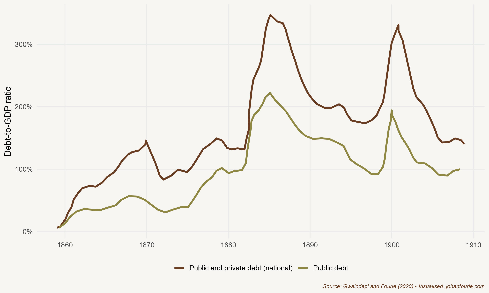

In March 1887 Robert Germond, a missionary in charge of a small mission station at Thabana Morena on the western border of present-day Lesotho, reported sad news. Basutoland, he wrote, 'produces less and finds no outlet for its products. Its normal markets, Kimberley and the Free State, purchase Australian and colonial wheat ... Basutoland, we must admit, is a poor country ... Last year's abundant harvest has found no outlet for, since the building of the railway, colonial and foreign wheat have competed disastrously with the local produce.'[^1]

Thabana Morena is about 330 kilometres from Kimberley. Then part of the British protectorate of Basutoland, the region was the breadbasket of the South African interior. Basotho farmers produced grain for the rapidly growing local markets of Griqualand West, a division of the Cape Colony whose major town was Kimberley, and the Orange Free State, one of the two Boer republics set up in the 1850s after the Great Trek. For much of the first two decades of its establishment, the Boers of the Free State were more interested in war with the Basotho than trade. The period of conflict eventually ended in 1869 when the British government intervened. The parts of Basutoland that were not lost in the conflict became a British protectorate, similar to Bechuanaland (Botswana) and Swaziland (Eswatini), which is the reason why these territories are not part of South Africa today.

The year 1869 was an opportune time for peace. Two years earlier, in 1867, a fifteen-year-old boy, Erasmus Jacobs, had picked up a pebble on a farm close to Hopetown, on the banks of the Orange River. He showed the stone to a neighbour, who believed that it might be valuable. It was sent -- by mail in a normal paper envelope -- to the Cape Colony's foremost mineralogist in Grahamstown, William Atherstone. The stone turned out to be a 21.25-carat diamond and was immediately christened Eureka. The discovery of Eureka, together with the colossal 83.5-carat Star of South Africa discovered two years later, started what has become known as South Africa's mineral revolution, a revolution that would transform the South African interior into the economic powerhouse that it remains to this day.

The Eureka and Star discoveries made big news not only locally, but especially in Europe -- a replica of the Eureka was even displayed at the 1867 Paris Exhibition. Soon thousands of hopeful locals and foreigners rushed to the plains of the interior in search of riches. One spot, a hill known as Colesberg Kopje, seemed especially promising. It would eventually become the Big Hole of Kimberley. What was at first just a hill dotted with small claims was, within five years, the second-biggest city in the colony. And it was a modern and sophisticated place: on 2 September 1882 Kimberley became the first city in the southern hemisphere to install electric lights -- beating even London to it.

This wealth in and around Kimberley also attracted migrants from other African regions hundreds of kilometres away. Most were men hoping to earn high wages within a short space of time, purchase guns and ammunition, important for both hunting and warfare, and then return to their villages. Some became property owners, buying up claims in the contested Griqualand West area. But white diggers, who held the political power in the Orange Free State and, after the region was annexed by the Cape Colony, in the Cape parliament, did not want to compete with black proprietors. By 1874 they had imposed a policy that limited black ownership, and black migrants had little recourse but to find employment as temporary diggers. A migratory labour system developed to accommodate these temporary workers, a system that suited the mine owners very well, because it meant that they did not have to pay wages high enough to allow the workers to purchase permanent accommodation or support their families. Black workers could, instead, be housed in cheap compounds. This system was quickly institutionalised, and became a feature of the diamond mines and, later, the gold mines on the Witwatersrand.

To mine successfully, though, mine owners needed more than cheap labour. As the mines deepened in search of diamonds, so the need intensified to pump water from them, and the need for capital to finance the machines that would do the pumping. Onto the scene stepped a young Englishman named Cecil John Rhodes. Only eighteen years old when he arrived in Kimberley in 1871, Rhodes, with the support of Rothschild & Sons, began renting out water pumps to miners. The profits from this operation were reinvested in buying up the claims of small mining operators. By 1888 Rhodes had created De Beers Consolidated Mines by merging his companies with those of Barney Barnato, a move which ensured a monopoly on the production and sale of diamonds in the country.

It is worth considering whom this monopolist exploited. Certainly, by the time Rhodes formed De Beers, black workers on the mines were earning wages below those of whites, staying in compounds temporarily and suffering from all the racial prejudice that was common at the time (including poorer public services). The monopoly that Rhodes created would not have helped these mine workers or improved their conditions. But a monopolist still has to pay wages in a competitive market. Economic historian Kara Dimitruk shows, for example, how Cape farmers struggled to keep workers on their farms after the discovery of diamonds: work on the diamond mines and on the new railways being built to connect the interior to the coast provided attractive alternatives.[^2] Squeezed for profits because of increasing wheat imports, farmers reacted by instituting coercive labour laws like the Masters and Servants Act, or Pass and Vagrancy laws. Using an innovative difference-in-difference econometric strategy, Dimitruk finds that regions with a higher wheat production intensity prior to 1871 were significantly more likely to lobby for these laws, resulting in approximately 1.10 additional petitions for labour laws to the Cape government each year. These regions also received additional judicial spending and were more likely to elect members of the ethno-nationalist Afrikaner Bond to parliament.

Whereas a monopolist pays wages in a competitive market, it sells its products in an uncompetitive one. What Rhodes thus managed to do was to exploit the diamond *consumer*. In a more competitive market, consumers would have had a choice in whom they might buy from, giving them the opportunity to bargain prices down. But as the only producer of diamonds, Rhodes could reduce supply and raise prices, extracting consumer surpluses. It was a lucrative venture which made the shareholders of De Beers, Rhodes especially, incredibly wealthy.

But Rhodes's ambition was not limited to making money. At the same time as he was building his mining empire, he joined the Cape parliament in 1881 and, two years after he founded De Beers, he became the prime minister of the Cape Colony. There were many benefits to being an elected member of parliament. One of them was that you could influence government's spending priorities. And the most expensive spending category -- by far -- was something in which Rhodes had a special interest: railways.

The Kimberley diamond rush created a massive demand for food and fuel in the dry and barren interior. At first this demand was supplied by transport riders, who would journey from places such as Basutoland to provide the mining town with wheat, meat and wood. Transport costs, however, were excessive -- and the prices of foodstuffs in Kimberley were often substantially above those elsewhere in the colony. This meant that the owners of the mines, people like Rhodes, had to pay both wages high enough to attract workers and exorbitant fuel prices to keep their machines running.

One way to reduce these high input costs was to find an alternative mode of transport. Although George Stephenson is credited with building the first commercially successful locomotive in England -- the *Rocket* -- in 1829, construction on the first Cape railway only began in 1859. Progress was initially slow, but once diamonds were discovered, construction accelerated rapidly. The plan was to first link the port cities of Cape Town, Port Elizabeth (today Gqeberha) and East London to Kimberley, and then build several branch lines that would link other important towns to these trunk lines. The connection between Cape Town and Kimberley was finally completed in 1885.

The railways lowered transport costs substantially, and this had a huge impact on the economy. In a paper I wrote with economic historian Alfonso Herranz, we calculate that the railways accounted for 22--25 per cent of the increase in GDP per capita in the Cape Colony in the period between 1873 and 1905. In other words, a quarter of the rise of all income in the colony can be ascribed to the railways. This, we conclude, is a 'very large share for a single investment and a clear indicator of the transformative power of the railway'.[^3]

The Cape was not the only colony where railways transformed commerce. In colonial India (modern-day India, Pakistan and Bangladesh) a massive 67,247-kilometre railway network was built by the British colonial government -- then known as the Raj -- between 1853 and 1930, connecting isolated inland districts with coastal markets. In a seminal contribution to the literature, the economist Dave Donaldson calculates that, on average, whenever a new district was connected to the network, agricultural income in that district rose by 16 per cent.[^4] The main reason for this was the reduction in trade costs, allowing inland districts to specialise in those goods they were relatively good at, and exchange the surpluses for things they were not so good at. Across the globe, from Algeria to Japan, Thailand to Uruguay, Ghana to Sweden, railways facilitated trade, buttressed industrialisation and boosted incomes.[^5]

At the Cape, however, not everyone benefited from the coming of the railways. The missionary Germond's report quoted at the start of this chapter suggests that Basotho farmers certainly did not. This was because, for political reasons, the railway lines circumvented the grain-producing districts of Basutoland. Once the trunk line between Cape Town and Kimberley was completed, it was cheaper to transport wheat produced in the region around Cape Town by rail to the mines -- a distance of 1,000 kilometres -- than over the 330 kilometres from Lesotho to Kimberley with transport riders and their carts. In fact, as Germond further notes, it was cheaper to import Australian and American wheat and send it to Kimberley than purchase Basutoland grain. Transport costs matter, a lot.

Building the railways, however, was not cheap. As I show in a paper with economic historian Abel Gwaindepi, the railways put the Cape's public finances in a precarious position.[^6] Rhodes was largely to blame. Even though the mine owners extracted much of the benefit of the reduced transport costs that the Cape Town--Kimberley rail connection brought, they did not pay any major taxes to help government fund this expenditure. The railways were, in fact, mostly financed through debt or, to put it differently, they were funded by future taxpayers. This can be clearly seen from the exorbitantly high debt-to-GDP ratio in the colony, shown in Figure 18.1.

{.book-figure fig-alt="The ratio of debt to GDP in the Cape Colony, 1860--1910"}

::: {.figure-caption}
Figure 18.1 The ratio of debt to GDP in the Cape Colony, 1860--1910
:::

Some members of parliament noticed how Rhodes and his allies used public funds to support their own mining interests. The MP John X. Merriman asserted as much in a budget debate of 1902 in response to a very optimistic speech by another member: 'But regarding the state of the prosperity of this country, my honourable friend is living in a fool's paradise ... the success alluded to by the honourable member was perhaps only in the Cape Peninsula and not in the rest of the country.'[^7]

The discovery of diamonds was only the beginning of the mineral revolution. In 1886 gold would be discovered further north, in the South African Republic (ZAR), another Boer republic. The discovery of gold dwarfed that of diamonds. Johannesburg, the city that was to grow up around the first goldfields, became the major financial capital of Africa in the space of just two decades. It remains the financial hub of Africa today.

There was one major difference between diamonds and gold. While Kimberley was part of the Cape Colony, and therefore the British Empire, the Witwatersrand was not. Rhodes's imperial ambitions and his vision of British rule from the Cape to Cairo could only be met if the South African Republic joined the British Empire. Railways again played an important part in this story. The ZAR identified an alternative port -- Lourenço Marques, today Maputo -- in Mozambique through which to export its gold. This meant that the British-controlled ports in Durban and the Cape Colony could not earn any import taxes on the goods proceeding to the large new market that arose around the gold mines. Once the Johannesburg--Lourenço Marques line was completed, and the Cape Colony lost an important source of import tax revenue, the colony's financial problems became particularly acute. There was one alternative that could both eradicate the high levels of debt and achieve Rhodes's imperial ambitions: to acquire the rich goldfields of the ZAR. But there was a problem: the ZAR was fiercely independent and did not want to lose its autonomy. The only outcome was war.

In 1899 the area we call South Africa today entered the largest and most expensive colonial war ever fought, with the two Boer republics on one side and the British Empire (including the Cape Colony and Natal) on the other. When peace was finally signed on 31 May 1902, the ZAR and Orange Free State formally became British colonies and, in 1910, were combined with the Cape and Natal into the Union of South Africa. South Africa had become one country, although one with very unequal rights, as the next chapter will explain.

[^1]: Robert Germond, 1967, Chronicles of Basutoland: a running commentary on the events of the years 183-1902. Morija, Lesotho: Morija Sesuto Book Depot. P. 469.
[^2]: Kara Dimitruk. 2024. Before apartheid: Labor Markets, Political Parties and Institutions in 19th-century South Africa. Working paper.
[^3]: A. Herranz-Loncán and J. Fourie, 'For the public benefit'? Railways in the British Cape Colony, *European Review of Economic History*, 22 (1), 2018, 73--100, at 96.
[^4]: D. Donaldson, Railroads of the Raj: Estimating the impact of transportation infrastructure, *American Economic Review*, 108 (4--5), 2018, 899--934.
[^5]: A. Herranz-Loncán, The role of railways in export-led growth: The case of Uruguay, 1870--1913, *Economic History of Developing Regions*, 26 (2), 2011, 1--32; J. P. Tang, Railroad expansion and industrialization: Evidence from Meiji Japan, *Journal of Economic History*, 74 (3), 2014, 863--86; R. Jedwab and A. Moradi, The permanent effects of transportation revolutions in poor countries: Evidence from Africa, *Review of Economics and Statistics*, 98 (2), 2016, 268--84; L. Maravall, The impact of a 'colonizing river': Colonial railways and the indigenous population in French Algeria at the turn of the century, *Economic History of Developing Regions*, 34 (1), 2019, 16--47; T. Berger, Railroads and rural industrialization: Evidence from a historical policy experiment, *Explorations in Economic History*, 74, 2019, 101277; C. Paik and J. Vechbanyongratana, Reform, rails and rice: Thailand's political railroads and economic development in the 20th century (working paper, 2021).
[^6]: A. Gwaindepi and J. Fourie, Public sector growth in the British Cape Colony: Evidence from new data on expenditure and foreign debt, 1830--1910, *South African Journal of Economics*, 88 (3), 2020, 341--67.
[^7]: Cape of Good Hope (1902) Debates in the House of Assembly, May Murray & Leger Printers 56 ST George's Street, Cape Town South Africa, p. 158.
