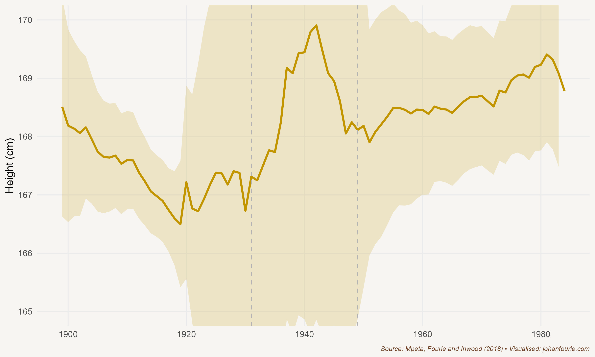

'Awaking on Friday morning, June 20, 1913, the South African Native found himself, not actually a slave, but a pariah in the land of his birth.'[^8] So begins Sol Plaatje's *Native Life in South Africa*, a book in which he appeals against one of the most consequential pieces of legislation passed by the new Union of South Africa after its establishment in 1910. The Natives Land Act of 1913 restricted ownership of land by black South Africans to a small fraction of the available agricultural land of the country. It decreed that whites and blacks were not allowed to buy land from each other. And although the Act did not have an immediate impact, as many, including Plaatje, had thought it would, it began a process of legislative segregation that would ultimately culminate in Grand Apartheid -- the division of South Africa into white and black territories or 'homelands' -- half a century later.[^9]

Plaatje was devastated by the new Act. Together with other prominent black leaders, he travelled to England to appeal to the British government. Britain could overturn legislation regarding 'native affairs' passed by the South African parliament, but the pleas from the delegation fell on deaf ears: war was about to break out in Europe, and the British government, despite its liberal convictions, feared that any attempt to overturn the legislation would create a backlash among white South Africans and jeopardise their support for Britain. While the delegation returned empty-handed, Plaatje stayed on in England, writing and teaching. It was in London, in 1916, in the midst of the First World War, that *Native Life* was first published.

Until this moment Plaatje's life had been one of upward mobility. Born on the lands of the Tswana people south of Mafeking (today Mahikeng) in 1876, Solomon Tshekisho Plaatje moved with his parents to a mission station when he was young. There he joined a mission school and quickly excelled in the classroom. When he was fifteen he became a pupil learner, teaching some of the younger students. In 1894, when he was eighteen, he moved to Kimberley, where he found work as a telegraph messenger and wrote the Cape Colony's civil service examination. He passed with the highest grades in Dutch and typing in the entire colony.

He quickly made a name for himself. He founded several Tswana newspapers in Kimberley and Mafeking and was an influential voice as an editor and journalist. The Cape Colony had a liberal franchise, meaning that any literate man who owned or rented property and earned an income above a certain threshold could vote. Plaatje, like many other black intellectuals of the time, was eager to see these rights extended to the other regions of South Africa. The Cape liberal franchise, however, was under threat. During the previous two decades legislation had been introduced in an attempt to disenfranchise many black voters; the income threshold for voter qualification, for example, had been raised and the property qualification was restricted to freehold rights, thus excluding the forms of communal tenure under which most black people lived. Political scientists Joachim Wehner and Daniel de Kadt have estimated that, without this legislation, the number of black voters could have increased by 50-75%.[^10] But though the law succeeded in reducing the potential voter base, black politicians organised to register those who were eligible; by 1909 there were still thousands of black voters on the Cape Colony voters' rolls.[^11]

Plans to extend these rights to the rest of the country during negotiations for the unification of the South African colonies were, however, met with fierce resistance by more conservative voters in the former Boer republics. To secure peace between English- and Dutch-speaking whites after a long colonial war -- a war, it should be added, that had also included black soldiers and servicemen on both sides -- the British government acceded to these demands, and accepted a franchise restricted to white voters in all parts of South Africa except for the Cape. In opposition, black leaders united around a new organisation, the South African Native National Congress, established in 1912. Plaatje became its first secretary-general; ten years later it was renamed the African National Congress. But because only whites could be elected to parliament, this new organisation had limited political influence. Instead, parliament only reflected the interests of a quarter of South Africans, an important reason why the Natives Land Bill would be tabled in 1913.

It is perhaps best to let Plaatje explain what happened in his own words:

> It is moreover true that, numerically, the Act was passed by the consent of a majority of both Houses of Parliament, but it is equally true that it was steam-rolled into the statute book against the bitterest opposition of the best brains of both Houses. A most curious aspect of this singular law is that even the Minister, since deceased, who introduced it, subsequently declared himself against it, adding that he only forced it through in order to stave off something worse.
>
> Indeed, it is correct to say that Mr. Sauer \[the minister of native affairs\], who introduced the Bill, spoke against it repeatedly in the House; he deleted the milder provisions, inserted more drastic amendments, spoke repeatedly against his own amendments, then in conclusion he would combat his own arguments by calling the ministerial steam-roller to support the Government and vote for the drastic amendments. The only explanation of the puzzle constituted as such by these 'hot-and-cold' methods is that Mr. Sauer was legislating for an electorate, at the expense of another section of the population which was without direct representation in Parliament.[^12]

In these excerpts Plaatje refers to some dissenting voices among white parliamentarians who spoke against the Act. To understand this political dynamic, it is useful to ask what the motive for the Act was -- or, put differently, in whose interests it was introduced. This has long been the subject of debate. Three reasons are often listed: segregation, labour and capital. Let's discuss each in turn.

First, there was wide agreement among whites (and even some black intellectuals) that South Africans could only be at peace if there was segregation between black and white. J. B. M. Hertzog, the most populist of the new Afrikaner politicians, even believed that there should be total separation of English- and Dutch-speaking whites, as he considered the descendants of the British and Dutch settlers two different 'races'. The Land Act, in distinguishing the areas where whites and blacks could own land, can thus be seen as one of the first policies of the Union government that would ultimately lead to segregation and, later, apartheid.

Other historians claim that white farmers' need for land and labour is key to understanding the motive for the Act. Many black farmers were sharecroppers on white farms and produced large surpluses of maize or owned sizeable herds of cattle. Some even rented out the oxen that ploughed the fields of white farmers. This interrelationship was, however, not seen as a good thing by all white farmers. While some clearly benefited from it, others were concerned that sharecropping reduced the available pool of labour. The same could be said for the mine owners, who were concerned that a prosperous class of black farmers would reduce the supply of labour to the mines. What is clear is that there was not a uniform 'white' position: some whites had an interest in preserving the existing system, while others would benefit from a policy such as the Land Act.

So why was the Act passed? The answer is, simply, politics. While almost all parliamentarians supported some form of segregation, many were against the harsh clauses of the Act. However, a small but zealous minority -- mostly Orange Free State farmers, led by Hertzog -- threatened that they would split off from the incumbent South African Party if the Act was not introduced. To keep the peace and unity within the party, most parliamentarians, including the new minister of native affairs, J. W. Sauer, an old Cape liberal, relinquished their ideological positions and accepted the extreme measures of the Act.

The lesson is clear: if all voices are not reflected in parliament, a tiny minority can easily sway policy to the detriment of those excluded. The irony is that the Act did not prevent a split in the ruling party. In January 1914 the politicians who had pushed hard for the Act created a new political party, the National Party. More than three decades later, after the South African Party and National Party had merged into the United Party, another radical breakaway minority, now called the Purified National Party, would come to power in 1948 and introduce an even more extreme version of segregation: apartheid.

South Africa, of course, was not the only country where labour demand shaped land ownership. Just as the Witwatersrand gold mines were in desperate need of cheap, unskilled labour, a topic we return to in Chapter 29, so too the world's largest silver mine, Potosí in Peru, depended on a steady supply of mine workers. One way to ensure such a supply was, of course, to pay high wages in a competitive labour market. But this is usually not the desired outcome for mine owners. They, instead, often find it easier to lobby government for legislation that forces workers off land -- either through legislation like the Native Land Act or through labour taxes.

One of the most famous examples of such a tax was the mining *mita*, a forced labour system instituted by the Spanish government in Peru and Bolivia in 1573 and abolished in 1812. The *mita* required all families on one side of a boundary to send one-seventh of their adult male population to work on the Potosí silver or Huancavelica mercury mines. Those on the other side of this (largely random) boundary were exempt from this labour tax. In one of the most cited studies in economic history, economist Melissa Dell uses an innovative technique to show the persistent effects of the *mita*: even though the tax was abolished more than two centuries ago, families living in former *mita* areas are today 25 per cent poorer compared with families living just across the artificial boundary.[^13] This is because, Dell finds, the Spanish colonial government did not allow private ownership of land in the *mita* areas. While large farms -- known as *haciendas* -- could be developed outside the *mita* areas, and roads and schools could be built that would benefit later generations, those in the *mita* areas were stuck in a cycle of poverty. Land policies have long-term consequences.

Let us return to Sol Plaatje. After the Land Act became law, Plaatje toured parts of South Africa to witness its consequences. He was appalled. One anecdote sums it up. On his travels he met a Boer policeman from the Transvaal. Plaatje asked him about the effects that the Act had had on black farmers. The policeman responded by explaining that he 'knew \[them\] to be fairly comfortable, if not rich, and they enjoyed the possession of their stock, living in many instances just like the Dutchmen'.[^14] Then he added: 'Many of these \[black farmers\] are now being forced to leave their homes. Cycling along this road you will meet several of them in search of new homes, and if ever there was a fool's errand, it is that of a \[black man\] trying to find a new home for his stock and family just now.' *Native Life* is filled with many such anecdotes.

Economic historians are not satisfied with anecdotes, though. We would like to know what the aggregate effect of the Act was on black living standards during this time. The challenge is that wages, incomes and other measures of living standards were often not recorded for a representative sample of the population. It is thus not easy to measure the effects of the Land Act or other such discriminatory policies.

{.book-figure fig-alt="Height of South African black men (older than eighteen), dated to their year of birth, 1900--1990"}

::: {.figure-caption}
Figure 19.1 Height of South African black men (older than eighteen), dated to their year of birth, 1900--1990
:::

This is where economic historians have to be creative. One possibility comes from measuring heights -- basically, how tall people were. Although this might sound strange, there is ample evidence to show that babies that are undernourished during infancy grow to be shorter than their peers. So, this means that while roughly 80 per cent of an individual's height is determined by genetics, 20 per cent is determined by environment. There is very little genetic change within two or three generations. If heights across a population vary significantly over time, it must be because of a change in their environment.

With economic historians Bokang Mpeta and Kris Inwood, I investigated the heights of black men over the twentieth century.[^15] And what we found, illustrated in Figure 19.1, supports the case that Plaatje made: living standards deteriorated significantly during the first three decades of the twentieth century. It was only in the 1930s, when gold mining expanded significantly, that babies were better nourished and there was an increase in their adult heights (measured twenty years or more after their birth).

The dispossession of black farmland, which had begun during the nineteenth century, was institutionalised with the Land Act of 1913. Black sharecroppers on white farms were forced to give up their own stocks of cattle and become labourers or move into the overcrowded reserves. Sol Plaatje documented many of these tragic personal stories -- and continued to fight for the rights of black South Africans until his death in 1932. Without political representation, however, this was an uphill battle, as black interests would always be trumped by those of white voters.

[^8]: Sol Plaatje, Native Life in South Africa (Johannesburg: Picador Africa, 2007), p. 21.
[^9]: W. Beinart and P. Delius, The historical context and legacy of the Natives Land Act of 1913, *Journal of Southern African Studies*, 40 (4), 2014, 667--88.
[^10]: Wehner, Joachim, and Daniel de Kadt. 2023. "The Tools of Voter Suppression: Racial Disenfranchisement in the Cape of Good Hope." SocArXiv. April 20. doi:10.31235/osf.io/by82s.
[^11]: F. Nyika and J. Fourie, Black disenfranchisement in the Cape Colony, c.1887--1909: Challenging the numbers, *Journal of Southern African Studies*, 46 (3), 2020, 455--69.
[^12]: Sol Plaatje, Native Life in South Africa (Johannesburg: Picador Africa, 2007), p. 24.
[^13]: M. Dell, The persistent effects of Peru's mining mita, *Econometrica*, 78 (6), 2010, 1863--1903.
[^14]: Sol Plaatje, Native Life in South Africa (Johannesburg: Picador Africa, 2007), p. 70.
[^15]: B. Mpeta, J. Fourie and K. Inwood, Black living standards in South Africa before democracy: New evidence from height, *South African Journal of Science*, 114 (1--2), 2018, 1--8.
