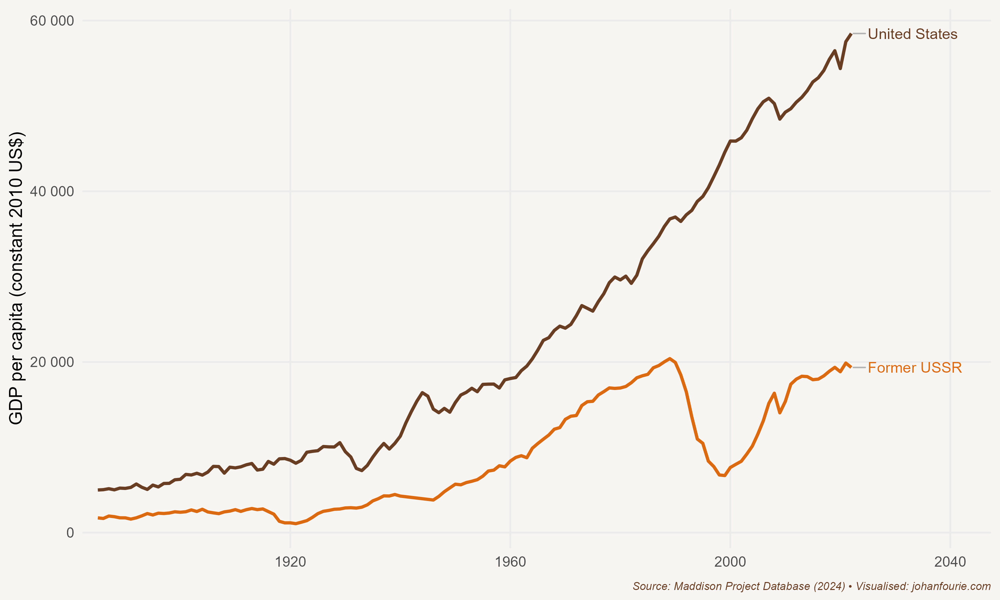
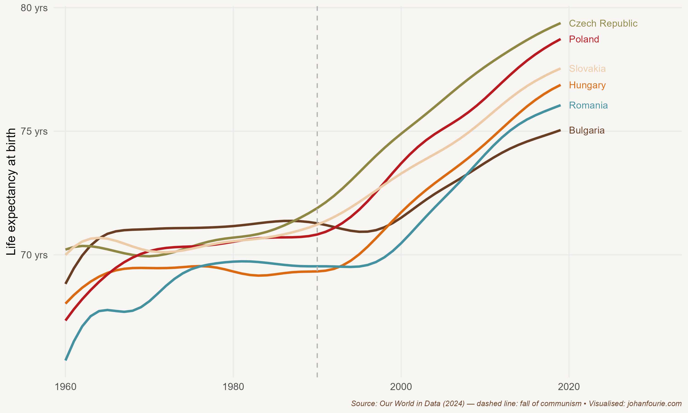

Russia is the world's largest country by landmass, covering an area of 17 million square kilometres. Canada, the world's second-largest country, is less than 10 million square kilometres in size. Today, Moscow, Russia's capital, is home to more billionaires than Paris, Zurich or San Francisco.[^45] Yet Russians are relatively poor compared with their western and eastern neighbours. The GDP per capita of Russians is only half that of Portugal, one of the poorest countries in Western Europe, and less than a quarter of that of Japan, its easternmost neighbour. Why is it that the average Russian has lagged behind, despite the nation's apparent opulence?

The answer lies in the country's economic institutions. By the beginning of the twentieth century Russia was already a poor country relative to its neighbours. It had only abolished serfdom in 1861. Serfdom, first introduced in the sixteenth century, was a system of labour coercion in which rural workers were forced to work for the landed elite, much like Western Europe's system of feudalism, which was already in decline by the time Russia imposed its version. And despite everything that befell Russia in the twentieth century, one should not lose sight of the fact that serfdom also had long-term consequences. The economic historians Johannes Buggle and Steven Nafziger have showed that households in districts where serfdom was widespread before 1861 are poorer today.[^46] Why is this? The authors explain that the mechanism through which past serfdom affects present outcomes is industrialisation: in those places with high levels of former serfdom, firms are smaller, less productive, and more likely to be involved in agriculture than in manufacturing.

But serfdom was not the only economic institution to shape Russia's economic trajectory. When the serfs were emancipated in 1861 they used their freedom to move to the cities of Moscow and St Petersburg. But work in the cities was hard to come by, which meant that many lived in worsening squalor, hungry and destitute. With no jobs at hand and little hope of the situation improving, their anger reached a tipping point.

Their anger was directed at the monarchy. Ruled by the Romanov tsar Nicholas II, Russia was not only poor, but also deeply corrupt and oppressive. In 1904 it had entered an unpopular war against the Japanese that could only end in Russia's defeat. To appease his subjects, the tsar promised reforms. These did not materialise and, as a result, in January 1905 thousands of angry workers took to the streets in protest. Imperial forces opened fire in response, wounding and killing hundreds of demonstrators. The 'Bloody Sunday massacre' sparked national protests that finally ended when Nicholas promised to set up a representative assembly, or Duma.

When the First World War broke out Russia was unprepared and ill-equipped to fight Germany's modern army. Russian casualties were greater than those of any country in any previous war. In 1915 Nicholas left the Russian capital, now renamed Petrograd (because St Petersburg sounded too German), to head the army, and left his unpopular wife Alexandra and her controversial (and somewhat mad) monk and adviser, Grigory Rasputin, in charge of running the country.

Nicholas had not learned from his earlier mistakes. Russia's losses in war, combined with an unpopular monarchy, were enough to fuel another wave of protests, this time with revolutionary consequences. The Revolution began on 8 March 1917. Thousands of hungry Russians clashed with police in the streets, demanding food and a change in government. Despite many fatalities, the protests continued until Nicholas abdicated and a new government was formed.

Thirty-six-year-old Alexander Kerensky was one of the leaders of the revolution. An excellent orator, he became minister of war in the new socialist-liberal coalition government which implemented various policies allowing free speech, trade-union formation and several other freedoms previously banned by the monarchy. As minister of war, Kerensky made the difficult decision to continue Russia's participation in the war. It proved hugely unpopular with the soldiers and workers, who had believed that the new government would end the war. By contrast, the more extreme socialist party of Vladimir Lenin -- the Bolsheviks -- promised 'peace, land and bread'. On 6 and 7 November, when it was clear that the policies introduced by the new government were not having the desired effect, the Bolsheviks, now bolstered by many disgruntled moderates, led an uprising against the Kerensky government in the second revolution of 1917 -- the October Revolution, or Red October. (It is called October because Russia was still using the Julian calendar, which was about two weeks behind the Gregorian calendar.)

Red October and the Bolshevik takeover plunged Russia into a civil war that would last three years. On the one side was the Red Army, backed by Lenin's Russian Communist Party, and on the other side was the White Army, a coalition of monarchists, capitalists and supporters of social democracy. Lenin, who was by 1918 the de facto leader of a one-party state, enacted economic policies that he believed would signal the next and final phase of economic development. Lenin's communist policies included the nationalisation of all manufacturing and industry and the requisitioning of surplus grain from peasant farmers.

Before we discuss their consequences, it helps to understand the intellectual origins of Lenin's communist policies. After he was expelled from university, Lenin had been drawn to the writings of the German philosopher Karl Marx. Marx believed that capitalism is based on the exploitation of labour. The owners of the means of production -- capitalists -- are able to extract the surplus value of this labour for their own benefit, protected by the ruling regime and by property rights. Marx believed that capitalism inevitably leads to a class struggle, a struggle that can only end in revolution whereby the means of production come to be owned by everyone equally. This will allow 'a higher phase of communist society', Marx wrote:

> After the enslaving subordination of the individual to the division of labour ... has vanished; after labour has become not only a means of life but life's prime want; after the productive forces have also increased with the all-round development of the individual, and all the springs of co-operative wealth flow more abundantly -- only then can the narrow horizon of bourgeois right be crossed in its entirety and society inscribe on its banners: From each according to his ability, to each according to his needs![^47]

Lenin believed that the Bolshevik Revolution in Russia had set an example of a workers' revolution that other countries would inevitably follow. But his optimism about collectivist policies was dashed when he witnessed the devastation they caused. Two years after the Communist Party came to power, farming and manufacturing output in Russia plummeted. While Americans were experiencing an era of unparalleled improvements in living standards -- the Roaring Twenties -- Russians were starving; in 1921 alone an estimated 5 million Russians died of famine. To prevent another revolution, Lenin announced a New Economic Policy that relaxed many of the War Communism policies, which included allowing peasants to sell their produce on the open market. While many Bolsheviks felt betrayed by these policies, scholars today suggest that the government would have been overthrown without them.

But Lenin was ill. In 1922 he appointed Joseph Stalin, a close ally, to the position of general secretary of the Communist Party. When Lenin had a stroke that partially paralysed him, Stalin became the de facto leader, making several important decisions, although still with Lenin's blessing. One was to incorporate fourteen countries, including Ukraine, Georgia, Latvia, Armenia and Kazakhstan, into a federation with Russia -- the Union of Soviet Socialist Republics (the USSR) -- which expanded Russia's influence greatly.

When Lenin died, there were multiple factions vying for power. On the left were Leon Trotsky and his supporters; on the right, holding the course with the New Economic Policy, was Stalin. Through clever alliances and appointments, by 1927 Stalin managed to gain control of the Central Committee of the Communist Party. Trotsky, his main rival, was deported in 1929.

As soon as he had gained control of the party, Stalin became more radical. He blamed the wealthier farmers (or kulaks), who had responded to the introduction of Lenin's New Economic Policy by increasing production, for hoarding grain and preventing its distribution to the cities where industrial workers needed it. He then sent the Red Army to confiscate all grain stores and arrest those farmers who opposed the measures. Violence broke out. By July 1930 more than 300,000 kulaks had been forced to flee or were shipped to penal camps in Siberia in what became known as the de-kulakisation policy. Many died on the way. With the kulaks out of the way, a policy of mass collectivisation of agriculture was introduced. Although it was officially voluntary, almost all peasants joined (for fear of punishment) or moved to the cities; between 1929 and 1931 1.4 million peasants abandoned their farms. The result was predictable: a major famine broke out in the winter of 1932--3, killing an estimated 5 to 7 million people.

The mass collectivisation of agriculture was one of two major initiatives in Stalin's Five-Year Plans. The other was the development of heavy industry and rapid industrialisation. Here Stalin achieved more success. In 1934, at the end of the first Five-Year Plan, industrial output was 50 per cent higher. Large new industrial centres were created overnight. These included Yekaterinburg with its heavy machine production facility, Magnitogorsk with its steel factory, and Chelyabinsk with its tractor plant.

Did this transformation of the Russian economy benefit the average Russian? Yes and no. Economic historian Robert Allen has calculated the changes in standards of living from 1928 to 1937 for both urban and rural Russians. He finds that those on the farms suffered: he quantifies 'the fall in living standards that occurred during collectivisation and shows that, by the late 1930s, the farm sector had only regained the consumption level of 1928'.[^48] By contrast, the 'gains in average consumption in the 1930s were confined to urban residents and, to a lesser extent, accrued to peasants moving to the cities'.[^49] He estimates that the gain for those in urban areas was about a 2 per cent annual increase in consumption.

But Stalin's apparent success in transforming the Soviet economy came at great cost. To entrench his position, Stalin executed more than 700,000 people between 1936 and 1938, including members of his own Communist Party, government officials, ethnic minorities and kulaks. The Great Purge, as it has become known, allowed Stalin to continue commanding more output with greater authority. His Five-Year Plans continued during the Second World War, when the focus was placed on the mechanisation of the military, and afterwards, when attention returned to heavy machinery and advanced industry.

{.book-figure fig-alt="GDP per capita in the United States and the USSR, 1885--1995"}

::: {.figure-caption}
Figure 23.1 GDP per capita in the United States and the USSR, 1885--1995
:::

If we consider only output, the industrialisation of the Soviet Union should be seen as a success story. From 1928 to 1970, as Figure 23.1 demonstrates, the USSR was arguably the second most successful economy in the world, after Japan.[^50] Interestingly, this growth was largely the result of improvements in labour efficiency. Capital efficiency, in contrast, severely lagged the United States, ultimately ensuring that by the 1970s, the Soviet economy diverged from its upward trajectory. Economic historian Leonard Kukić explains why this happened:

> A distinctive feature of the Soviet investment policy was the over-concentration of investment in new enterprises, compared with reconstructing the existing enterprises.104 This pattern, although natural in the early stages of industrialization, prevailed in the Soviet Union throughout the central planning period. The main reason for this is the relative ease of planning and directing new plants from the centre, compared with planning and enforcing investment in the existing plants.[^51]

Building new factories is certainly not the only measure of a successful economy. Firms need to adjust to changing consumer demands in order to remain profitable and, in so doing, increase living standards. In the Soviet Union, however, consumer goods were not the priority of the centrally planned regime. These goods -- toasters, toys, televisions -- were limited to a small elite and were generally of poor quality. While urban wages may have increased, the things these workers could buy were restricted to what the government believed was necessary for survival.

Output, therefore, is only one indicator of better living standards. Figure 23.2 plots the average life expectancy between 1960 and 2019 in former communist countries that were under the influence of the Soviet Union. The remarkable rise in life expectancy after the fall of the Berlin Wall is indicative of the poor quality of life under communism.

{.book-figure fig-alt="Average life expectancy in former Soviet-dominated communist countries, 1960--2019"}

::: {.figure-caption}
Figure 23.2 Average life expectancy in former Soviet-dominated communist countries, 1960--2019
:::

This is best summarised by an anecdote. John Steinbeck's novel about the suffering during the Great Depression -- *The Grapes of Wrath* -- was released in 1939. The following year the book was turned into a film, with Henry Fonda as the lead character, Tom Joad. Although the film is considered one of the greatest American films of all time, its reception was not welcomed everywhere, especially not by the US government, which branded it 'socialist' and 'Marxist'.

In 1948, in an attempt to bolster sentiment against the capitalist system, Stalin thought it a good idea to show *The Grapes of Wrath* in the Soviet Union. Released there as *The Road to Wrath*, it produced a response that was very different from what Stalin had imagined. Audiences were in complete awe of the fact that even the poorest of the poor in the United States were able to afford an automobile. After showing for only a couple of weeks, it was quickly pulled from the circuit. Clearly, the definition of what constituted 'poor' was vastly different between the capitalism of America and the communism of the USSR.

[^45]: According to the Hurun Global Rich List 2024: <https://www.hurun.net/en-US/Info/Detail?num=K851WM942LBU> (accessed 1 May 2024)
[^46]: J. C. Buggle and S. Nafziger, The slow road from serfdom: Labor coercion and long-run development in the former Russian Empire, *Review of Economics and Statistics*, 103 (1), 2021, 1--7.
[^47]: K. Marx, *Critique of the Gotha Programme*, edited by C. P. Dutt (New York: International Publishers, 1938 \[1875\]), 5.
[^48]: R. C. Allen, The standard of living in the Soviet Union, 1928--1940, *Journal of Economic History*, 58 (4), 1998, 1063--89, at 1065.
[^49]: Ibid., 1065.
[^50]: R. C. Allen, The rise and decline of the Soviet economy, *Canadian Journal of Economics*, 34 (4), 2001, 859--81.
[^51]: Kukić, Leonard. \"Technical change and the postwar slowdown in Soviet economic growth in a long run perspective, 1885--2019.\" The Economic History Review 77, no. 2 (2024): 644-674.
