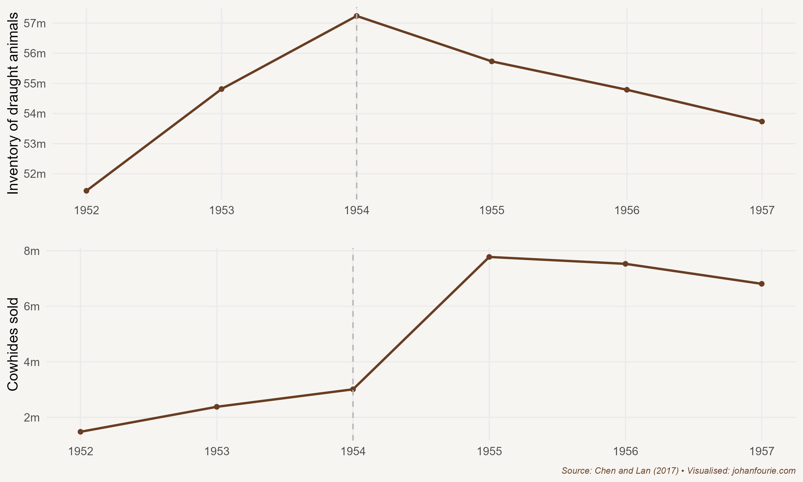

One of the most influential individuals of modern history is Mao Zedong -- or Chairman Mao. He lived an extraordinary life. Influenced by the Marxist-Leninist ideology of communism while a student at Peking University, Mao was a founding member of the Communist Party of China (CPC) in 1927. He immediately led an insurrection -- the Autumn Harvest Uprising -- that initiated a civil war with the Kuomintang (KMT), the nationalist party that then ruled China. It was a war that would last until 1949 (although interrupted by the Second Sino-Japanese War from 1937 to 1945). When Mao's CPC finally defeated the nationalists, the KMT and its followers retreated to Taiwan. This is the reason that China still does not recognise Taiwan as an independent country today.

With the defeat and exit of the KMT in 1949, Mao founded the People's Republic of China, a one-party state controlled by the CPC. He then began to implement his plans to transform the Chinese economy. Although he had many plans, the most ambitious Five-Year Plan was undoubtedly the Great Leap Forward from 1958 to 1962.

Much like Stalin in the USSR, Mao thought that grain and steel production was the key to transforming China from an agrarian into an industrial power. He had seen the apparent success of the Soviet Union's economic transformation and hoped to replicate it in China. To do this, Mao established self-sufficient communes of collective ownership and work. The plan was that these communes would be tasked by the party's Politburo, another Soviet import, to produce a certain quantity of grain and steel annually. Hard work was key, Mao believed. There was no need for luxury items or consumables: the Maoist life was one of stoic work for the greater good of the party and country.

But hard work and stoicism were not enough. Mao wanted China to industrialise and, to do that, it needed to produce steel. Whereas Stalin had built large steel factories, Mao believed that steel output could be achieved within communes by using backyard steel furnaces. Millions of workers, most with no knowledge of metallurgy, were diverted from farming to operate these steel furnaces in the communes. Instead of reliable fuel such as coal, workers used wood from trees and, once that source was depleted, began using their home doors and furniture. To meet the wildly optimistic output projections, they often used their own pots, pans and other scrap metal as inputs.

Mao invested heavily in irrigation -- these were large capital projects that lacked input from qualified engineers. Mao also imported pseudo-scientists from the Soviet Union who advocated unscientific beliefs aimed at increasing productivity and yields. One of these was close cropping -- the false idea that by planting seeds closer together, seeds of the same type would not compete against each other. Another was deep ploughing, the belief that planting seeds up to 2 metres deep would yield plants with a stronger root system.

Despite these attempts at higher farm productivity (or perhaps because of them), grain output could never reach the high targets set by the Politburo. In fact, because so many workers were diverted to work on the steel furnaces, when it was time to harvest there were not enough agricultural workers available. A lot of grain was left on the fields. Nature responded: huge swarms of locusts descended on these crops, reducing the harvest even further.

The surprising thing was that few in the upper echelons of the CPC were aware of the looming disaster. This was because of the incentives that bureaucrats faced when they had to report grain output. Because no one wanted to report declining grain output -- if they did, it would amount to an admission that the system was failing and the bearers of bad news would be replaced -- they inflated the output figures. This happened at almost every level of state bureaucracy. The figures that were ultimately reported to the Politburo were very different from what was happening on the ground. The result was that a lot more grain was requisitioned for the cities than the countryside could afford to provide.

The consequences were devastating: between 1959 and 1962 at least 30 million Chinese died in one of the largest famines ever recorded in human history. Some estimate the number of dead as high as 45 million. This happened despite the fact that China was still exporting grain -- Mao did not want to admit that there was a famine, and thought that continuing exports would help him to save face.

While the Great Leap Forward is considered one of the greatest human tragedies of recorded history, it is worth asking just which of Mao's many policies were responsible for the disaster. The economic historians Shuo Chen and Xiaohuan Lan show that one important precursor was the collectivisation movement, which ran from 1955 to 1957.[^67] This movement involved the largest transfer of property in human history: nearly 600 million farmers were organised into collectives and deprived of private ownership of land and draught animals. But while they could do little about their land, Chen and Lan show that peasants were reluctant to transfer their draught animals. As Figure 25.1 illustrates, they killed them instead.

{.book-figure fig-alt="Changes in the number of draught animals and cowhides in China, 1952--1957"}

::: {.figure-caption}
Figure 25.1 Changes in the number of draught animals and cowhides in China, 1952--1957
:::

Why would they do this? It was a matter of incentives. 'Faced with the prospect of losing the animals' future output, and unwilling to accept the low price paid in instalments that might never materialise, peasants chose to slaughter their animals to keep the meat and hide,' the authors explain.[^68] Using an innovative econometric approach, they then calculate that almost 10 million draught animals were killed in the build-up to the Great Leap Forward. This provides another reason for the severity of the famine in 1959: peasants had far fewer draught animals that might have sustained them during a famine.

But collectivisation not only changed the economic incentives, but family and social structures too. In a 2024 paper, Chen, now with Yaohui Peng and Danli Wang, find a causal relationship between increased collectivisation and domestic violence, notably the killing of fathers (or patricide).[^69] The traditional intergenerational inheritance system involved fathers controlling family wealth, with sons obligated to obey in exchange for their inheritance. However, with the collectivisation of this wealth, family conflicts increased, leading to a rise in patricide. In their dataset, over 30 percent of counties reported such cases, where fathers were publicly humiliated, abused or even killed.

Extended families mattered too.[^70] The Chinese are known for their strong clan or kinship structure; many families have genealogical records going back generations and preserve them in ancestral halls, buildings dedicated to the veneration of ancestors. In another study, Chen and her co-authors found that fewer draught animals were killed in districts with strong clans because clan leaders could force their members to give up their livestock more easily under the new collectivisation policies. Coercion within these clans could override individual incentives, seemingly leading to better outcomes. But, surprisingly, it is also in these strong clan districts, the authors show, where the effects of the famine were worse. Coercion can explain this too: under orders of the state to procure food for export, clan leaders could more effectively coerce villagers to surrender their produce, even if these ill-guided policies led to severe food shortages. Power structures that enable coercion distorts individual incentives -- with potentially disastrous social and economic consequences.

One would expect that a great human tragedy like the Great Famine would initiate change. And, for a brief moment, this seemed possible. After the famine, many of the policies that had brought about the disaster were reversed. Mao, although still chairman of the party, was not in charge anymore. He was replaced by younger, more pragmatic men. But this situation did not last long. While out of power Mao had been contemplating the idea of 'continuous revolution'. In 1966, at a policy conference, Mao returned to power by calling many of the reformers enemies of the communist cause. He then launched the Cultural Revolution, which would last until 1976, the year of his death.

While the Great Leap Forward was an economic programme of land reform, the Cultural Revolution was an attempt at cultural reform with a focus on education. Here is one excerpt from the 'Sixteen Points' accepted by the party's Central Committee in 1966:

> Although the bourgeoisie has been overthrown, it is still trying to use the old ideas, culture, customs, and habits of the exploiting classes to corrupt the masses, capture their minds, and stage a comeback. The proletariat must do just the opposite: It must meet head-on every challenge of the bourgeoisie ... to change the outlook of society. Currently, our objective is to struggle against and crush those people in authority who are taking the capitalist road, to criticize and repudiate the reactionary bourgeois academic 'authorities' and the ideology of the bourgeoisie and all other exploiting classes and to transform education, literature and art, and all other parts of the superstructure that do not correspond to the socialist economic base, so as to facilitate the consolidation and development of the socialist system.[^71]

Academics and intellectuals were especially targeted. Three-quarters of all the senior members of the Chinese Academy of Sciences in Beijing were persecuted. Yao Tongbin, one of China's foremost missile engineers, was beaten to death by a mob in 1968. Many others were sent to labour camps where they were forced to do hard labour and 're-educate' themselves by studying Mao's socialist writings.

Schools and universities closed down at the start of the Cultural Revolution. Although some schools could reopen within a few months, most universities remained closed until 1972. An estimated 17 million 'educated youths' in the cities were forced to move to the countryside to be re-educated by the peasantry in agrarian matters. This cohort of Chinese students is often called the 'lost generation'.

The one thing the Great Leap Forward and Cultural Revolution did succeed in doing was to eradicate inequality in China. The redistribution of land and the elimination of education meant that physical and human capital were, by 1976, almost equally distributed. Five economists thought it worth asking whether this eradication of inequality has had any effect on inequality in China today. Four decades after the demise of Maoism, China has returned to a system of private ownership and has gradually opened its economy to the rest of the world.[^72] The authors look at three generations -- the grandparents (who were adults before the Great Leap Forward), the parents (the 'lost generation' of the Great Leap Forward and the Cultural Revolution) and the children (who are adults today). They then use digitised archival sources, household surveys and censuses today to link grandparents, parents and children to each other. This means that they can compare the grandchildren of rich and poor grandparents to see if any differences remain despite the wealth and income of the parents having being equalised.

Their results are startling. They show that the grandchildren of the pre-Revolution elites earn 17 per cent more than the grandchildren of the pre-Revolution non-elites. So, in short, if your grandparent was rich, you are more likely to be rich today. Remember, this wealth persisted despite the fact that your parents were not rich and did not receive an education, despite the most successful policy in human history to wipe out privilege and advantage.

The economists argue that this is because of the persistence of cultural values. 'The grandchildren of former landlords are more likely to express pro-market and individualistic values, such as approving of competition as an economic driving force, and willing to exert more effort at work and valuing education as an input into success.'[^73] Despite Mao's best attempts at ridding Chinese society of any capitalist inclinations, positive attitudes towards the free market have survived. With the opening of the Chinese economy, these attitudes have been given the freedom to re-emerge and, it seems, have been pivotal in creating prosperity. China is home not only to the greatest human tragedy in recorded history, but also to the greatest human achievement: more than 850 million people have escaped poverty since the return to private ownership, education and the freedoms of a market economy.[^74] The average Chinese citizen is today at least thirteen times more affluent than his or her parents were when Mao died in 1976.[^75]

[^67]: S. Chen and X. Lan, There will be killing: Collectivization and death of draft animals, *American Economic Journal: Applied Economics*, 9 (4), 2017, 58--77.
[^68]: Ibid., 59.
[^69]: Chen, Shuo, Yaohui Peng, and Danli Wang. \"Communism and patricide: Collectivization and domestic violence in 1960s China.\" The Economic History Review, 77 (2), 2024, 703-727.
[^70]: Chen, Shuo, Raymond Fisman, Xiaohuan Lan, Yongxiang Wang, and Qing Ye. The Costs and Benefits of Clan Culture: Elite Control versus Cooperation in China. No. w32414. National Bureau of Economic Research, 2024.
[^71]: Quoted from [www.marxists.org/subject/china/peking-review/1966/PR1966-33g.htm](http://www.marxists.org/subject/china/peking-review/1966/PR1966-33g.htm).
[^72]: A. F. Alesina, M. Seror, D. Y. Yang, Y. You and W. Zeng, Persistence through revolutions (National Bureau of Economic Research working paper no. 27053, 2020).
[^73]: Ibid., 39.
[^74]: The poverty rate fell from 88 per cent in 1985 to 0.7 per cent in 2015.
[^75]: From \$1,519 in 1976 to \$19,238 in 2022. This is a conservative estimate. The World Development Indicators reported by the World Bank shows an increase from \$327 to \$11,560, or an increase of thirty-five times!
