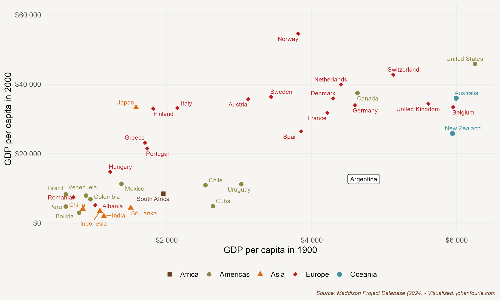

When the former university economics professor and radio host Javier Milei was inaugurated as president of Argentina on 10 December 2023, he began with a history lesson: 'In the early 20th century, we were the beacon of the West. Our shores welcomed with open arms millions of immigrants fleeing a ravaged Europe in search of a horizon of progress. Unfortunately, our leadership decided to abandon the model that had made us rich and embrace the impoverishing ideas of collectivism.'

His knowledge of history was spot-on. Argentina was one of the richest countries in the world in 1900. Its GDP per capita, according to the Maddison Project database, was \$4,583. At the same time, Germany's GDP per capita was \$4,758, Sweden's was \$3,320, and Japan's \$2,123, the same as South Africa one year earlier, while Indonesia (\$1,151) and India (\$955) were comparatively poorer.[^76]

More than a century later, in 2022, the situation was very different. While Argentina was four times as rich in 2018 as in 1900 (\$18,292 vs. \$4,583, adjusted for price increases), Germany was ten times richer in 2022 than in 1900 -- a country, one must remember, that had suffered defeat in two world wars. Sweden was fourteen times richer. Indonesia was eleven and India eight times richer. And Japan -- a country that had seen two cities destroyed by atomic bombs in the middle of the century -- was eighteen times richer. Even South Africa, with all its racial oppression and economic exclusion, was seven times richer in 2022 than in 1900.

So what had happened to Argentina?

Let's begin by understanding why Argentina was so rich by the beginning of the twentieth century. The Industrial Revolution had made England the leading industrial power in the world. Several Western European countries, such as France and Germany, soon joined this process of industrialisation and experienced a rapid growth of their manufacturing sectors and a concomitant rise in the incomes of their populations. Higher incomes meant that Western Europeans could now afford to buy more consumables, which increased demand for not only manufactured goods (i.e. the things they were producing themselves), but also primary products, from food to fur.

It was this insatiable European demand for primary products that was the reason for Argentina's rising prosperity during the nineteenth century. Argentina was, of course, not the only country to export meat, wheat and other agricultural products to Europe, earning high incomes with relatively low levels of industrialisation. Other countries such as Uruguay, Canada, South Africa, Australia and New Zealand had also achieved prosperity based on three important things: exports of primary products; the integration of these export sectors with the rest of their economies; and the prevalence of broad-based economic and political rights.

Factor endowments -- or what in Chapter 8 we simplistically called the land--labour ratio -- help to explain this export-led growth model: countries that had a lot of natural resources, notably cheap and fertile land, were more likely to produce food. By contrast, European countries had abundant labour and capital, and therefore produced manufactured goods that used these things most intensively.[^77] Argentina would thus export meat to England, and England would export equipment to Argentina.[^78] As the economist David Ricardo had already predicted in the early nineteenth century, both benefited from the trade, which is why the reduction in trade barriers resulted in large increases in prosperity on both sides of the Atlantic.

{.book-figure fig-alt="Correlations between GDP in 1900 and 2000 for various countries"}

::: {.figure-caption}
Figure 26.1 Correlations between GDP in 1900 and 2000 for various countries
:::

It was not enough, though, for a country just to have raw materials. It was important for these sectors to be integrated into the rest of the country's economy. The extraction of mineral resources, for example, could be very lucrative, but often access to such mineral wealth was limited to a small subsection of the population. The same could be true of land. Many tropical countries had incredibly fertile land and produced commodities that were in high demand in Europe, but, as Engerman and Sokoloff explained (in Chapter 10), the lack of economic and political freedoms in the exporting countries meant that the returns were limited to the elites in these societies. Brazil's exports of lucrative commodities such as sugar and coffee relied heavily on slave labour; when slavery was abolished in Brazil in 1888, Argentina's GDP per capita was more than six times larger than Brazil's.

Given its relatively equal distribution of land and political rights, Argentina was as affluent as, if not more so than, the richest European countries by the turn of the twentieth century. A visitor to Buenos Aires in 1900 'would have marvelled', writes the economic historian Alan Taylor, 'at the splendours of the city: the impressive opera house, the graceful architecture, the sophisticated railway system.'[^79] But Figure 26.1 also shows that Argentina was unique in not maintaining its advantage over the course of the next century. Taylor continues:

Today the city presents the same elegant facade, only frayed and decaying at the edges -- and the visitor marvels that the city can function at all, given its dilapidated infrastructure. The satisfaction of living in one of the richest countries in the world is now a distant memory for the Argentines, who have struggled to come to terms with their sinking status. The downfall of this once developed country is ... an enigma for students of economic history ... More compelling and mysterious examples of failure than the ruination of Argentina are hard to imagine.[^80]

So what explains the downfall?

As always, there are many theories. They all begin with measurement, as there is not even consensus on when the downfall began. Some argue that it started with the First World War, when international trade, a pillar of Argentina's economic growth, came to a halt and GDP fell precipitately. But all settler economies were badly hit by the Great War and the closing of international borders that accompanied it, so why did Australia and Canada, for example, recover but not Argentina?

Others look to the Great Depression and the Second World War as the causes of Argentina's woes. The import tariffs imposed by the Smoot--Hawley Tariff Act of 1930 in the United States, followed by similar trade restrictions from Europe, badly hurt the Argentinian economy, which needed the foreign exchange from its meat and wheat exports to pay for its manufactured imports. The Ottawa Treaty of 1932 allowed countries like Australia, Canada and South Africa to export goods at lower tariff rates than other countries, undercutting products from Argentina, which had previously relied on the United Kingdom to buy a third of its exports. A trade agreement signed in 1933 to protect its share of the British market brought little relief.

Argentina turned to the United States as a possible outlet for its goods. But as a major wheat and meat producer itself, America was a competitor in many of the industries in which Argentina had an advantage. Attempts to sign a trade agreement with the United States in 1939 failed. It also did not help that Argentina refused to declare war on the Axis powers during the Second World War.

Finding no export markets, Argentina took a new direction: it turned inwards. It began with Juan Perón and the Perónist movement he founded. First elected president in 1946, a year after the end of the Second World War, at a time when Argentina's economy was struggling, the hugely popular Perón -- aided, it must be said, by the popularity of his wife, Eva Perón, who was portrayed by Madonna in the movie *Evita* -- introduced policies that gave a more active role for the state in the economy. To support the working class, his primary support base, he expanded social programmes and provided financial support for both labour unions and industrialists -- measures which were aimed at redistributing income from the export (rural) sector to the industrial (urban) sector. Import-substitution industrialisation (or ISI), Perón believed, was the tool to make this happen, replacing imports of expensive manufactured goods with locally produced ones.

Perón would soon find intellectual support for this policy shift. In 1950 two economists, the Argentinian economist Paul Prebisch -- who, ironically, had been forced to resign as head of the Argentinian central bank when the Perónists took over -- and a German economist working at the United Nations, Hans Singer, separately developed a theory that would come to be known as the Prebisch--Singer hypothesis.[^81] The theory proposes that the price of primary commodities, such as the meat and wheat that Argentina was exporting, will decline relative to the price of manufactured goods over the long run, causing the terms of trade of primary-goods-producing economies, such as Argentina, to deteriorate. The terms of trade is the ratio of export prices over import prices: basically, it measures how much imports an economy can buy for a unit of exports. If the price of exports rises more slowly than the price of imports, then the terms of trade will weaken. When Prebisch and Singer looked at trade data since the 1880s, they realised that this partly explained Argentina's weakening economic performance in the twentieth century, and they derived a general theory from it.

The Prebisch--Singer hypothesis did not offer a solution that would deal with the declining terms of trade. But Perón had a plan: his government would force structural reform through intervention in the markets.[^82] Even before Prebisch and Singer had developed their theory, Perón implemented a Five-Year Plan to push Argentina away from primary-sector exports towards industrialisation. A new agency was established, for example, that would monopolise all agricultural exports by buying them in the local market and selling them abroad. Another new agency -- the Secretariat of Industry and Commerce -- imposed price controls for certain manufactured goods in the erroneous belief that this would ensure their availability. The Perónist government also supported industrialists by provided cheap loans (made possible after nationalising the central bank and bank deposits) and granting favourable exchange rates for raw materials and equipment imports.

Perón's interventions did have positive consequences for the poor. Workers received better protection than before and incomes increased, at least for a while. Perón saw himself as Argentina's Franklin Roosevelt; in his final speech as part of his presidential campaign in 1946, he quoted at length from Roosevelt's second inaugural address.

But his plans to industrialise the economy failed. By the end of the 1940s agricultural exports had collapsed. This caused a massive balance of payments crisis; put another way, Argentina's capacity to import halved between 1948 and 1952. Perón and his government tried to find a solution, and in the second Five-Year Plan agricultural exports were prioritised again. But it was too late. Three years later, in 1955, Perón's government was overthrown by the military and the Perónist party banned.

The ban did not end Perón's legacy of import-substituting industrialisation. The first open elections after the military coup of 1955 would only be held in 1973. Juan Perón was again elected, although he would die the next year, and was succeeded by his wife, who was deposed in a military coup two years later. In 2003 the Perónist Néstor Kirchner was elected president, followed by his wife, Cristina Fernández de Kirchner, from 2007 to 2015. The Kirchners' economic and trade policies mimicked their party's founder: nationalisation, large social-welfare programmes, opposition to free-trade agreements, and discouragement of importing goods that were also produced in Argentina.

But these populist policies, as before, had one predictable outcome: they burdened Argentina with huge debt obligations. Mauricio Macri, a former businessman turned politician, was elected president in 2015 to fix this. To do so, Macri implemented several reforms, including lifting exchange controls and opening the economy, but he could never keep the budget deficit down, and investors continued to distrust the ability of the Argentinian government to repay its debt. As a consequence, the peso collapsed and inflation soared, and Macri lost the 2019 election, again to a Perónist.

In 2019 Alberto Fernández was elected president, with Cristina Fernández de Kirchner, the former president, as vice president. They won the election on promises of reintroducing the spending that Macri had been forced to slash. Six months later, in May 2020, Argentina defaulted on its debt, for the ninth time in its history. One of the richest countries in the world at the start of the twentieth century was insolvent again, its current middle-income status evidence that the road to prosperity is not without detours.

Fast-forward to December 2023. Javier Milei faced what to many seem like insurmountable challenges: lack of support in Congress, a 200% inflation rate, rising poverty and a polarised population. 'Today we bury decades of failure, infighting, and senseless struggles, struggles that only succeeded in destroying our beloved country and leaving us in ruins. Today a new era begins in Argentina, an era of peace and prosperity, an era of growth and development, an era of freedom and progress', he announced in his speech.'

Milei's first decree was to lower the number of government ministries from 18 to 9. In the first few months of his presidency, he implemented what he describes as 'shock therapy', a combination of fiscal reform, monetary stabilisation and deregulation. Inflation fell rapidly; in April 2024 he announced a first quarter budget surplus for the first time in almost two decades.

Argentinians may soon have something to smile about.

[^76]: Because of the South African War, I use the GDP per capita estimate of South Africa in 1899 (so as not to overstate South Africa's twentieth-century economic performance).
[^77]: In international trade this is known as the Heckscher--Ohlin trade theory.
[^78]: In a 2019 paper published in *Cliometrica*, Vicente Pinilla and Agustina Rayes show convincingly that Argentina had a successful agro-export sector because it offered a diverse basket of products to the different European and American countries that consumed them. In other words, grains and meat, which became stronger after the final decade of the nineteenth century, joined the livestock products that Argentina traditionally exported: V. Pinilla and A. Rayes, How Argentina became a super-exporter of agricultural and food products during the First Globalisation (1880--1929), *Cliometrica*, 13 (3), 2019, 443--69.
[^79]: A. M. Taylor, External dependence, demographic burdens, and Argentine economic decline after the Belle Epoque, *Journal of Economic History*, 52 (4), 1992, 907--36, at 908.
[^80]: Ibid., 908.
[^81]: J. F. Toye and R. Toye, The origins and interpretation of the Prebisch--Singer thesis, *History of Political Economy*, 35 (3), 2003, 437--67.
[^82]: C. Belini, Industrial exports and Peronist economic policies in post-war Argentina, *Journal of Latin American Studies*, 44 (2), 2012, 285--317.
