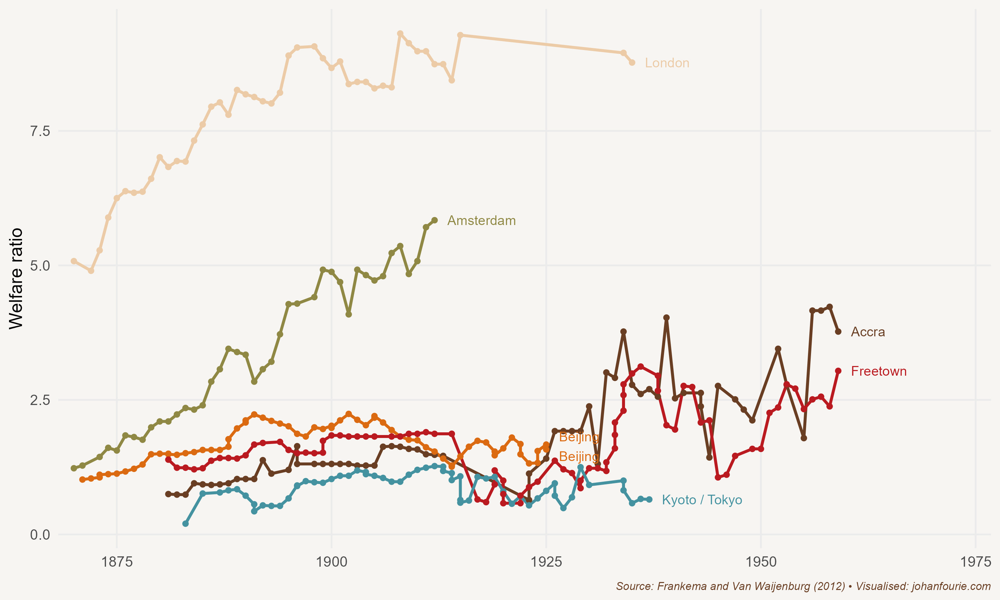

When Milton Obote was inaugurated as Uganda's first prime minister in 1962, the future of the country that Winston Churchill had called 'the Pearl of Africa' looked brighter than ever. Independence from Britain had come with a carefully constructed federal constitution that gave some internal autonomy to the ancient kingdom of Buganda and its king, while Obote and his government could still maintain effective control of a country with diverse ethnic and interest groups.

Independence brought democratic institutions at a time when the economy was booming. The 'cash crop revolution' involving cotton and coffee that started with the construction of the railway from Uganda to the Kenyan port at Mombasa in 1901 had spread rapidly during the following half-century. In the first decade of independence, coffee exports more than doubled.[^83]

But growth was not just a consequence of cotton and coffee. In the more fertile southern region of the country bananas were the staple crop, providing a decent standard of living to smallholder farmers. Uganda was also producing some of the world's highest-quality tea. Manufacturing was small but growing; it reached 6 per cent of GDP in 1965 and 7.3 per cent in 1971. The transportation system, including the railways, roads, airports and the steamer services that ran on Lake Victoria and the Nile River, was considered one of the best in sub-Saharan Africa. Copper had been discovered, and the abundant supply of water provided the means for water-powered electricity generation. GDP growth reflected the optimism that Ugandans experienced: real GDP growth averaged 4.8 per cent per year between 1965 and 1970.

The relative prosperity had also allowed for an expansive social-welfare programme. Uganda had an extensive health-care sector and had pioneered nutrition programmes for the poorest. Investment in primary education ensured that school class sizes were substantially below the African average.

Yet the optimism of the years that followed independence, as in many other regions of Africa, soon gave way to pessimism and, sadly, tragedy. Less than five years after he became prime minister, Milton Obote published a new constitution, arrested several ministers and suspended the National Assembly.[^84] When leading members of the Buganda Kingdom tried to resist, he sent the army to attack the palace, forcing the king to flee to London. Hundreds of Baganda were detained without trial; in 1967 the kingdom of Buganda was abolished and divided into four administrative units.

Within five years Uganda had moved from a liberal democracy to a one-party state. Obote ruled by decree, with the support of the army and a new secret service, stocked with members of his own ethnic group. But Obote had underestimated his army commander, a man of enormous physical stature who was a former nine-time national heavyweight boxing champion and a rugby player, someone popular within army ranks. When Obote flew to Singapore in 1971 to attend a Commonwealth meeting, Idi Amin seized power.

Amin was initially welcomed as president. He freed political prisoners, stressed the temporary nature of military rule, promised new elections, and flew across the country to meet and listen to chiefs and elders. Yet Amin, who was largely illiterate and had no predilection for matters of government, was deeply insecure. He trusted no one and reacted to criticism in the only way he knew: by getting rid of those he thought were trying to oust him. Thousands of soldiers and police officers disappeared, killed by death squads that Amin had assembled, their bodies thrown into the Nile in the hope that crocodiles would destroy any evidence. Many simply washed up on the river's banks.

As the killings intensified Amin's popularity waned. In reaction, Amin turned on the wealthy Indian community that controlled much of the country's trade and industry. In August 1972 he ordered them to leave Uganda within three months; an estimated 50,000 Indians out of a total of 80,000 left for the United Kingdom or Canada or returned to India. With their assets seized by Amin's army, industry collapsed; government revenues fell by 40 per cent within the year.

Amin's behaviour became increasingly erratic. He bestowed on himself the title 'His Excellency, President for Life, Field Marshal Al Hadji Doctor Idi Amin Dada, VC, DSO, MC, CBE, Lord of All the Beasts of the Earth and Fishes of the Seas and Conqueror of the British Empire in Africa in General and Uganda in Particular'. It is no wonder that *Time* magazine, in a 1977 piece, labelled him 'the Wild Man of Africa' and described him as a 'killer and clown, big-hearted buffoon and strutting martinet' -- a description, to be fair, that would be equally true of Belgium's King Leopold II after his atrocious exploitation of the Congo almost a century earlier.[^85] Amin also enjoyed being addressed as the 'Last King of Scotland', having apparently defeated the British. In a 2006 movie of the same name, Forest Whitaker portrays Amin, a performance which won him an Oscar.

Uganda was not the only African country to suffer at the hands of a tyrant. Across the continent the euphoria of independence soon gave way to military coups and, ultimately, the rise of dictators. Kwame Nkrumah of Ghana, the first African country to become independent, in 1957, was deposed by a military coup less than ten years later, in 1966. More coups would follow in Ghana in the ensuing decades. Nigeria, which became independent in 1960, experienced eight coups between 1966 and 1993. In 1966 the eccentric and ruthless Jean-Bédel Bokassa became the second president of the Central African Republic, formerly a colony of France, by overthrowing the incumbent, David Dacko. In 1976 he anointed himself Emperor of the Central African Empire, only to be ousted three years later. In the Democratic Republic of the Congo, which had gained independence from Belgium in 1960, Mobutu Sese Seko took power in 1966 after a second coup. He would rule until 1997. In Sudan, Omar Hassan Ahmad al-Bashir took power in 1989 and ruled until 2019. The long-time ruler of one of the last countries to gain independence, Robert Mugabe of Zimbabwe, was deposed in a coup in 2017, ending thirty-seven years of rule. Even in countries with no colonial presence, instability was common. Samuel Doe of Liberia overthrew William Tolbert in 1980 in a military coup, only to be deposed himself ten years later by Prince Johnson. Ethiopia had three coups in the 1970s alone.

It would be too easy, however, to blame the misfortunes of independent Africa on the rise of 'bad men' such as Amin, Bokassa, Sese Seko, al-Bashir and Mugabe. Weak political institutions certainly contributed to the malaise. Having maintained the former colonial boundaries, the newly independent African states had to deal not only with ethnic divisions -- divisions that had often been amplified during the period of colonial rule -- but also an ill-equipped and inexperienced state bureaucracy and an electorate illiterate in national politics. Besides, it took centuries of conflict for democratic institutions to emerge in Europe: why should we expect the process to be any less painful in Africa?

But economics played just as big a part in Africa's post-independence misfortunes as politics. In the years after the Second World War, the last phase of colonial rule, world prices for African commodities such as cocoa, cotton, coffee and copper soared to new levels. In Ghana, just as in Uganda, African smallholder farmers profited, using the colonial railways to ship their produce to international markets. Oil prices were low, at less than \$2 per barrel, and debt was cheap. Even nature played along: good rains fell throughout the 1950s and early 1960s, boosting agricultural output. In 1961 Lake Chad and Lake Victoria reached their highest levels in the twentieth century.

Economic growth was also reflected in living standards. Economic historians Stephen Broadberry and Leigh Gardner calculate GDP per capita for eight Anglophone African countries since 1885.[^86] They find that per capita incomes 'were above subsistence by the early twentieth century, on a par with the largest economies in Asia until the 1980s'. This is best reflected in wage data. As Figure 27.1 demonstrates, while the real wages of an East African unskilled labourer were on a par with those of labourers in major East Asian cities, West African urban labourers achieved welfare ratios -- a ratio of household income to the poverty line -- two to three times those of their Asian counterparts.[^87] These high incomes inspired confidence in future growth. In *The Economics of African Development*, published in 1967, the World Bank economist Andrew Kamarck wrote: 'I am confident that for most of Africa the economic future before the end of the century can be bright.'[^88]

{.book-figure fig-alt="Welfare ratios calculated for various cities across the world, 1880--1960"}

::: {.figure-caption}
Figure 27.1 Welfare ratios calculated for various cities across the world, 1880--1960
:::

When independence came the new leaders had to decide which economic strategies to adopt. Put yourself in the shoes of Kwame Nkrumah in 1957. Amidst the Cold War there were basically two options: the free-market capitalism of the West, which had less than three decades earlier suffered one of the largest depressions in history, or the communism of the Soviet Union, which had been rapidly transformed from an agricultural society into an industrial powerhouse (news of Stalin's atrocities were slow to emerge). For an ambitious leader, the socialist state-led approach seemed far more attractive.

The intellectual support for this came from a new subdiscipline of economics -- development economics -- and its disciples. Based on modernisation theory, development economists were critical of the laissez-faire approach of classical economists and in support of a larger role for government in the economy. One of its main proponents, the West Indian-born and later Nobel Prize-winning economist W. Arthur Lewis, was appointed as senior economic advisor in Nkrumah's new government. What was needed, Lewis and Nkrumah agreed, was a 'big push' strategy to industrialise, a Ghanaian Five-Year Plan. It was akin to the policies that, as we saw in the previous chapter, Argentina and other Latin American countries adopted.

But there was an important difference between Nkrumah and Lewis's views. In the West Indies, Egypt and India, Lewis argued, surplus labour could be redirected to the manufacturing sector. The constraint to development in those countries was inadequate investment in manufacturing.[^89] Because Ghana was a labour-scarce country, there was no surplus labour. The solution, Lewis proposed, was to increase agricultural productivity first, so that surplus labour would be created to allow manufacturing to take off.

The point is that Nkrumah and Lewis had different types of 'big push' investment in mind. Both agreed to use the profits of agricultural marketing boards to cross-subsidise industrial investments. The marketing boards had been instituted to ensure a safety net for farmers -- the boards would buy produce from cocoa farmers at fixed prices and would sell it on international markets at world prices. With the rise in world prices, though, marketing boards often did not increase the price they paid to farmers, generating huge revenues for the government. Lewis believed these revenues should be used to raise agricultural productivity. But his advice was unacceptable to the ambitious Nkrumah, who was determined that black Africa's first independent country would be a shining star for the rest of the continent.[^90] Nkrumah, instead, wanted large projects that would support industrialisation. His flagship project was the Akosombo Dam on the Volta River, for example, creating the third-largest man-made lake in the world and supplying hydroelectric power to both Ghana and neighbouring Benin and Togo.

The Volta River Project, finished a month before Nkrumah was deposed in a coup, was the exception. Most of his projects had political rather than economic motives and included military spending and various vanity projects that were often rampantly corrupt. After fifteen months, in 1958, noting irreconcilable differences in approach, Lewis quit as adviser. Nkrumah attempted to explain his decisions in a letter: 'The advice you have given me, sound though it may be, is essentially from the economic point of view, and I have told you, on many occasions, that I cannot always follow this advice as I am a politician and must gamble on the future.'[^91]

Using the profits of farmers to build factories failed to bring prosperity. Just as in Latin America, African markets were too small to realise the economies of scale necessary to make factories profitable. The trouble was compounded by African leaders borrowing prodigiously to fund their 'big push' strategies. All this borrowing could be repaid as long as their economies were growing, but by the 1970s growth began to falter. Global stagnation, the end of the Bretton Woods monetary system and an international oil crisis not only reduced commodity prices but also contributed to Africa's debt spiralling out of control. By the 1980s many African countries were close to insolvent, forced to approach the International Monetary Fund (IMF) and enter structural adjustment programmes. These reforms included severe budget cuts, improving monetary policy to reduce inflation, removing restrictions on international trade and lifting subsidies and state controls. The reforms came at a great cost, especially those that cut expenditure on education and health. This is why many Africans still not only consider these programmes unsuccessful -- growth did not return immediately -- but also see institutions such as the IMF and World Bank as evil. We return to the consequences of these reforms in Chapter 35.

The two decades between 1975 and 1995 are generally considered to be Africa's 'lost decades'. By 2000 the optimism about African prosperity had withered, replaced by a deep pessimism that Africa would never be able to grow -- that it was a hopeless continent. That is a false belief. Half a century ago Africans were enjoying standards of living that were on a par with or often above those of their Asian counterparts. But three decades of dismal performance have meant that Africa now sits at the bottom of the global income-distribution tables.

This suggests that there is hope. If Africa's poverty is a consequence of the interaction of weak political institutions and poor economic policies following independence, combined with colonial policies that generally limited political and economic freedoms, then the happy message is that political institutions and economic policies can also be used to alleviate it. The point is that there is nothing inherent in Africa that predestines its people to perpetual poverty. The economic historian Morten Jerven summarised this idea best: 'The search for a root cause of African underdevelopment is futile, and ... such a search is based on asking the wrong question. There is a crucial difference between approaching the conundrum of African growth by asking why there has been a chronic growth failure and asking why African economies have sometimes grown and then regressed.'[^92]

Asking the right question, as I pointed out in Chapter 1, is indeed a perspective that economic historians can offer. In Chapter 35 we turn to the surprising turnaround that has happened in Africa's fortunes, just when the rest of the world had given up.

[^83]: M. de Haas, Measuring rural welfare in colonial Africa: Did Uganda's smallholders thrive? *Economic History Review*, 70 (2), 2017, 605--31.
[^84]: M. Meredith, *The State of Africa: A History of the Continent since Independence* (New York: Simon & Schuster, 2011).
[^85]: Time Magazine, March 7, 1977. Accessed online at http://content.time.com/time/subscriber/article/0,33009,918762,00.html
[^86]: S. Broadberry and L. Gardner, Economic growth in Sub-Saharan Africa, 1885--2008: Evidence from eight countries, *Explorations in Economic History*, 83, 2022, 101424.
[^87]: E. Frankema and M. van Waijenburg, Structural impediments to African growth? New evidence from real wages in British Africa, 1880--1965, *Journal of Economic History*, 72 (4), 2012, 895--926.
[^88]: Andrew Kamarck. The Economics of African development. New York: Frederick A. Praeger. P. 248.
[^89]: W. A. Lewis, Economic development with unlimited supplies of labour, *Manchester School*, 22 (2), 1954, 139--91.
[^90]: E. Akyeampong, African socialism; or the search for an indigenous model, *Economic History of Developing Regions*, 33 (1), 2018, 69--87.
[^91]: R. L. Tignor, *W. Arthur Lewis and the Birth of Development Economics* (Princeton: Princeton University Press, 2006), 173.
[^92]: M. Jerven, African growth recurring: An economic history perspective on African growth episodes, 1690--2010, *Economic History of Developing Regions*, 25 (2), 2010, 127--54, at 147.
