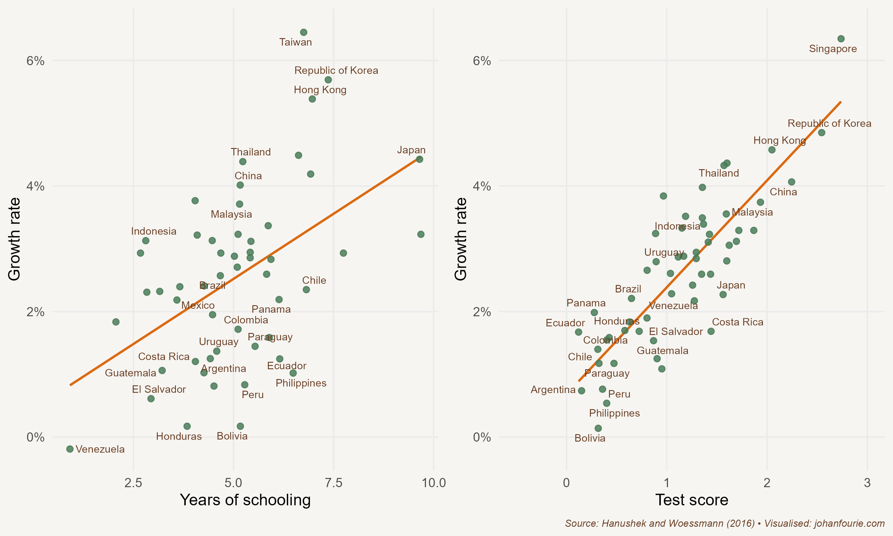

On 9 August 1945 the United States dropped an atomic bomb on Nagasaki, a port city of Japan. Sumiteru Taniguchi was sixteen at the time, delivering post about a mile from ground zero. The force of the explosion threw him from his bicycle, melting his cotton shirt and searing the skin off his back and one arm. But Taniguchi survived, one of the fortunate few who did. Many thousands in Nagasaki and Hiroshima, the first city to be bombed, were not as fortunate. Japan surrendered six days later, thereby ending the Second World War.

Just like Taniguchi, who would become a lifelong advocate for the prohibition of nuclear weapons, Japan was left badly scarred after the war. But to understand the extent of the devastation, it helps to briefly discuss what came before the Second World War.

In 1872, the year that its first railway was built, Japan was still relatively poor; its citizens had roughly the same income as those of Peru, Poland and Portugal. The Japanese were poorer than Venezuelans or South Africans, and about half as rich as the French. The average American or Briton was about three times as rich as the average Japanese. But the transformation of the Japanese economy was already under way. It began in 1853 when US warships arrived in Japan to sign a treaty that would open the country to trade. Japan had been ruled by a military government, closed off to the outside world for more than two centuries. It had believed, much as the Chinese did a few centuries earlier, that outside influences, particularly Christian missionaries, would threaten the unique Japanese way of life. But when Commodore Matthew Perry sailed into Edo Bay with his warships, the Japanese realised that their traditions and technologies were outdated. One Japanese elder reflected on their conundrum, saying: 'If we take the initiative, we can dominate; if we do not, we will be dominated.'[^117]

Those pushing for reform won. The goal of the Meiji Restoration -- meaning 'enlightened rule' -- was to adopt modern systems and technologies from the West while preserving traditional values. On his second visit, in 1854, Perry brought a miniature steam locomotive to Japan. Eighteen years later the Meiji emperor opened the first railway between Tokyo and Yokohama. Japan did not only import new transport technologies: the merchants also introduced rugby to Japan, before the sport had even arrived in France, New Zealand or South Africa.

Japan's late nineteenth-century industrialisation was not just a consequence of imported institutions. Innovative new domestic institutions like the *zaibatsu* -- large, family-owned conglomerates -- were responsible for investing in capital-intensive technology. They could afford this capital-intensive approach because of their size (which gave them economies of scale), ownership structure (which allowed them to invest for the long run), diversified holdings (which spread the risk), high levels of education, and access to minerals such as coal.[^118]

By 1939, then, on the eve of the Second World War, Japan's international ranking had changed. Japanese incomes were now above those of Peru, Poland and Portugal. It had surpassed Venezuela and South Africa. Britain was only twice as rich. Japan had become an industrial power.

But the war, and the two atomic bombs to end it, wiped out much of that progress. Industrial production declined to just 28 per cent of its pre-war level. Japanese incomes in 1945 were equal to what they had been on the eve of the First World War. Three decades' worth of economic growth had been obliterated.

Yet in what has become known as the 'Japanese economic miracle', industrial production did not just bounce back, it accelerated. By 1980, one generation after the bombs had flattened the two cities, Japanese incomes were now three times as large as incomes in Peru, and twice as large as incomes in Poland. Japanese GDP per capita was above the GDP per capita of Britain. And although Japan was the first, it was not the only East Asian country to experience an 'economic miracle'. South Korea and Taiwan soon followed, as well as the city-states of Hong Kong and Singapore -- all countries collectively known as the Asian Tigers. By the twenty-first century Japan and the Asian Tigers had become high-income countries, their citizens attaining standards of living on a par with or even above those of Western Europe or the United States. At the same time, other countries that had been classed as developing in the middle of the twentieth century (as Japan had once been), including those in Latin America, Africa and South Asia, struggled to escape their middle-income-country status. In some cases they had even regressed. The Asian Tigers, joined by Thailand, Malaysia and, ultimately, China, came to form the fastest-growing -- and poverty-eliminating -- region worldwide.

What explains East Asia's remarkable transformation? The textbook explanation is straightforward: while other developing countries were looking inward -- adopting the import-substitution policies we discussed in Chapters 26 and 27 -- East Asian economies, despite some differences in timing and intensity, were generally looking outward. With no real natural resources to speak of, East Asia's economies had to turn to manufacturing. The formula was simple: import television sets, toasters and toys. Take them apart, copy and adjust the designs, and then produce them at a fraction of the import price for the export market.[^119] Although initially applied predominantly to light manufacturing, the formula soon expanded to heavy industry, including the manufacture of motor vehicles.

But textbook explanations are sometimes oversimplified. Not everyone agrees with this export-oriented interpretation of East Asia's success. Yes, argues economist Dani Rodrik, those countries did see a stellar increase in exports, but they started from such a small base that exports alone cannot explain the miracle.[^120] Rodrik, instead, attributes success to a coherent investment strategy that was implemented by the state: 'In Korea the chief form of investment subsidy was the extension of credit to large business groups at negative real interest rates. In addition to providing subsidies, the Korean and Taiwanese governments also played a much more direct, hands-on role by organizing private entrepreneurs into investments that they may not have otherwise made.'[^121]

Take the vehicle-manufacturing sector. In 1962 the South Korean government announced an automobile industry promotion policy. Foreign producers could only manufacture cars in Korea if they had a local partner. In the same year Japanese Mazda entered into a joint venture with Kia. The predecessor of SsangYong began operations in 1963. And Hyundai began as a partnership with Ford in 1968. But private-sector investment could only happen if cars could be produced profitably. This required cheap inputs. Here, too, government action helped. While car parts had to be imported initially, these imports were soon replaced with the products of local manufacturers, often also established with state support.[^122]

State intervention could range from industrial policies such as devaluing or unifying currencies, providing government loans and subsidising exports to creating consultative business councils, building an efficient bureaucracy and stamping out corruption. Why, then, were these state interventionist policies successful in the East and not elsewhere? The economist Ha-Joon Chang gives three reasons:

> The first reason is policy realism. Although the final goals were often ambitious, the choice of priority sectors was made only after careful consideration had been given to things like world market conditions and the state of local technological capabilities. The second is policy flexibility. Like any other businessman trying to move into new sectors, East Asian policymakers often made mistakes. However, they were quite willing to acknowledge mistakes and re-direct their policies if they did not work.[^123]

The third reason is autonomy. East Asian states' success in industrial policy was due to their high autonomy of politicians, often autocrats, which enabled them to withdraw support when necessary and prevent permanent unproductive subsidies. 'The point is that, as the state-created incentives dampen the disciplinary forces of the market, the success of an industrialisation strategy based on such incentives critically depends on the willingness and the ability of the state to discipline the recipients of such supports.' Greater autonomy allowed the state to promote private sector interests without being captured by them.

This, of course, was unlikely to happen in the more democratic, postcolonial regimes of Latin America and Asia, where an expectant population, now liberated from the yoke of colonialism, demanded rapid improvements in living standards. It is exactly for this reason that some scholars are sceptical of the replicability of such industrial policies today, particularly in African countries, as we shall see in Chapter 35. These same industrial interventions, in their attempt to boost industrial output, also distorted markets, raised prices, lowered real wages and limited consumer choice; workers ultimately 'paid' for the miracle by temporarily forgoing higher living standards, just as workers in England did during the Industrial Revolution. The only reason this was possible, the argument goes, is that there was consensus among the political and economic leaders to sacrifice the short-term well-being of their citizens for long-term development. With industrial policy back on the agenda today, these are important questions to ponder.[^124]

It is further complicated by the fact that not all East Asian miracles relied on industrial policy for its success. Hong Kong, a Crown colony of Britain, is an example of how state intervention was not necessary at all. In contrast to South Korea and Taiwan, the free market was allowed to operate relatively unchecked in Hong Kong. In 1960 the average per capita income of Hong Kong was 28 per cent of Britain's. By 1996, a year before Hong Kong officially reverted to Chinese sovereignty, the average resident of Hong Kong, despite its population increasing tenfold from 600,000 to ,000,000, was 37 per cent more affluent that the average Briton. The economist Milton Friedman frequently used Hong Kong as a case study for the success of free enterprise and free markets.

Whether or not you believe industrial policy is necessary and sufficient to explain the East Asian miracle, one form of state intervention that is generally agreed to have contributed substantially is education. Two economists, Erik Hanushek and Ludger Woessmann, published a paper in *Science* in 2016, explaining that it was not the *quantity* of education that mattered (the number of years of schooling each student had), but the *quality* of education (how they actually performed on standardised tests).[^125] Figure 30.1 shows two graphs: the first plots the average GDP growth rate between 1960 and 2000 against the average years of schooling. Although the correlation is positive, it is clear that there is large variation around the linear trendline; children in Chile, for example, spend more time in school than those in Singapore, yet Singapore's growth rate far exceeds the Chilean one. Compare that with the second correlation. It again plots average GDP growth, but now against test scores -- a measure of education quality or outcomes. The correlation is stronger and the variance around the trend lower. Despite all the years children in Chile spend in school, their outcomes are dismal compared to those in Singapore.

{.book-figure fig-alt="Correlations between schooling and economic growth, 1960--2000"}

::: {.figure-caption}
Figure 30.1 Correlations between schooling and economic growth, 1960--2000
:::

The point that Hanushek and Woessmann make is that better-quality education -- and not just more education -- explains the Asian miracle. It was not just that wages were lower in East Asia than in Europe and North America -- wages were cheap in many parts of the world, from Latin America to Africa to South Asia. Rather, workers were both affordable *and* skilled, with the result that labour productivity was high. This created a virtuous cycle: high labour productivity boosted profits, resulting in more investment, capital accumulation, innovation and higher labour productivity. Profits also meant higher tax revenues, which the Asian governments could then reinvest in education and industrial support.

One thing to keep in mind is that expanding the productivity of inputs is a great way to ignite an industrial transformation, but it cannot be done indefinitely. At some stage everyone will be educated and all land and capital will be used efficiently. What then? Does growth reach a plateau? To some extent, this has happened in some of the East Asian economies. In the thirty years between 1961 and 1991 Japan grew at 6.1 per cent annually; in the twenty-seven years from 1992 to 2019 Japan grew at an average 0.9 per cent annually. In 2019, the year South Africa's Springboks beat England to win the Rugby World Cup in Japan, the Japanese economy grew at a dismal 0.7 per cent.

So how does one create sustained growth? The key is total factor productivity (TFP). This is the term economists give to the productivity increases not associated with more or better inputs in the production process. Such increases are entirely dependent on innovation in new technologies, new systems and new institutions. This is the heart of what makes a society prosperous.

As a result of increasing public and private investment in research and development, TFP growth has indeed been accelerating in several Asian Tigers, notably Hong Kong, South Korea, Singapore and Taiwan. The projections are that such TFP growth will continue to boost living standards, just as it has done in the last six decades. One astonishing statistic from anthropometrics summarises this transformation in living standards very well. The economic historian Sunyoung Pak shows that South and North Koreans born during the 1940s were of similar height.[^126] The Korean War created two countries: one turning inward and the other, South Korea, turning outward. The height of men born today in North Korea is similar to what it was in the 1940s. By contrast, South Korean men by the year 2000 were, on average, 6 centimetres taller than their North Korean neighbours.

[^117]: R. H. Wade, East Asia, in *Asian Transformations*, edited by D. Nayyar (Oxford: Oxford University Press, 2019), 477--503, at 482
[^118]: J. P. Tang, Technological leadership and late development: Evidence from Meiji Japan, 1868--1912, *Economic History Review*, 64 (1), 2011, 99--116.
[^119]: The Japanese did it so well that they sometimes changed the language of importing countries. To this day, the Dutch call a calculator a *zakjapanner* -- a pocket Japanese.
[^120]: D. Rodrik, East Asian mysteries: Past and present, National Bureau of Economic Research, The Reporter, no. 2, [www.nber.org/reporter/spring-1999/east-asian-mysteries-past-and-present](http://www.nber.org/reporter/spring-1999/east-asian-mysteries-past-and-present).
[^121]: Ibid.
[^122]: Ibid.
[^123]: H-J Chang, Rethinking Development Economics, Anthem Press, 2003. Chapter 6: The East Asian Development Experience.
[^124]:
[^125]: E. A. Hanushek and L. Woessmann, Knowledge capital, growth, and the East Asian miracle, *Science*, 351 (6271), 2016, 344--5.
[^126]: S. Pak, The biological standard of living in the two Koreas, *Economics and Human Biology*, 2 (3), 2004, 511--21.
