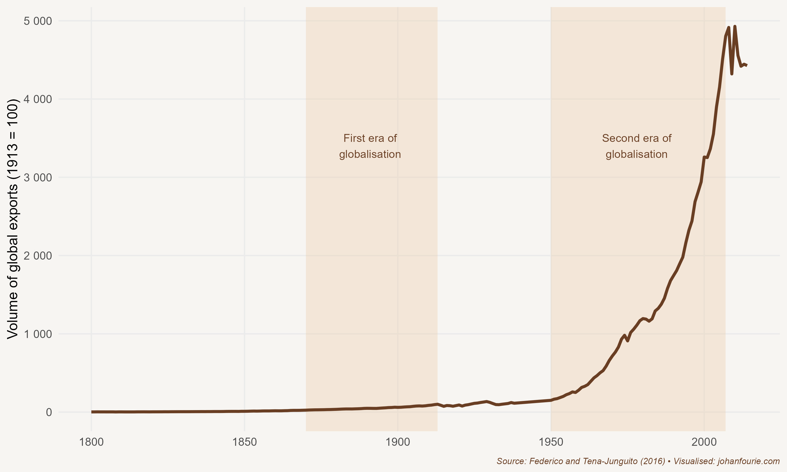

The main reason for the long-lasting popularity of Lego bricks is their versatility. A back-of-the-envelope calculation will reveal that six bricks of 2 x 4 studs can be combined in almost 1 billion ways. And because Lego bricks made today still interlock with those first made in 1958, the year the toy was first patented, the possibilities for creative play are, quite literally, innumerable.

Two years before the patent that would turn Lego into the world's favourite toy company, a man called Malcom McLean made the same discovery as Ole Kirk Christiansen, the inventor of Lego. McLean was not in the business of making children's toys, however, but of shipping goods. On 26 April 1956 he was watching his idea come to fruition: in Newark, New Jersey, a crane was lifting fifty-eight aluminium metal boxes into an old tanker ship. Five days later McLean was in Houston to see the same ship, the *Ideal-X*, sail into the port with fifty-eight trucks waiting to take the boxes to their final destination. It was the first, tentative step towards what would arguably become the greatest invention of the twentieth century. It required no great design or engineering, nor any deep philosophical insights -- at least, not anything beyond those of a Danish toymaker. What made the shipping container the greatest invention of the twentieth century was its impact. The box, as it would become known, would transform global trade patterns and, as a consequence, would be instrumental in alleviating global poverty and raising living standards to an unprecedented level. While McLean is now a footnote in history, he deserves to be celebrated.

Of course, McLean was not the first to have the idea that goods can be transported in boxes. In the 1930s US freight companies experimented with using the same boxes on trains and ships. But it was McLean who realised that what was necessary was a total transformation of the freight industry. As the historian Marc Levinson explains in *The Box*, almost everyone in the shipping industry thought their business was shipping.[^146] McLean realised that they were missing something important, that their business was not just carrying cargo across oceans, but that it was more about moving cargo from the point of production to the point of delivery. And this meant that every part of the transport system -- ports, ships, cranes, storage facilities, trucks, trains, insurance and all the other aspects of moving goods -- had to be containerised.

But for McLean, the first priority was to show that containerisation was worth the effort. He was happy to see the *Ideal-X* arrive in Houston, but anxious about whether it had been a financial success. Loading loose cargo on a medium-size cargo ship cost \$5.83 per ton in 1956. After the boxes had reached their destination, McLean's experts tallied the costs of transport. They came in at 15.8 cents per ton, a saving of 97 per cent. It was an extraordinary triumph in cost saving -- and a development that ushered in the second era of globalisation.

To understand the tremendous change of this second era, it helps to know something about the first. Although long-distance trade routes had existed for millennia -- consider the Ishmaelite traders we met in Chapter 6, the Chinese trade voyages of Chapter 11 or the Atlantic slave traders of Chapter 12 -- globalisation is generally considered to have begun during the second half of the nineteenth century.[^147] This is because economic historians like to attach a very specific definition to globalisation: that is, the economic integration of markets. One way to know whether markets are integrated is to test whether a shock in one market affects the price of the same commodity in another. Wheat prices in Cape Town, for example, began to co-move with London wheat prices around 1872.[^148]

This is no coincidence. Technological improvements such as the steamship and railway were spreading rapidly around the globe, lowering transport costs.[^149] The invention of the marine chronometer by John Harrison a century earlier allowed seamen to infer both the latitude and the longitude of their position by just using the position of the sun. Ships could now go much faster in cloudy regions, which caused a complete reorganisation of the major shipping routes during the nineteenth century. The island of St Helena in the Atlantic Ocean, for example, an important refuelling station and reference point for exploration from the sixteenth to the eighteenth centuries, witnessed a decline in ship arrivals from the 1850s onwards as the chronometer and steamships allowed captains to sail directly to their destinations.

Improvements were both technological and institutional. An ideological shift towards free-trade policies made it much easier to ship everything from wheat to pianos halfway around the world, transporting the goods that rolled out of the factories of the Industrial Revolution into new, distant markets, without having to pay high tariffs or be subjected to embargoes or restrictive colonial preferences.

But the first era of globalisation was also characterised by another movement: that of people. Hundreds of thousands of Europeans migrated to the 'New World' of the Americas or the frontier colonies of Australia, New Zealand or South Africa, further boosting demand for industrial goods from the 'Old World'. The world had suddenly become a much smaller place.

The inter-war period slowed this integration. Not only was trade tricky when German U-boats lay in wait, but military production took precedence over civilian consumption. Instead of integration, autarky ruled. Towards the end of the Second World War, when Europe was beginning to imagine a post-war world, the need for deeper integration became once again glaringly obvious. The *raison d'être* for the first regional integration initiatives in Europe -- the European Coal and Steel Community of 1950 and the Common Market of 1957 -- was to encourage economic integration so as to make war unimaginable. Over the next four decades integration would deepen. In 1993, four years after the collapse of the Berlin Wall and the end of the Cold War, the European Union became a single market for the movement of goods, services, people and money. In 1999 the euro was adopted as a single currency for the region.

Such integration was not just happening within Europe. In 1,944 delegates from 44 Allied nations convened in Bretton Woods, New Hampshire, to decide about a new international monetary and financial order once the war was over. Three major decisions were made, although we generally celebrate only two of them. To regulate the foreign exchange market, the International Monetary Fund was created. To help with the reconstruction of Europe, the International Bank for Reconstruction and Development was founded (it was later renamed the World Bank). And to promote international trade, the International Trade Organisation was created. But the last body was stillborn, as it was never ratified by the US Senate. All that survived was an agreement -- the GATT, or General Agreement on Tariffs and Trade -- that stated that countries would voluntarily reduce the barriers to trade with participating nations.

But such a relaxation of tariffs required negotiation. The first meeting, in Geneva, involved 23 participating countries and yielded 45,000 tariff reductions, an impressive effort towards global trade liberalisation. Each successive 'trade round' further reduced tariffs, so that participating countries soon had very low levels of tariff protection. The goal of a tightly integrated world with goods moving freely between nations was becoming a reality.

Seeing the benefits of international trade, more countries joined the GATT. The Kennedy trade round of 1964 involved forty-five countries. The larger size did, however, complicate things: whereas the Geneva round took seven months to conclude, the Kennedy round took thirty-seven months. The next one, the Tokyo round, took seventy-four months, and the Uruguay round eighty-seven. The issues to discuss also widened in scope. Initially, tariff reductions were the only topic of discussion. But in the Kennedy round anti-dumping duties were added, and in Tokyo other non-tariff measures were added too. The Uruguay round, which began in 1986 and involved 123 countries, discussed all kinds of trade-related issues, including trade in services, intellectual property, and the creation in 1995 of the World Trade Organisation, which was to be a new international body to operate a system of trade rules.

The latest round, the Doha round, was opened with big fanfare in 2001. It has still not been concluded -- and very likely never will be -- because it has become almost impossible to get consensus among all members on contentious issues such as agricultural subsidies. These subsidies, paid to farmers in Western Europe and North America, distort agricultural prices, making it difficult for farmers in developing countries to sell their goods at competitive prices abroad. While agricultural subsidies are politically very popular -- whenever there is talk of abolishing them, French farmers, in particular, have staged protests, often using their tractors to block major French highways -- they have been shown to severely impoverish African farmers.[^150]

To avoid the political stalemate of global trade negotiations, most countries have opted to sign regional agreements rather than attempting to negotiate one global agreement. The proliferation of regional trade agreements -- an occurrence the economist Jagdish Bhagwati has termed the spaghetti bowl effect -- has allowed countries to reach agreements more quickly.[^151] But the downside is that smaller or poorer countries have been excluded; not only do they often not have the capacity to negotiate such agreements, but, given their size, they bring little to the table in negotiations with a large and rich country. A return to a multilateral system, which would benefit a greater number of countries, would be a fairer system.

But the ideological shift towards free trade and the consequent reduction in trade barriers alone cannot explain the surge in global trade during the second half of the twentieth century. Let us consider the evidence. Figure 32.1 shows that between 1950 and 2005 the volume of global exports increased more than twenty-fivefold. New technologies, like Malcom McLean's container or, as we'll explore in the next chapter, internet connectivity and the ICT revolution, explain much of this remarkable growth. It was not that these technologies simply reduced trade costs, but that they fundamentally reshaped the types of exchange possible. Before the second era of globalisation, almost all components were produced in the same country as the one where the final product was assembled. Today, that rarely happens. Although local manufacturers do supply a wide range of parts to car assembly plants in South Africa, a fully assembled car that rolls off the production line nowadays has leather seats, gearboxes, tyres, electronics and various other components sourced from across the world. The same is true of assembly plants in all other countries. In short, value chains -- the term used for all the firms involved in the assembly process of a product -- have become far more integrated across national borders. Just as humans have become more specialised and, as a result, dependent on one another for survival, so too countries have become increasingly specialised in the production of certain components of the production process, and dependent on international cooperation and exchange. We thrive by relying more on others.

{.book-figure fig-alt="The value of global exports, 1800--2014"}

::: {.figure-caption}
Figure 32.1 The value of global exports, 1800--2014
:::

Another feature of the second era of globalisation is the shift towards trade in services. These services include all kinds of things, from the download of the latest *Grand Theft Auto* game by an Australian teenager, to Pakistani call-centre operators handling UK-based client queries, from American tourists travelling to South Africa for plastic surgery, or Brazilian football players signing for a top Bundesliga team. This is all a consequence of technological innovation in the field of information and communications technology. It is very likely that trade in services will continue to thrive, especially after Covid-19. As we discuss in Chapter 35, this creates opportunities for African entrepreneurs.

But while goods and services (and capital) move freely today, people don't. This is in stark contrast to the first era of globalisation. In the inter-war period governments started issuing passports to their citizens and began to impose limitations on cross-border movement. Today, even just travelling as a tourist from a developing country like South Africa to Europe or the United States requires a costly visit to an unfriendly and often privatised local visa issuer. Permanent emigration in the same direction is exorbitantly expensive. This is why, every year, more than a thousand African migrants lose their lives trying to cross the Mediterranean in search of a better life. Just as reducing the high barriers to trade brought huge benefits for the global economy, so too the reduction of the high barriers to the free movement of people would lead to global gains -- and not just to those people in developing countries. In an exhaustive review of the migration literature, the economists Michael Clemens and Lant Pritchett conclude:

> Economics was born of studying the 18th-century efficiency losses from trade barriers. In the 21st century, the efficiency losses from remaining restrictions on trade are relatively small. Much larger, but much less studied, the recent literature suggests, are the efficiency losses from restrictions on migration. Wage gaps of hundreds of percent for similar workers between countries may imply large inefficiencies in the spatial allocation of labour, suggesting global costs of migration restrictions in the trillions of dollars per year.[^152]

But while voters in the rich world have generally accepted the benefits of free trade, they have far bigger reservations about the free movement of people -- of accepting immigrants. The rise of populism has exacerbated this belief; in 2018, one study found, the number of populist leaders globally in office was at its highest since the start of the twentieth century, with more than a quarter of nations governed by populism.[^153]

The rise of populism is itself, however, a consequence of the success of globalisation.[^154] The remarkable surge in international trade during the second half of the twentieth century has coincided with a period of dramatic declines in global poverty. As we have seen in Chapter 30, East Asian economies and, more recently, those of China and India have benefited immensely from a more open world and the technological innovations associated with it. But despite the many winners, this surge in trade has also created losers. Manufacturing and other blue-collar jobs have been outsourced to countries that pay lower wages for similar levels of productivity. In the United States, for example, the rich and the poor have become wealthier, while the middle class has been left behind. This has not only created populist sentiment, it has also prevented further liberalisation -- notably the free movement of people -- and has, in some cases, created a backlash against free trade itself.[^155] On both sides of the political spectrum in much of the developed world, tariff restrictions are back in vogue.

Humanity has thrived because of the free movement of people and things across borders. But the overwhelming evidence from history is often not enough to convince politicians or voters. The case against free trade is gaining momentum. That will only hurt future generations.

[^146]: M. Levinson, *The Box: How the Shipping Container Made the World Smaller and the World Economy Bigger* (Princeton: Princeton University Press, 2016).
[^147]: K. H. O'Rourke and J. Williamson, When did globalisation begin? *European Review of Economic History*, 6 (1), 2002, 23--50.
[^148]: W. H. Boshoff and J. Fourie, When did South African markets integrate into the global economy? *Studies in Economics and Econometrics*, 41 (1), 2017, 19--32.
[^149]: L. Pascali, The wind of change: Maritime technology, trade, and economic development, *American Economic Review*, 107 (9), 2017, 2821--54.
[^150]: E. W. F. Peterson, *A Billion Dollars a Day: The Economics and Politics of Agricultural Subsidies* (Oxford: John Wiley & Sons, 2009).
[^151]: J. Bhagwati, *Termites in the Trading System: How Preferential Agreements Undermine Free Trade* (Oxford: Oxford University Press, 2008).
[^152]: M. A. Clemens and L. Pritchett, The new economic case for migration restrictions: An assessment, *Journal of Development Economics*, 138, 2019, 153--64, at 153.
[^153]: Funke, M., Schularick, M., & Trebesch, C. (2023). Populist leaders and the economy. American Economic Review, 113(12), 3249-3288.
[^154]: Guriev, S., & Papaioannou, E. (2022). The political economy of populism. Journal of Economic Literature, 60(3), 753-832.
[^155]: D. Rodrik, Populism and the economics of globalization, *Journal of International Business Policy*, 1 (1), 2018, 12--33.
