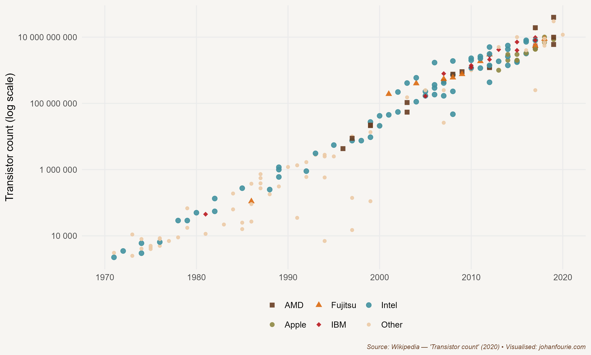

You wouldn't call it a classic joke. It's more of a quip, to be honest; something you might hear at a computer-science convention. It is said that the number of people predicting the end of Moore's law doubles every two years. Lol.

For the uninitiated, Moore's law refers to Gordon Moore's prediction, in 1965, that the number of transistors on a computer microchip would double every two years while the cost of computers would be halved. It was a brave prediction to make when microprocessors and home computers were still just a distant dream. But despite the countless experts predicting the demise of Moore's law, as the quip insinuates, it has remained true for almost five decades, as Figure 33.1 demonstrates.

Today's microchips are millions of times stronger than those that guided Apollo 11 to the moon in 1969. It gets even more bizarre: the smartphone in your pocket is now faster than the most famous supercomputer that has existed -- IBM's 1997 Deep Blue, which beat Garry Kasparov in a historic chess showdown. That is the power of exponential growth.

{.book-figure fig-alt="Moore's law: the number of integrated circuit chips, 1971--2018"}

::: {.figure-caption}
Figure 33.1 Moore's law: the number of integrated circuit chips, 1971--2018
:::

This exponential growth of the computer chip has transformed our lives in ways that no one at the dawn of the ICT revolution could have imagined. We now open our smartphones -- an invention of the 1990s -- to read our daily news, order a lift or food delivery, make payments, watch videos and listen to music, have meetings, attend lectures and interact with friends via social media sites such as TikTok and X. Sometimes we may even call someone to chat. But, surprising as it may be to us now, the benefits of microchips and home computers were not immediately obvious to everyone. In fact, by the end of the 1980s economists were puzzled: why had productivity growth been so sluggish despite huge improvements in computing technology? The Nobel Prize-winning economist Robert Solow summarised the paradox at the time: 'You can see the computer age everywhere but in the productivity statistics.'[^156]

In reflecting on this question, the economic historian Paul David did what any good economic historian would do: he turned to history.[^157] Did the electric dynamo, David asked, the technological innovation at the heart of the electricity revolution that swept the world at the beginning of the twentieth century, have a similar delayed impact on productivity? And, if so, why? David's insight was that transformative technologies do not make an immediate impact. A visitor to the Paris Exhibition of 1900, where the dynamo and many of its applications were on display, could easily have imagined a bright future (literally and figuratively) for the device, but could also have thought to herself: many of these inventions, like the light bulb and the power station, were already more than two decades old. Why wasn't the dynamo immediately visible in the productivity statistics of the time? The simple answer is that, ironically, the larger the technological impact, the slower it is to take off. There are two reasons for this. As in the case of electricity, new technologies often require completely new infrastructure. A power plant only makes sense if enough users are connected to the grid. And building infrastructure takes time, especially during the initial phase when the technology is still improving. It often also requires government regulation, which can involve a slow process.

A second reason for the slow take-off of truly transformational technology is that most established firms play a wait-and-see game. Many managers argue that 'we should not fix something that is not broken'. They want to wait for the technology to reach maturity before they invest. That is partly why new technologies are so disruptive: new firms are nimbler and can adapt more quickly to the changing environment. Incumbents are often saddled with soon-to-be-obsolete systems and technologies, and prefer to hold on to those, frequently to their own detriment.

It was not long after the Paris Exhibition that the price of electricity began to decline precipitately. Between 1909 and 1929, as the technology standardised, electrification of US factories increased by 50 percentage points. And, as a consequence, so too did total-factor productivity and economic growth.

When David published his paper in 1990, it had been almost two decades since the dawn of the information age. Many were worried that it was a false hope; that the microchip and computer would be little more than playthings for the few. David notes that patience is a virtue:

> There is, on the one hand, the buoyant conviction that we are embarked on a pre-determined course of diffusion, leading swiftly and inexorably toward the successful transformation of the entire range of productive activities in a way that will render them palpably more efficient; and, on the other hand, there is the depressing suspicion that something has gone terrible awry, fostered by the disappointment of premature expectations about the information revolution's impact upon the conventional productivity indicators and our material standard of living. But, closer study of some economic history of technology should help us to avoid both the pitfall of undue sanguinity and the pitfall of unrealistic impatience as we proceed on our journey into the information age.[^158]

We now know that the computer and the World Wide Web (which was developed by the British computer scientist Tim Berners-Lee in the same year David wrote his paper) have indeed had profound political, social, cultural and, of course, economic consequences. Production and trade have changed in ways David could not have imagined. Microchips have accelerated automation to levels unimaginable only a few decades earlier. More recent developments in robotics -- at the interface between computers and engineering -- have further transformed the factory floor; Henry Ford's twentieth-century assembly line employing thousands of unskilled workers has now been displaced by machines operated by a few programmers. Computers and connectivity have created just-in-time (JIT) inventory systems. Based on a system originally developed by Toyota in the 1970s, JIT allows manufacturers to operate with low inventory levels, reducing the need for storage and cutting down on waste. And in the 1990s, as the internet spread across the globe, the outsourcing of production -- or of parts of the production process -- became a necessary cost-saving strategy for most firms in the developed world.

But the biggest impact of computers and the internet has been on the services sector. More than two-thirds of total value added globally is now in services, a sector that includes activities such as banking, retail, marketing, accounting, recreation, education, health and communication. Consider the industry that I work in: education. When I was a student in the early 2000s, my lecturers used to teach supply-and-demand graphs using transparencies and projectors. If they wanted to find information about the GDP of, say, Botswana, they had to visit the campus library and find the most recent World Bank report, in printed form. Many still wrote their papers by hand, submitting them to academic journals by postal mail. Just a decade or so earlier, many still had to draw graphs by hand or use punch cards to run regressions.

Of course, things are different now. This book was written with extensive use of Google from the comfort of my home. Four years later, I've made use of artificial intelligence tools like Grammarly and ChatGPT to update it. When I now need access to books, I generally can find an electronic copy. I can easily download all the data from the Maddison or World Bank databases, open a (freely downloadable) software package and plot my graphs using code that was written for me by Co-Pilot. My blog -- ourlongwalk.com -- uses Midjourney-created images to visualise my posts.

Covid-19 accelerated the transformation of teaching exponentially. My classes moved online. And with everything moving online, my students -- from as far away as France and Finland -- could still participate. They all submitted essays on Turnitin, a website that automatically checks for plagiarism. In the first version of this book I predicted that 'they will soon write tests graded by artificial intelligence software -- more fairly and much faster (and with far less emotional drain) than I ever could'. I did not foresee that the quality of Large Language Models like ChatGPT would improve to the extent that they can now have their essays written by a machine to (almost but not quite) the level required of a second-year university student.

The fear, just as with the eighteenth-century invention of the spinning jenny, is that these technologies will replace workers. And indeed, I would have had to spend much more time grading essays if technologies such as Turnitin did not exist. But in my profession, as in many others, technology is complementary rather than a substitute; it has boosted my productivity, allowing me to teach and research at a much higher quantity and quality than was possible before. In other words, without these technologies, this book would not have been written as quickly or with the same level of quality.

Whether these technologies will reduce labour demand is an empirical question. Preliminary evidence suggests that artificial intelligence tools may displace certain tasks while augmenting worker productivity, enabling them to focus more on higher-value activities.[^159] But perhaps it is too soon to judge. It is in such instances that history can help. One famous example of how technology can create jobs rather than shed them comes from banking. In the early 1990s, when ATMs were rolled out across the United States, the fear was that banking clerks would become obsolete, resulting in huge job losses. But exactly the opposite happened: instead of workers being displaced, the number of banking jobs increased.[^160] The reason? The much cheaper ATMs allowed banks to set up many more local branches, build a much bigger network, and use their staff to provide other client services, such as selling insurance, rather than counting coins. Consumers profited not only from lower bank fees but also from a greater variety of financial services.

There *are* valid concerns regarding these technological developments. One of them is the concentration of market power among a few tech giants. Network industries are, by definition, monopolistic in nature. But it is useful to keep in mind that this monopolism is not new. Nineteenth-century railway lines or twentieth-century electricity grids were often under state control because it made sense to have only one provider. But the pervasive nature of today's network industries -- from banking to broadcasting -- has meant that many industries have concentrated around one or two firms. Google dominates the search-engine market, with more than 90 per cent market share. In several dozen countries Visa and Mastercard control more than 90 per cent of the market for debit and credit cards. Amazon sells more than 40 per cent of US ecommerce. Tencent takes half of all mobile game revenues in China. And these large market shares have allowed the companies to do incredibly well. Almost all of the world's largest companies -- Apple, Amazon, Alphabet (Google), Microsoft, Meta (Facebook), Alibaba and Tencent -- are tech companies, most of them created in the last three decades.

To maintain their market dominance, these giant companies buy up smaller companies. In 2022 alone, Alphabet acquired eleven firms, from cybersecurity firms to robots, from health monitoring to artificial intelligence. Meta acquired four firms, including a game design studio. Microsoft acquired the London Stock Exchange Group. In many cases, entrepreneurs today build businesses not to make profits, but for them to be sold to these tech conglomerates.

This would all be familiar to the business historian Alfred Chandler, who in the 1970s wrote about a similar phenomenon. In contrast to the perfectly competitive market that Adam Smith termed the 'invisible hand', Chandler wrote about the emergence of large, vertically integrated, managerially directed enterprises.[^161] This phenomenon arose because large firms were more efficient: while small firms had to depend on the market to coordinate their purchases of inputs and sale of outputs, vertically integrated firms could integrate these functions internally through managerial hierarchies. But as the economic historians Naomi Lamoreaux, Daniel Raff and Peter Temin have pointed out, this turn towards 'big business' did not last.[^162] In the 1980s and 1990s these large conglomerates were outperformed by smaller, nimbler firms that could adjust more easily in the rapidly changing ICT environment. It is not inevitable that the tech giants of today will remain giants forever. As new technologies evolve, and management of increasingly large entities becomes too cumbersome, new entrants emerge. And there is much to look forward to. With billions of people now connected via mobile devices, each more powerful than the most powerful computer only two decades ago, many argue that we have now entered another revolution -- the Fourth Industrial Revolution. It remains to be seen to what extent the current giants will be able to maintain their advantage in the emerging fields of artificial intelligence, robotics, the Internet-of-Things, autonomous vehicles, 3D printing, nanotechnology, biotechnology, materials science, energy storage and quantum computing.

What is sure, though, is that these tech giants have not only created services from which we all benefit, but they have also created immense wealth for their shareholders. Apple is a great example. It is now worth more than \$2.8 trillion[^163], yet this wealth is not concentrated in the hands of just a few founders. Its shares are owned by investment companies, such as the Vanguard Group, which, in turn, has more than 50 million investors. This means that millions of people around the world have a stake in Apple. Or take Tencent. In 2001 Koos Bekker, then a young CEO of Naspers, a largely unimpressive South African media company, purchased a 46.5 per cent stake in an unknown Chinese company. Tencent, founded just three years earlier, was the creator of an instant messaging platform called QQ at the time. Today Tencent is one of the twenty largest companies in the world, and Naspers's 29 per cent share (held in Prosus, a company which was spun off in 2019), is now worth \$160 billion.[^164]

While Bekker himself has benefited handsomely from his foresight, so too have all South Africans who own Naspers and Prosus shares. And that is almost everyone with a pension fund, because Naspers and its spin-off makes up a large share of the Johannesburg Stock Exchange. In fact, a great example of digital transformation is the fact that South Africa, a country known for its wealth of gold and diamond resources, has created most of its wealth in the last decade from Chinese kids fighting and scavenging for resources in online games such as *Honor of Kings* and *PlayerUnknown's Battlegrounds*.

[^156]: His comment appears in a 1987 *New York Times Book Review* article.
[^157]: P. A. David, The dynamo and the computer: An historical perspective on the modern productivity paradox, *American Economic Review*, 80 (2), 1990, 355--61.
[^158]: This lengthy quotation is from a presentation of his working paper at the Warwick Economics Summer Workshop in July 1989. The quote sadly did not make it into the published version: P. A. David, Computer and dynamo: The modern productivity paradox in a not-too distant mirror (working paper, 1989), 31.
[^159]: Dell\'Acqua, F., McFowland, E., Mollick, E. R., Lifshitz-Assaf, H., Kellogg, K., Rajendran, S., \... & Lakhani, K. R. (2023). Navigating the jagged technological frontier: Field experimental evidence of the effects of AI on knowledge worker productivity and quality. Harvard Business School Technology & Operations Mgt. Unit Working Paper, (24-013).
[^160]: B. Bátiz-Lazo, *Cash and Dash: How ATMs and Computers Changed Banking*. (Oxford: Oxford University Press, 2018).
[^161]: A. D. Chandler, *The Visible Hand: The Managerial Revolution in American Business* (Cambridge, MA: Belknap Press of Harvard University Press, 1977).
[^162]: N. R. Lamoreaux, D. M. Raff and P. Temin, Beyond markets and hierarchies: Toward a new synthesis of American business history, *American Historical Review*, 108 (2), 2003, 404--33.
[^163]: As of May 2024.
[^164]: As of May 2024.
