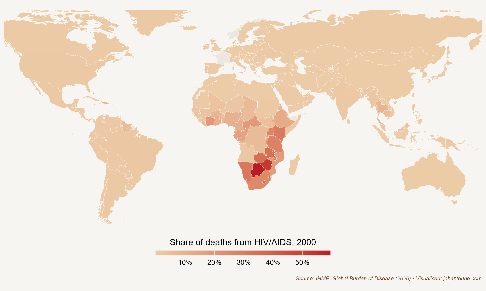
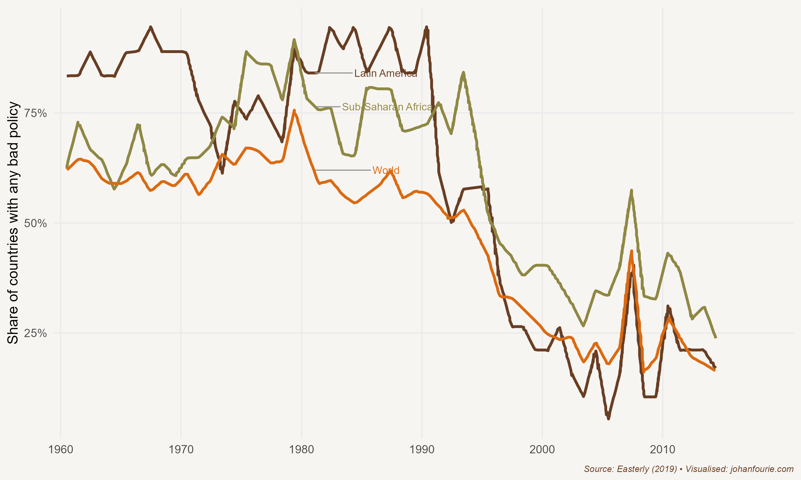

In May 2000 the world's leading financial weekly announced that there was little hope for the future of Africa. Under the headline 'The hopeless continent', *The Economist*'s cover showed a young man, presumably a rebel, carrying an anti-tank rocket launcher, over a cut-out of the region. The dark background spelt doom.

*The Economist* was not alone in its Afro-pessimism. In a seminal 1999 paper, development economists Paul Collier and Jan Willem Gunning attributed most of the malaise to Africa's poor integration in the global economy, a result of import-substitution and exchange controls. They concluded that African countries were left with challenges that 'are much more difficult to correct than exchange rate and trade policies, and so the policy reform effort needs to be intensified. However, even widespread policy reforms in this area might not be sufficient to induce a recovery in private investment, since recent economic reforms are never fully credible.'[^170]

This bleak outlook was shared by other scholars. Academic journals frequently published papers using cross-country growth regressions -- the fashion of the time -- that included continental dummy variables which always yielded a negative coefficient for Africa, suggesting that, conditional on many other things, there was something uniquely wrong with Africa.[^171]

And, indeed, there was much to be pessimistic about. As I noted in Chapter 27, many African countries had poor or negative economic growth; some were poorer in 2000 than they had been in 1960. The scourge of HIV/Aids had spread rapidly throughout sub-Saharan Africa during the 1990s, with devastating consequences. As Figure 35.1 demonstrates, by 2000 the death of half of all Zimbabweans was due to HIV/Aids. The figure was a third for Namibia and a quarter for South Africa. The global average, on the other hand, was 3 per cent.

{.book-figure fig-alt="Share of deaths from HIV/Aids across the globe, 2000"}

::: {.figure-caption}
Figure 35.1 Share of deaths from HIV/Aids across the globe, 2000
:::

The misery of HIV/Aids was compounded by the ineffectiveness of international aid. In the early 2000s Jeffrey Sachs, one of the world's leading development economists and an eager contributor to understanding African poverty, proposed ending poverty through massive spending: a 'big push' of international aid that would drive investment, notably in infrastructure, boost productivity and raise living standards.[^172] Although Sachs's efforts did help to reduce the incidence of malaria, it had little effect on poverty alleviation. In fact, some would argue that aid did more harm than good. The development economist William Easterly has been especially critical of Sachs's 'big push' strategy, arguing that there is little evidence that the more than \$500 billion spent on aid to Africa has had any meaningful impact. This is because poverty, he argues, is not solved through expert plans implemented from the top -- but through economic growth which empowers people from below.[^173] The economist Dambisa Moyo, in her 2009 book *Dead Aid: Why Aid is Not Working and How There is a Better Way for Africa*, concurred with Easterly, arguing that foreign aid corrodes democratic institutions.[^174] The good intentions of foreign aid may in fact have resulted in perverse outcomes.

Things were not bad everywhere in Africa, of course. Between 1965 and 2000 Botswana had the highest rate of per capita economic growth of any country in the world. It is easy to simply attribute this exceptional performance -- what many have now called an African growth miracle -- to the discovery of diamonds. This assumption would ignore the strong market-friendly institutions -- or, put differently, the lack of bad policies -- that have been key to Botswana's success.[^175] Other African countries, such as Sierra Leone, also have diamonds, yet they have not prospered; in 2018 the average citizen of Botswana was ten times richer than the average citizen of Sierra Leone.

But Botswana was the exception rather than the rule. In 2000, when *The Economist* wrote its unfortunate headline, most African countries were in bad shape. Fast-forward a decade to December 2011, when *The Economist* published another story on Africa, this time with a decidedly more optimistic outlook.

> Since *The Economist* regrettably labelled Africa 'the hopeless continent' a decade ago, a profound change has taken hold. Labour productivity has been rising. It is now growing by, on average, 2.7% a year. Trade between Africa and the rest of the world has increased by 200% since 2000. Inflation dropped from 22% in the 1990s to 8% in the past decade. Foreign debts declined by a quarter, budget deficits by two-thirds. In eight of the past ten years, according to the World Bank, sub-Saharan growth has been faster than East Asia's.
>
> Even after revising downward its 2012 forecast because of a slowdown in the northern hemisphere, the IMF still expects sub-Saharan Africa's economies to expand by 5.75% next year. Several big countries are likely to hit growth rates of 10%. The World Bank -- not known for boosterism -- said in a report this year that 'Africa could be on the brink of an economic take-off, much like China was 30 years ago and India 20 years ago,' though its officials think major poverty reduction will require higher growth than today's -- a long-term average of 7% or more.[^176]

What had caused this remarkable reversal? It helps to take a long-term view. The IMF's structural adjustment programmes of the 1980s and 1990s -- policies intended to reduce bloated government budgets, reduce debt and stabilise things like inflation and exchange rates, reforms which later became known as the Washington Consensus -- did not seem to yield immediate results. During the last two decades of the twentieth century growth in much of Africa remained dismal. And tragic outbreaks of famine -- Ethiopia in 1984 -- or genocide -- Rwanda in 1994 -- exacerbated the dire economic situation. This poor record of performance is why *The Economist* could justify its May 2000 headline and why both Africans and international experts doubted the efficacy of the Washington Consensus. In 2006 the economist Dani Rodrik wrote: 'Proponents and critics alike agree that the policies spawned by the Washington Consensus have not produced the desired results ... It is fair to say that nobody really believes in the Washington Consensus anymore. The debate now is not over whether the Washington Consensus is dead or alive, but over what will replace it.'[^177]

{.book-figure fig-alt="Share of countries with any 'bad policy', 1961--2015"}

::: {.figure-caption}
Figure 35.2 Share of countries with any 'bad policy', 1961--2015
:::

But the apparent lack of success of the neoliberal reforms of the 1980s and 1990s should not be dismissed so quickly. In a 2019 working paper William Easterly quantifies the extent of 'bad policies' in Africa and elsewhere and measures their effect on later growth performance.[^178] It turns out that when experts were making claims in the mid-2000s about the impact of the structural adjustment programmes, they were using a 2001 World Bank dataset that had not yet accounted for the rapid economic growth that many countries would experience from the 2000s onwards. Although Easterly himself was critical of the neoliberal reforms -- in 2005, for example, he said that 'repeated (structural) adjustment lending ... fails to show any positive effect on policies or growth'[^179] -- he was now happy to change his mind on the basis of new evidence. The reforms, it seems, had a profound but delayed impact: fewer 'bad policies' did cause economic growth, particularly in those regions that were most likely to have had bad policies in the 1980s and earlier. Figure 35.2 shows the rapid decline in 'bad policies' in Latin America and Africa between 1990 and 2000. In a later review paper, economists Belinda Archibong, Brahima Coulibaly, and Ngozi Okonjo-Iweala conclude that the reforms related to the Washington Consensus was associated with an improved macroeconomic environment with lower inflation combined with debt reductions. 'These changes did help to attract more private investment in key sectors like retail, wholesale, telecommunications, and manufacturing that accounted for a significant share of the growth increases in the 2000--2019 period.'[^180]

The lesson is obvious: the package of Washington Consensus policies was instrumental in getting rid of bad policies. Once they were removed, economies began to grow, although this growth was from a low base and was often deferred.[^181]

It was not only a consequence of fewer bad policies that Africa's 'lost decades' from 1975 to 1995 were replaced by two decades of 'Africa rising'. The growth period was linked to the fact that commodity prices rose rapidly, a consequence of higher demand in fast-growing India, China and other Asian countries, thereby improving the terms of trade in many African economies and boosting commodity exports. To put the turnaround in perspective: between 2001 and 2010 six of the ten fastest-growing economies in the world were African -- Angola, Nigeria, Ethiopia, Chad, Mozambique and Rwanda -- and almost all were dependent on commodity exports. For some, this growth continued into the 2010s: Ethiopia was the fastest-growing economy between 2010 and 2019, growing at an incredible 9.5 per cent per annum. For others, growth slowed: Angola, an oil exporter, had negative growth rates between 2016 and 2019.

The fear is that African economies are just repeating the same boom-and-bust cycle they experienced in the 1950s and 1960s, which was also a period characterised by high commodity prices. Will African countries now finally be able to structurally transform their economies away from volatile commodity exports?

The economic historians Ewout Frankema and Marlous van Waijenburg caution against over-optimistic predictions of Africa's structural transformation.[^182] They compare Africa today with Britain and Japan at the time of their transformation into manufacturing -- and draw five lessons. First, the rapid industrialisation of Asian economies was based on a large labour cost gap between the West and the rest. No such gap exists today between the cost of labour in Africa and in Asia, where manufacturing is still increasing. Second, even if African countries were to push towards industrialisation, it is unlikely that this will immediately translate into higher living standards. It took almost half a century in Britain and Japan for living standards to improve after the shift to manufacturing. Third, population growth is higher in Africa and, in contrast to Britain and Japan, there is no 'escape valve', such as colonies or new territories to which surplus labour could move. This suggests that Africa will have a larger pool of labourers, which would widen the gap between industrialisation take-off and increases in living standards. Fourth, because of the focus on export commodities, Africa has lost many of its traditional artisanal skills. How quickly modern education can replace such skills remains to be seen. Fifth, and most importantly, industrialisation in Britain and Japan was backed by governments willing to forgo the human freedoms of its citizens, as well as to suppress wages for decades to ensure international competitiveness. Strong labour movements in Africa make such policies unlikely. This gloomy outlook is best summarised by the economic historian Morten Jerven: 'The dependency of African economies on export volumes and prices makes their development path one of recurring growth and recession.'[^183]

But there is also cause for optimism. Information and communications technology, as we discussed in Chapter 33, has transformed the traditional path of economic development. Africa has embraced the digital revolution at a bewildering speed. In 2001, only 3.3% (or 1 in 30) of South Africans owned a mobile phone. In 2022, according to the census, it was 92% (or 9 in every 10).[^184] Or consider Rwanda: in 2001, only 1 in every 200 Rwandans owned a mobile phone. In 2022, Rwanda had a mobile phone penetration rate of 87% (close to 9 in every 10). This rapid and deep penetration of mobile technology has opened two opportunities: first, the closer integration of domestic markets, and second, the opening of new export sectors.

Frankema and van Waijenburg discuss the first of these: a larger, more integrated market. Lower information, communication and transaction costs have brought producers, traders and consumers closer together, expanding domestic markets to those who were often excluded by distance or low density. Smallholder farmers in Kenya can now easily access market prices and weather updates on their mobile phones, making them more productive.[^185] Mobile payment systems such as M-Pesa open up banking and insurance services that would have been too costly for any bricks-and-mortar equivalent.[^186] And the changes are not only because of mobile technology. Drones have reduced transport costs for vaccines and other medical supplies.[^187] Solar power enables countries to avoid building large power generators with their expensive power-transmission infrastructure. The point is that technological innovation is rapidly leading to more integrated and empowered local, national and regional networks, allowing producers to scale up production, reducing prices and expanding consumer choice.

The second reason for optimism is that technology allows for new export industries, notably in the services sector. Tourism is the most obvious industry in which many African countries already have a comparative advantage and into which new technology platforms, such as Uber or Airbnb, can easily expand. Thanks to the continent's rich natural and cultural heritage, many places are high on the list of must-see destinations. Indeed, for countries such as Madagascar (15 per cent), the Gambia (20 per cent), Mauritius (25 per cent), Cape Verde (46 per cent) and Seychelles (67 per cent), tourism is the driving force of the economy.

But new technologies also allow for the export of other service types. Consider the Zambian accountant who is accredited in Britain. Based in Lusaka, she has a team that flies to London, audits their clients, and then returns to Zambia to complete the paperwork. She charges less than what a British auditor would ask -- and provides the same high-quality service. Or consider the Nigerian software developer who specialises in creating custom applications for businesses. Based in Lagos, he has a team that collaborates remotely with clients in the United States. They hold virtual meetings to gather requirements, develop the software, and provide ongoing support and updates. By offering competitive pricing and high-quality services, the Nigerian developer attracts clients who might otherwise hire more expensive local developers. Or the South African husband-and-wife duo who has built a strong graphic design portfolio of work for international clients. Based in Stellenbosch, they use online platforms to connect with businesses in Europe and Australia needing design services for book covers, marketing materials and websites.[^188] These types of service exports can range from highly skilled (business and financial, engineering, education) to less skilled (from business process outsourcing -- or call centres -- to entertainment). There are several reasons why Africa, rather than Asia or Latin America, can fill this gap: the continent lies in the same time zone as Europe, and Africans speak two of the largest European languages, French and English.

It remains to be seen to what extent countries can skip industrialisation and shift directly from agriculture to services. The only countries that have managed to do so are city-states such as Hong Kong and Singapore. But the type of technological change brought about by the Fourth Industrial Revolution now allows more than one route to prosperity. If Africa is to avoid the path of recurring growth and recession dependent on the commodity cycle, it needs to prevent the recurrence of the policy disasters of the past and embrace the opportunities that technological innovation offers.

[^170]: P. Collier and J. W. Gunning, Why has Africa grown slowly? *Journal of Economic Perspectives*, 13 (3), 1999, 3--22.
[^171]: P. Englebert, Solving the mystery of the AFRICA dummy, *World Development*, 28 (10), 2000, 1821--35.
[^172]: J. D. Sachs, *The End of Poverty: Economic Possibilities for our Time* (London: Penguin, 2006).
[^173]: W. Easterly, *The White Man's Burden: Why the West's Efforts to Aid the Rest Have Done So Much Ill and So Little Good* (London: Penguin, 2006).
[^174]: D. Moyo, *Dead Aid: Why Aid is Not Working and How There is a Better Way for Africa* (New York: Farrar, Straus and Giroux, 2009).
[^175]: E. Hillbom, Diamonds or development? A structural assessment of Botswana's forty years of success, *Journal of Modern African Studies*, 46 (2), 2008, 191--214.
[^176]: The sun shines bright, *The Economist*, 3 December 2011, [www.economist.com/briefing/2011/12/03/the-sun-shines-bright](http://www.economist.com/briefing/2011/12/03/the-sun-shines-bright).
[^177]: D. Rodrik, Goodbye Washington consensus, hello Washington confusion? A review of the World Bank's economic growth in the 1990s: learning from a decade of reform. *Journal of Economic Literature*, 44 (4), 2006, 973--87.
[^178]: W. Easterly, In search of reforms for growth: New stylized facts on policy and growth outcomes (National Bureau of Economic Research, working paper no. w26318, 2019).
[^179]: Easterly, William. \"What did structural adjustment adjust?: The association of policies and growth with repeated IMF and World Bank adjustment loans.\" Journal of development economics 76, no. 1 (2005): 1-22, at 1.
[^180]: Archibong, B., Coulibaly, B., & Okonjo-Iweala, N. (2021). Washington consensus reforms and lessons for economic performance in Sub-Saharan Africa. Journal of Economic Perspectives, 35(3), 133-156, quote on page 150.
[^181]: See also K. B. Grier and R. M. Grier, The Washington consensus works: Causal effects of reform, 1970--2015, *Journal of Comparative Economics*, 49 (1), 2021, 59--72.
[^182]: E. Frankema and M. van Waijenburg, Africa rising? A historical perspective, *African Affairs*, 117 (469), 2018, 543--68.
[^183]: Jerven, African growth recurring: An economic history perspective on African growth episodes, 1690--2010, *Economic History of Developing Regions*, 25 (2), 2010, 127--54, at 147.
[^184]: South African Government News Agency. <https://www.sanews.gov.za/south-africa/921-sa-population-owns-cellphone>
[^185]: N. T. Krell, S. A. Giroux, Z. Guido, C. Hannah, S. E. Lopus, K. K. Caylor and T. P. Evans, Smallholder farmers' use of mobile phone services in central Kenya, *Climate and Development*, 2020, 1--13.
[^186]: I. Mbiti and D. N. Weil, The home economics of e-money: Velocity, cash management, and discount rates of M-Pesa users, *American Economic Review*, 103 (3), 2013, 369--74.
[^187]: L. A. Haidari, S. T. Brown, M. Ferguson, E. Bancroft, M. Spiker, A. Wilcox, R. Ambikapathi, V. Sampath, D. L. Connor and B. Y. Lee, The economic and operational value of using drones to transport vaccines, *Vaccine*, 34 (34), 2016, 4062--7.
[^188]: This is an actual example of a thriving business, one that is also responsible for the design of this book's cover and my website. Check them out: Nudge Studio at [www.nudgestudio.co.za](https://www.nudgestudio.co.za/)
