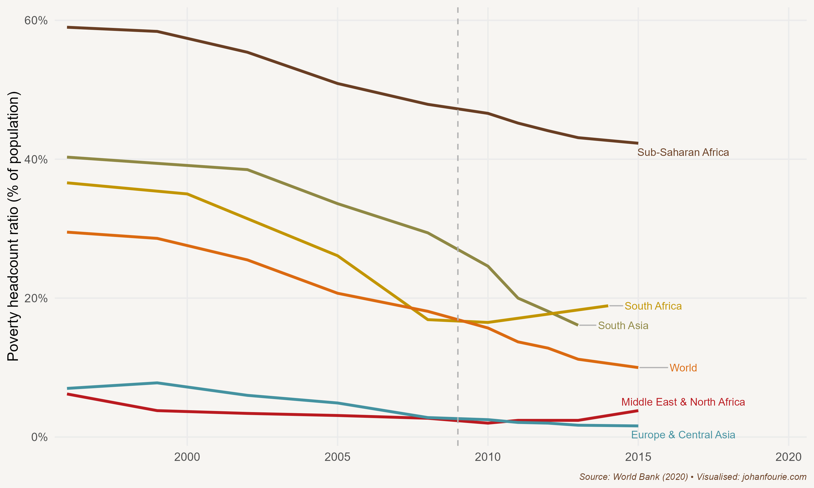

On 27 April 1994 Nelson Mandela's long walk to political freedom came to an end. On that fresh autumn morning 22 million South Africans headed to their nearest voting booths to cast their votes, many for the first time, in the country's first democratic elections. The mood was festive. After almost a century of political exclusion, black South Africans now had an equal political voice -- and they made it count: the African National Congress won 63 per cent of the total vote. Mandela was sworn in a few days later as the country's first democratically elected president.

But not all freedoms were fulfilled on Freedom Day (as that first democratic election is known). Many South Africans at the time were living in abject poverty, unable to achieve the life they wanted. Almost all of them were black. The new rainbow nation was characterised by stark levels of inequality. In 1998 then-deputy president Thabo Mbeki described South Africa as a 'two-nation' society: 'One of these nations is white, relatively prosperous, regardless of gender or geographic dispersal ... The second and larger nation ... is black and poor, with the worst-affected being women in the rural areas.'[^189] Mbeki was both right and wrong. White South Africans were indeed far more affluent than black South Africans. In 1996, the year of the first democratic census and the year South Africa adopted its new constitution, of the richest 10 per cent in South Africa, 22 per cent were black while 65 per cent were white. Poverty, of course, was almost an entirely black experience: of the poorest 10 per cent in South Africa, 90 per cent were black.[^190]

But by the time Mbeki described South Africa as a 'two-nation' society, inequality was changing, and had been doing so for at least the three preceding decades. In 1975 only 2 per cent of the richest 10 per cent of South Africans were black. Within two decades the share of black South Africans who formed part of the elite would increase tenfold. Inequality was increasing more within race groups than between them: 62 per cent of inequality in South Africa in 1975 could be explained by the gap between black and white incomes; by 1996 this had fallen to 33 per cent -- still large, but far less important.[^191]

That these changes were happening during the last two decades of apartheid should not be surprising. The National Party, in an attempt to placate black unrest, had begun to expand social transfers to black South Africans too. By 1993 white and black state pensions had equalised. Many of the restrictions that had limited black economic freedom, such as influx control, the colour bar and the ban on trade unions, had been relaxed during the 1980s or early 1990s.

There is no denying, however, that the ANC faced an immense challenge to build a better life for all. In 1993 they adopted their first policy document, called the Reconstruction and Development Programme, which promised 'a decent living standard and economic security'. This would be achieved largely through fiscal redistribution, using tax revenues to build housing and provide other social services. Many of the public housing projects on the outskirts of South African towns and cities are still known as RDP houses. But in 1996 the ANC switched gears, adopting the Growth, Employment and Redistribution (GEAR) plan, which shifted the government's priorities to macroeconomic stability and economic growth. This made sense at the time. Not only did the new government inherit high levels of debt and price volatility, making it difficult to pay for the social services they wished to provide, but they also had no track record to help convince potential investors of their capacity to govern. They urgently needed investment in an economy that had stagnated for almost a decade -- investment that could only come from the international community, which was sceptical of the ANC's socialist roots. GEAR was their plan.

It worked. For one thing, the timing was fortunate. The end of the Cold War, rapid globalisation and high rates of growth in the developed world created an appetite for investments in developing countries. And there is no doubt that South Africa's 'political miracle', with Mandela as its figurehead, helped convince the sceptics that the country was on the way up. Yet it was not Mandela who was largely responsible for GEAR's success. That honour would fall to the three TMs: Thabo Mbeki, as second president of the democratic Republic, Trevor Manuel, as minister of finance, and Tito Mboweni, as governor of the Reserve Bank. Although GEAR was not an immediate success -- and the 1998 Asian financial crisis, the 2001 depreciation of the rand and the 2002--3 'small bank crisis' did not help -- the overall economic outlook improved markedly between 1994 and 2006. Between 2004 and 2007 economic growth averaged above 5 per cent per annum. Inflation, a measure of price increases, was down. In the decade leading up to 1994 average inflation was 14 per cent; over the next decade inflation averaged 6.4 per cent. Debt as a percentage of GDP was down too, from 49.5 per cent in 1996 to 26.5 per cent in 2008. Government revenue increased faster than expenditure; after many years of budget deficits, in February 2007, Minister Manuel could announce a budget surplus.

Part of this period of success can, of course, also be ascribed to higher global commodity prices. As the world's largest producer of platinum -- six times bigger than Russia, the second largest -- commodity prices still shape the fortunes of South Africa, just as gold shaped its fortunes in the twentieth century. But the economic growth achieved during this period was not exclusively due to commodities; innovation was key, too. Just consider the following news article from *Wired* magazine, published in October 2008: 'On the 15th anniversary of Nelson Mandela receiving the Nobel Peace Prize, South Africa is gaining attention for another world-friendly achievement. This time, it's an electric car from Cape Town-based Optimal Energy that's grabbing headlines. The Joule has been the darling of the Paris Auto Show, and it's easy to see why.'[^192] In the same year that Tesla, headed by Elon Musk built its first electric car, an impractical and expensive all-electric roadster, it was the Joule's long-range, six-passenger capacity and quirky design that attracted all the attention.[^193]

The economic growth achieved in the 2000s raised living standards too. Higher revenue meant that government spending on social grants could increase from 1.9 per cent of GDP in 2000 to 3.3 per cent in 2007. South Africa had -- and still has -- some of the best-targeted grant systems in the world. This simply means that the grants actually reach the poorest who need them. And the expanding economy and more stable macro-environment gave more people a safety net, what the development economist and Nobel Prize-winning economist Amartya Sen calls the freedom of 'economic protection'. The result was that poverty declined. Using a standard money metric, development economists Arden Finn, Murray Leibbrandt and Ingrid Woolard calculate that between 1993 and 2010 the poverty rate in South Africa fell from 37 per cent to 28 per cent.[^194] If a multidimensional index is used that also accounts for things such as housing, electricity, water and sanitation, the numbers are even more impressive: from 37 per cent to 8 per cent. A better life for all, indeed.

All was not perfect, however. Although the decline in poverty was impressive, there were still not enough jobs for everyone. This was because South Africa's integration into the global economy necessitated changes in many firms. Gone was the 'protection' that apartheid isolation offered; South African firms suddenly had to compete against far more efficient foreign competitors. To improve their efficiency, the South African firms cut jobs. Economists at the time called the early 2000s a period of 'jobless growth'. More efficient firms meant higher labour productivity for those employees who remained behind -- and higher wages -- but it also meant a growing gap between those with and those without jobs. This led to increasing inequality.

Inequality was further exacerbated by a school system unable to produce good-quality graduates. Although the large funding gap between black and white schools had been eliminated soon after 1994, school outcomes were still very different. In 2007 education economist Servaas van der Berg summarised this trend: 'Despite massive resource shifts to black schools, overall matriculation results did not improve in the post-apartheid period. Thus, the school system contributes little to supporting the upward mobility of poor children in the labour market.'[^195]

The first fifteen years of democracy, from 1994 to 2009, stand in stark contrast to the next fifteen. The global financial crisis of 2008, although it did not have the same disastrous impact on South Africa's financial sector as it did in other parts of the world, still hurt the economy badly. It led to a short recession and higher debt levels in the country. But rather than a global recession, it was local politics that would transform the South African economy from one that was imperfect but optimistic to one that was decidedly bleak; from one where South Africans could dream about improvement to one where they had to cope with immiseration.

In September 2008, with about nine months left of his second term as president, Thabo Mbeki was recalled by the National Executive Committee of the ANC. He resigned and was replaced by Kgalema Motlanthe as interim president, who in turn was succeeded by Jacob Zuma after the 2009 elections. The country soon found itself heading in a new direction. The first and most obvious change was the rapid increase in the size of government. Not only did the number of government employees increase in the first five years of Zuma's presidency, from around 2.2 million to 2.7 million, but their wages increased much more than inflation -- in fact, some estimates show that they achieved a premium of 22 per cent over private-sector workers at the wage-negotiation table. The consequence was that the budget surpluses of the Manuel years quickly turned into large (and unsustainable) deficits. It also became increasingly clear that the action plans drawn up by government -- notably the ambitious and admirable National Development Plan (NDP), which aimed to eliminate poverty and reduce inequality by 2030 -- were paid little more than lip service.

One key component of the NDP was the strengthening of state-owned enterprises such as Eskom and Transnet. Exactly the opposite happened under Zuma's leadership. In what has become known as a process of state capture, political cronies affiliated with the ANC leadership were appointed to positions of power. A 2017 report -- entitled 'Betrayal of the Promise' -- explains the strategy:

> From about 2012 onwards the Zuma-centred power elite has sought to centralise the control of rents to eliminate lower-order, rent-seeking competitors. The ultimate prize was control of the National Treasury to gain control of the Financial Intelligence Centre (which monitors illicit flows of finance), the Chief Procurement Office (which regulates procurement and activates legal action against corrupt practices), the Public Investment Corporation (the second largest shareholder on the Johannesburg Securities Exchange), the boards of key development finance institutions, and the guarantee system.[^196]

The consequence was that many state-owned enterprises collapsed. The most significant of these was Eskom. Although the first power cuts occurred for a short time in late 2007 and early 2008, as a consequence of underinvestment they returned in 2014 and again, more frequently, in 2019. A country that does not have a reliable source of energy, the most important input in almost any production process, cannot grow. And that is exactly what happened. In Zuma's first term of office, per capita GDP growth averaged less than 1 per cent; in his second term, which lasted from 2014 to 2018 (when he, too, was recalled by the ANC), per capita GDP growth was negative. The implication was that the average South African became poorer. This was borne out by poverty statistics. In contrast to the sharp declines in poverty during the Mbeki era -- an era, it should be stressed, that witnessed the rapid spread of HIV/Aids, largely due to Mbeki's unwillingness to tackle the issue -- the share of people below the poverty line increased substantially during Zuma's presidency. Figure 36.1 demonstrates this reversal quite clearly.

{.book-figure fig-alt="Share of population living in extreme poverty by region, 1980--2015"}

::: {.figure-caption}
Figure 36.1 Share of population living in extreme poverty by region, 1980--2015
:::

In 2018 Cyril Ramaphosa was elected as the fifth president of South Africa. His task was immense: to turn around the fortunes of a country scarred by a bitter past and a burgled decade. To see how far South Africa has fallen, compare the country's performance with its then more famous BRICS partners -- Brazil, Russia, India and China. Between 1994 and 2018 only Brazil, at 2.1 per cent per annum, grew at a slower pace than South Africa, at 2.9 per cent. Russia (4.4 per cent), India (4.7 per cent) and China (5.4 per cent) experienced rapid catch-up growth. China's GDP per capita, as recently as 1990, was half of South Africa's; by 2016 China was richer on a per-capita basis.

What can be done to elevate South Africa's growth path to those of our peers? There is no doubt that, just as in 1996, South Africa needs to get the macroeconomic fundamentals right -- a task made extra difficult by the impact of Covid-19. Investment in renewable energies would not only ease the burden on the fledgling electricity network, but also shift South Africa, a heavy polluter, towards carbon neutrality. But we also need creative solutions that improve economic freedom.[^197] These can range from affordable family planning that empowers young mothers to make their own decisions, to early childhood-development programmes, to a voucher programme for schools that will encourage innovation in education, to making it easy for skilled migrants to establish businesses. Covid-19 has accelerated the digital transformation of our lives, and the Fourth Industrial Revolution, as I have argued in Chapter 33, will open up new avenues for growth by enhancing productivity, fostering innovation and creating new markets. It should be top of the government's list of priorities to reduce the digital divide.

The first thirty years of the 'new South Africa' were what sports enthusiasts might call a game of two halves. During the first half economic freedoms were extended to those who had for centuries been denied access to them. To do this, the ANC government implemented sound economic policies that created economic growth. The benefits were growing prosperity and a better life for all. The second half, unfortunately, was less rosy. Extracting rents became the government's priority. The poorest, who depend most on a capable government, lost out, and their lives became a daily struggle for food, jobs and service delivery. Nelson Mandela's long walk to economic freedom went down a wrong path. Let's hope we can find our way back.

[^189]: Available at [www.dirco.gov.za/docs/speeches/1998/mbek0529.htm](http://www.dirco.gov.za/docs/speeches/1998/mbek0529.htm).
[^190]: N. Nattrass and J. Seekings, 'Two nations'? Race and economic inequality in South Africa today, *Daedalus*, 130 (1), 2001, 45--70.
[^191]: A. Whiteford and D. van Seventer, Understanding contemporary household inequality in South Africa, *Studies in Economics and Econometrics*, 24 (3), 2000, 7--30.
[^192]: K. Barry, South African electric car the Crown Joule of Paris Auto Show, *Wired*, 10 October 2008, [www.wired.com/2008/10/south-african-e](http://www.wired.com/2008/10/south-african-e)/.
[^193]: The Joule, just like other electric cars, depended on government subsidies. Sadly, that support ended during the financial crisis. By contrast, Tesla would become one of the largest companies in the world. Few in South Africa today remember that we once built an electric car.
[^194]: A. Finn, M. Leibbrandt and I. Woolard, What happened to multidimensional poverty in South Africa between 1993 and 2010? (SALDRU working paper no. 99, University of Cape Town, 2013).
[^195]: S. van der Berg, Apartheid's enduring legacy: Inequalities in education, *Journal of African Economies*, 16 (5), 2007, 849--80, at 849.
[^196]: M. Swilling, Betrayal of the promise: How South Africa is being stolen (State Capacity Research Project, 2017).
[^197]:  J. Fourie, The long walk to economic freedom after apartheid, and the road ahead, *Southern Journal for Contemporary History*, 42 (1), 2017, 59--80.
