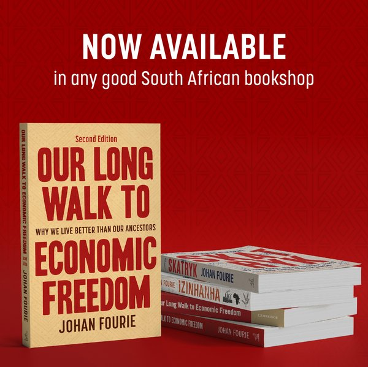

::: {.column-margin}
{fig-alt="Cover of Our Long Walk to Economic Freedom"}
:::

Welcome to the free online edition of *Our Long Walk to Economic Freedom*. The book
offers an accessible, engaging introduction to economic history from an African
perspective. It was first published in 2021 (Tafelberg), then by **Cambridge University
Press** in 2022, with a revised edition in 2025.

This online edition is **free to read** thanks to the generosity of the publishers. It is
also a **living book**: I update it as new research — my own and others' — appears, and I
link the text to the original papers, working papers, and datasets behind the argument so
you can go straight to the source. I prescribe it to my second-year economics students at
Stellenbosch University, and you are welcome to read along.

> "This is the first book to bring Africa in from the margins and place it centrally into
> the big narratives of world economic history. The subject will never be the same again."
> — James Robinson, University of Chicago and 2024 Nobel laureate

## How to read this book

- Use the **sidebar** to move between chapters, or the **search** box (top of the sidebar)
  to find any topic, name, or place.
- Hover over a **citation** to preview the source; click it to jump to the full reference
  and, where available, a link to the original paper.
- Each chapter ends with a **Sources & data** box linking the papers and the
  [GitHub datasets](https://github.com/johanfourieza) behind it.
- Toggle **reader mode** (top-right) for a distraction-free view.

## How to cite this edition

> Fourie, Johan. *Our Long Walk to Economic Freedom* (living online edition).
> johanfourie.com/OLWTEF. Accessed [date].

A citable, versioned snapshot (with a DOI via Zenodo) will be added at launch.

::: {.licence-notice}
**Licence.** This edition is free to read online. © Johan Fourie. The text is **not** for
download or redistribution. The print and ebook editions remain available from
[Cambridge University Press](https://www.cambridge.org/core/books/our-long-walk-to-economic-freedom/0985F9390A3B26B40DE0AC6BC1111414)
and booksellers.
:::
