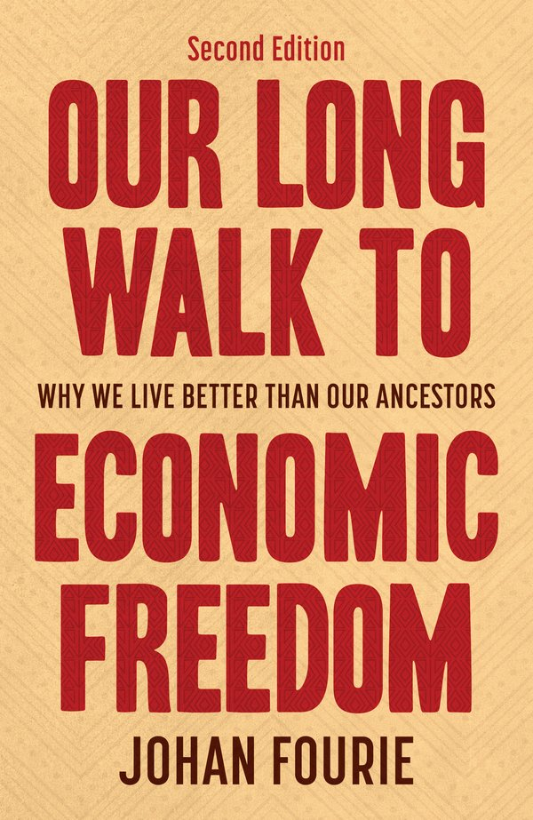

My book, *Our Long Walk to Economic Freedom*, is now free to read online, in full. This is a
**living edition**: I update it as new research appears, and I link the text to the original
papers, working papers, and [datasets](https://github.com/johanfourieza) behind each argument.
Looking for a copy to buy instead? Visit the [Bookshop](bookshop.qmd).

::: {.read-grid}

::: {.read-card}
[{.read-cover fig-alt="Our Long Walk to Economic Freedom cover"}](OLWTEF/)

::: {.read-card-body}
### [Our Long Walk to Economic Freedom](OLWTEF/)

An accessible, engaging introduction to economic history from an African perspective. Free to read online and continuously updated.

[Read online →](OLWTEF/){.read-btn}
:::
:::

::: {.read-card}
[{.read-cover fig-alt="Let's Talk About Varsity cover"}](LTAV/)

::: {.read-card-body}
### [Let's Talk About Varsity](LTAV/)

A practical, generous guide to university in South Africa, written by leading academics and public figures. Free to read online and to download.

[Read online →](LTAV/){.read-btn}
:::
:::

:::

::: {style="margin-top:2rem;font-size:0.9rem;color:#6b5a46;"}
More titles will join this reading room over time.
:::
