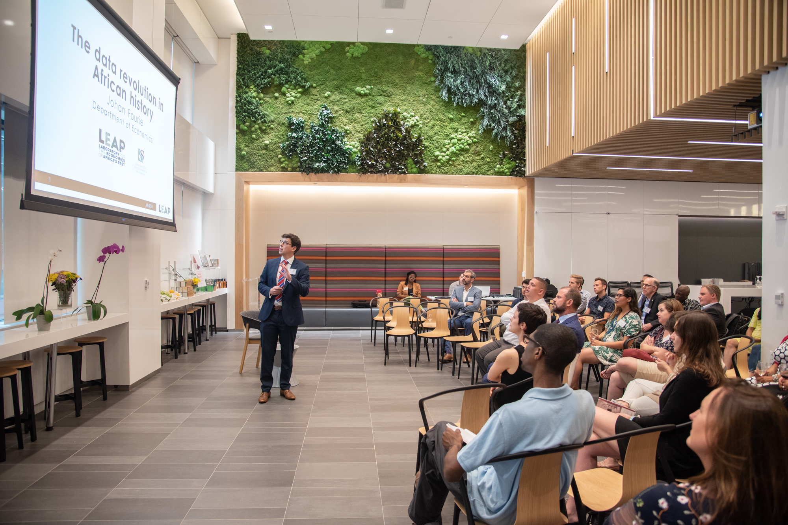

I work at the intersection of economics, history, and policy. Much of my research begins with present-day problems and works backwards, using historical evidence to understand how institutions came into being, why incentives endure, and why policies with good intentions so often produce unexpected results. This approach – often described as applied economic history – treats the past not as something remote or antiquarian, but as a record of social and economic experiments from which we can still learn. In that sense, I agree with the Coldplay line that I would rather be a comma than a full stop: interested less in definitive conclusions than in keeping important conversations open.

That perspective shapes my work as Chair in Economics, History and Policy at Stellenbosch University. The Chair rests on a simple idea: that history influences how people think about the economy, and how governments design policy. As Robert Shiller has argued, the stories societies tell about their economies shape expectations and behaviour. Engaging seriously with those stories, and anchoring them in careful historical research, is particularly important in developing-country contexts, where policy debates often proceed with limited reference to past experience.



The Chair therefore treats applied history as a practical input into decision-making. By combining archival research, new data, and historical comparison, it connects the past to present-day policy questions. This work is shared not only through academic research and teaching, but also through public-facing formats – including the Our Long Walk blog and podcast, public talks, and other creative projects – with the aim of making historical insight both accessible and useful. The goal is not to provide simple answers, but to broaden the range of options that policymakers and citizens consider when thinking about today’s challenges.

## Blog

I’ve been writing a blog since January 2012, first on WordPress and, since 2022, on Substack. [Our Long Walk](https://www.ourlongwalk.com/), taken from the title of my book, is where I publish essays, columns, and other thought pieces on South Africa’s economic past, present, and future, usually shorter than 2,000 words.

At first, only a few readers subscribed. I kept going partly out of a sense of duty, and partly because I wanted to share ideas about the world that I was not finding elsewhere – arguments that take history seriously, that try to be empirically grounded, and that do not treat South Africa as an exception that requires its own rules. The blog became a place to think in public, to test claims, to make mistakes, and to return to the same themes with a bit more evidence each time.

Over more than a decade, I’ve written more than 700 posts, now totalling more than 1,000,000 words.

The blog has grown enormously since those early years. In 2025 alone, my posts received nearly 300,000 reads on Substack. That excludes reads on platforms like News24, Netwerk24, Currency News, Business Day and Litnet.

## Podcast

The podcast bug bit me in 2024, when historical sociologist Jonathan Schoots, now at Wits University, and I started the Our Long Walk podcast. We interview leading social scientists working on African topics to help us understand Africa’s long-run development.

<strong>Podcast episodes (click to expand)</strong>

| Episode | Guest               | Topic                                                                 | Substack | YouTube |
|--------:|---------------------|-----------------------------------------------------------------------|----------|---------|
| S1E0    | —                   | Johan and Jonathan introduce the podcast                               | [Link](https://www.ourlongwalk.com/p/what-is-the-moral-of-your-story) | — |
| S1E1    | Bronwen Everill     | Are good intentions bad?                                                | [Link](https://www.ourlongwalk.com/p/are-good-intentions-bad) | — |
| S1E2    | Ken Opalo           | Leadership, legacies, and the politics of change                        | [Link](https://www.ourlongwalk.com/p/can-you-say-sdgs) | — |
| S1E3    | James Robinson      | What can economists learn from ubuntu?                                 | [Link](https://www.ourlongwalk.com/p/what-can-economists-learn-from-ubuntu) | — |
| S1E4    | Belinda Archibong   | Why should Washington care about Africa?                               | [Link](https://www.ourlongwalk.com/p/are-we-in-the-long-or-longer-run) | — |
| S1E5    | Ewout Frankema      | What is Africa's ideal development model?                              | [Link](https://www.ourlongwalk.com/p/what-is-africas-ideal-development) | — |
| S1E6    | Benjamin Bradlow    | How to build an African city?                                          | [Link](https://www.ourlongwalk.com/p/how-to-build-an-african-city) | — |
| S1E7    | Nathan Nunn         | Can herding shape morals?                                              | [Link](https://www.ourlongwalk.com/p/can-herding-shape-our-morals) | — |
| S1E8    | Ola Olsson          | Why did we stop roaming?                                               | [Link](https://www.ourlongwalk.com/p/why-did-we-stop-roaming) | — |
| S1E9    | Elias Papaioannou   | What if borders were never meant to last?                              | [Link](https://www.ourlongwalk.com/p/what-if-borders-were-never-meant) | — |
| S1E10   | Richard Reid        | Can war be creative?                                                   | [Link](https://www.ourlongwalk.com/p/can-war-be-creative) | — |
| S1E11   | Jacob Dlamini       | What did Mandela leave behind?                                        | [Link](https://www.ourlongwalk.com/p/what-did-mandela-leave-behind) | — |
| S1E12   | —                   | Where did the rain begin to beat us?                                   | [Link](https://www.ourlongwalk.com/p/where-did-the-rain-begin-to-beat) | — |
| S2E1    | Tony Hopkins        | Is imperial history overdue a comeback?                                | [Link](https://www.ourlongwalk.com/p/is-imperial-history-overdue-a-comeback) | [Link](https://youtu.be/BZGy83p9lsk) |
| S2E2    | Olúfẹ́mi Táíwò      | Africa, who are you?                                                   | [Link](https://www.ourlongwalk.com/p/africa-who-are-you) | [Link](https://youtu.be/bX6piiJFBWI) |
| S2E3    | Paul Seabright      | What can Africa teach us about God?                                    | [Link](https://www.ourlongwalk.com/p/what-can-africa-teach-us-about-god) | [Link](https://youtu.be/0_qSYAEneAQ) |
| S2E4    | Catia Batista       | What returns when talent leaves?                                       | [Link](https://www.ourlongwalk.com/p/what-returns-when-talent-leaves) | [Link](https://youtu.be/ZrmKfzuHxLQ) |
| S2E5    | Jenny Trinitapoli   | What lives inside of “don’t know”?                                     | [Link](https://www.ourlongwalk.com/p/what-lives-inside-dont-know) | [Link](https://youtu.be/wmek8cJUEb4) |
| S2E6    | Karin Pallaver      | What do Africa's old currencies say about our modern world?            | [Link](https://www.ourlongwalk.com/p/what-do-africas-old-currencies-say) | [Link](https://youtu.be/KThH7GYLnyI) |
| S2E7    | Christopher Eaglin  | Who is more capitalist than Elon?                                      | [Link](https://www.ourlongwalk.com/p/who-is-more-capitalist-than-elon) | [Link](https://youtu.be/oBuMBZFDF84) |

## Public talks

Aside from presenting my research at academic conferences, I’m often invited to speak about the economic topics I write about. I enjoy these invitations because they pull the ideas out of the page and into a room, where people can interrupt, challenge, and bring their own experiences to the discussion. It is also a useful discipline. When you have to explain an argument to a mixed audience, you quickly learn which parts are doing real work and which parts are just habits of academic writing.

{style="display:block; width:100%; height:auto; margin:0;" fig-alt="An alumni talk in New York, July 2018"}

The talks range widely. Sometimes it is to colleagues within Stellenbosch University. Sometimes it is to Stellenbosch alumni events across the globe, in places like Amsterdam, Paris, New York, Boston, Brussels, and Belfast. Often it is to corporates, farmer meetings, history societies, or book clubs across South Africa. In November 2025, I was fortunate to travel with the PSG team to give a series of keynotes across the country, including Cape Town, Gqeberha, Durban, Johannesburg, Polokwane, Pretoria, and Bloemfontein.

I’ve also been a guest on several podcasts, and have discussed economic topics on radio and television. They are a reminder that the public conversation about economics is shaped as much by storytelling and framing as by statistics.

## Art

{style="float:left; width:400px; margin:0 2rem 1rem 0;" fig-alt="eNdabeni"}

There are even more creatives ways to disseminate economic research. Art shifts attention from results to interpretation. It also reaches audiences who would never read an academic paper, and who ask different, often sharper, questions.

That idea led to an exhibition. When Covid struck in 2020, and again in 2021, the international conference I had planned to mark three years of Biography-project research had to be cancelled. Rather than moving it online, I decided to try something else: pairing fourteen scholars – from Master’s students to professors – with leading South African artists, asking each artist to interpret a piece of research creatively, and then organising an exhibition. The research covered topics ranging from school feeding programmes and runaway slaves to domestic workers, race reclassification, and Spanish flu deaths. Artists were carefully matched to projects – Marlene Steyn on bridal pregnancy, Lady Skollie on Khoe wealth, Nelson Makamo on voter disenfranchisement – and produced work across media, including paintings, prints, a quilt, and a sculpture. 



The exhibition ran from 11 February to 27 March at GUS (Gallery Stellenbosch University). A documentary – Fugitives – directed by Philip du Plessis of [Blindspot Films](www.blindspotfilms.co.za) brilliantly captured the creative process between student (Karl Bergemann) and artist (Kathryn Smith and Pearl Mamathuba).

I have also been experimenting with music as a form of dissemination. Using Suno, I created an Afrikaans song about the economics of AI. The core idea is simple: AI makes production abundant, but judgement and performance remain scarce. That shifts where value sits, without removing the human from the process. I write more about this [here](https://www.ourlongwalk.com/p/can-ai-sokkie-196). I also create songs for guests of the Our Long Walk podcast: [Season 1]( https://suno.com/playlist/75fc44d5-61b3-43f1-ba0f-92a5825affa6) | [Season 2](https://suno.com/playlist/2c267008-b901-4ee3-8d2c-73707adfe507)

Finally, I am working with Willem Samuel on a graphic novel adaptation of the South African chapters of Our Long Walk to Economic Freedom, sponsored by an EV fellowship at the Mercatus Centre. This will be released later this year.