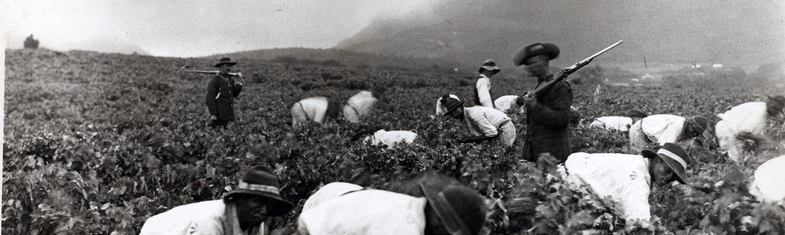
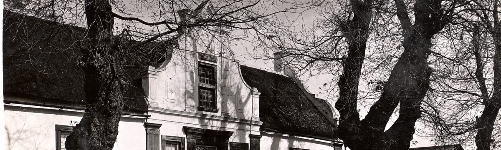
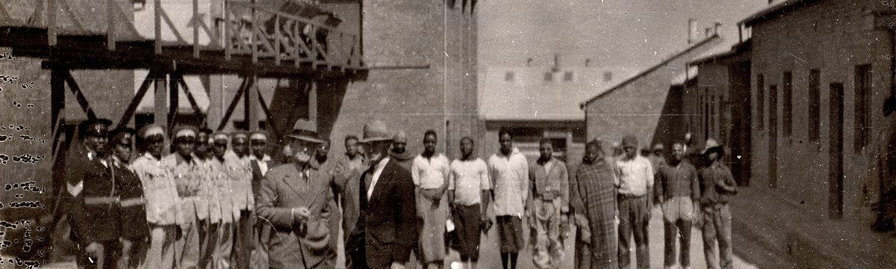
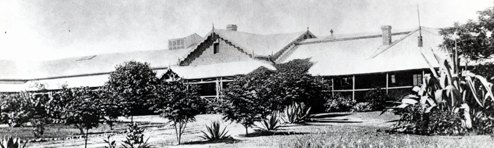
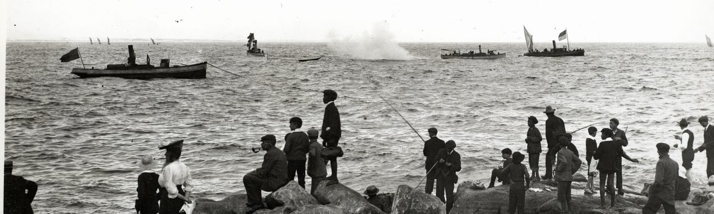
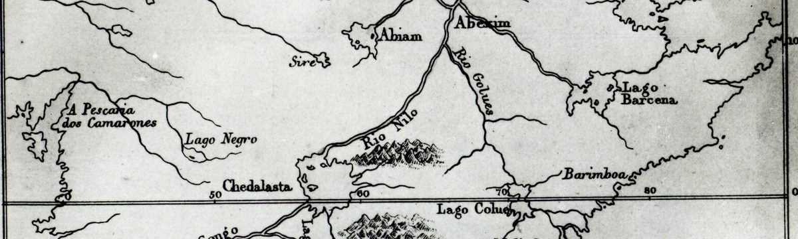
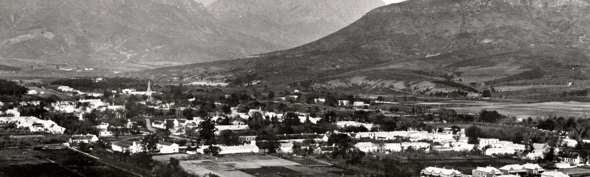
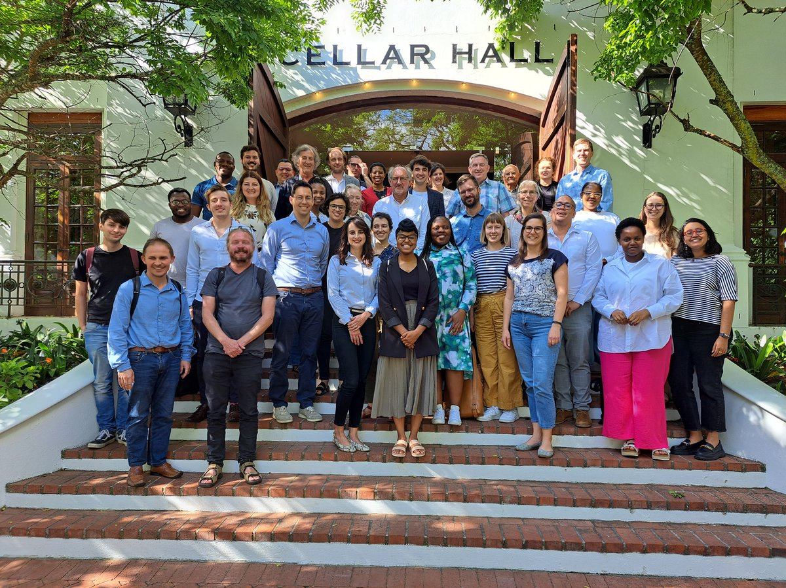
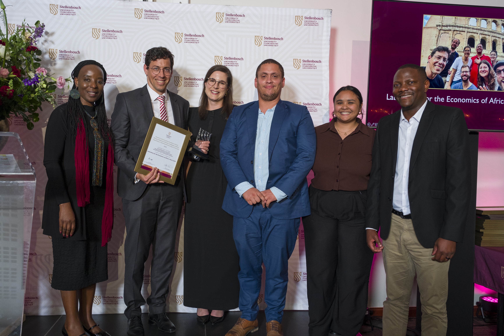

## Research themes

My research is organised into eight themes. Under each theme, work in progress is listed first, papers closest to publication at the top, each with its current status. Published work sits behind the dropdown, with full citations. [Google Scholar](https://scholar.google.com/citations?user=DL4f8DQAAAAJ&hl=en&authuser=1&oi=ao) has a complete list of my publications.

<!--
AUTHORING RULES (for future updates):
- One paper = one "-" list line, no blank lines between items.
- Line order: status pill, bold title, [with co-authors]{.with}, then optional
  " · *Journal*" and " · [Working paper](url)" links. The journal (kabbo's
  "Intended journal" field) is shown ONLY on R&R and Accepted rows, never
  on Draft or Submitted rows.
- No em-dashes anywhere on this page; use commas or en dashes.
- Pills: [Draft]{.pill .pill-draft} [Submitted]{.pill .pill-submitted}
  [R&R]{.pill .pill-rr} [Accepted]{.pill .pill-accepted}
- Kabbo stages revise_resubmit AND resubmitted both display as R&R.
- When a paper is published: delete its row, add a full citation to the
  theme's 
 list (reverse-chronological), update the (N) count in the
  
 and the counts in the pipeline-glance strip.
- The blank lines after 
 and before 
 are required.
- Theme banner images live in images/themes/ (Elliot Collection & AG
  photographs, reproduced by kind permission of the Western Cape Archives and
  Records Service): slavery.jpg = E7841 Convicts picking grapes, Groot
  Constantia; wealth.jpg = E703 La Motte, Franschhoek; twentieth.jpg = E6698
  Gold mining surface crushing works; health.jpg = AG6004 Hospital, Kimberley,
  c.1900; sports.jpg = E7895 Regatta, Kalk Bay; practice.jpg = E4430 Map of
  Africa, 1578–1587; science.jpg = AG1077 Panoramic view of Stellenbosch;
  trade.jpg = E5541 Train leaving Cape Town station.
- A theme with no published work carries no 
 block at all.
-->

::: {.pipeline-glance}
**30 papers in the pipeline:** [11 drafts]{.pill .pill-draft} [13 submitted]{.pill .pill-submitted} [3 R&R]{.pill .pill-rr} [3 accepted]{.pill .pill-accepted}
:::

::: {.theme}
::: {.theme-banner}
{fig-alt="Convicts picking grapes under armed guard at Groot Constantia. Elliot Collection, Western Cape Archives and Records Service."}
:::

### Slavery and emancipation

How slavery shaped the Cape economy, and what freedom, when it came, was worth.

::: {.papers}
-   [Accepted]{.pill .pill-accepted} **The New Economics of Cape Slavery** · *South African Journal of Economics*
-   [R&R]{.pill .pill-rr} **Selection into the Great Trek** [with Calumet Links]{.with} · *European Review of Economic History*
:::

Published work (3)

-   Bergemann, Karl, Gabriel Brown, and Johan Fourie. 2026. "Running Towards: Labour Market Incentives for Runaway Slaves in the British Cape Colony, 1830–1838." *Asia-Pacific Economic History Review*. [Paper](https://onlinelibrary.wiley.com/doi/10.1111/aehr.70034)
-   Martins, Igor, Jeanne Cilliers, and Johan Fourie. 2023. "Legacies of Loss: The Health Outcomes of Slaveholder Compensation in the British Cape Colony." *Explorations in Economic History* 89: 101506. [Paper](https://www.sciencedirect.com/science/article/pii/S0014498322000778)
-   Ekama, Kate, Johan Fourie, Hans Heese, and Lisa-Cheree Martin. 2021. "When Cape Slavery Ended: Introducing a New Slave Emancipation Dataset." *Explorations in Economic History* 81: 101390. [Paper](https://www.sciencedirect.com/science/article/pii/S0014498321000012)

:::

::: {.theme}
::: {.theme-banner}
{fig-alt="The Cape Dutch gable of La Motte, Franschhoek. Elliot Collection, Western Cape Archives and Records Service."}
:::

### Wealth, inequality and mobility at the Cape

Tax censuses, auction rolls and probate inventories reveal who prospered in the colonial Cape, and how.

::: {.papers}
-   [Accepted]{.pill .pill-accepted} **Prices and Living Standards: Evidence from the Cape Colony Auction Rolls** [with Leoné Walters and Jonathan Schoots]{.with} · *Cliometrica*
-   [Submitted]{.pill .pill-submitted} **Biplots and Classification: Measuring Household Economic Systems at the Cape Colony** [with Sugnet Lubbe, Johané Nienkemper-Swanepoel and Dieter von Fintel]{.with}
-   [Submitted]{.pill .pill-submitted} **Between Public Duty and Private Profit: Government Officials and Real Estate Investments in the Cape Colony, 1897–1902** [with Munashe Chideya]{.with} · [Working paper](https://www.ekon.sun.ac.za/wpapers/2026/wp022026)
-   [Submitted]{.pill .pill-submitted} **The Household in a Coercive Society: Evidence from South Africa's Cape Colony** [with Kate Ekama]{.with}
-   [Draft]{.pill .pill-draft} **The Poor Fund as Lender: Church Credit and Agricultural Production in the Cape Colony, 1686–1829** [with Jacques Theron]{.with}
-   [Draft]{.pill .pill-draft} **Counter-Elite Mobilization and Settler Colonialism: The Structure of Contestation in the Cape Colony, 1779** [with Jonathan Schoots]{.with}
-   [Draft]{.pill .pill-draft} **Selection Bias in Probate Inventories** [with Anne McCants and Leoné Walters]{.with}
:::

Published work (14)

-   Walters, Leoné, Johan Fourie, and Robert Ross. 2026. "Colonial Elites in the Eighteenth-Century Cape Colony." *Revista de Historia Industrial – Industrial History Review*. [Paper](https://revistes.ub.edu/index.php/HistoriaIndustrial/article/view/48401)
-   Fourie, Johan. 2025. "Inequality in the Cape Colony, 1685–1844." *South African Journal of Science* 121 (11-12): 71–79. [Paper](https://www.scielo.org.za/scielo.php?pid=S0038-23532025000600020&script=sci_arttext&tlng=en) \| [Code](code/Fourie_2025_CapeInequality.R) \| [Updated Working Paper](https://www.ekon.sun.ac.za/wpapers/2026/wp042026)
-   Fourie, Johan, Erik Green, Auke Rijpma, and Dieter von Fintel. 2025. "Income Mobility Before Industrialization: Evidence from South Africa's Cape Colony." *Social Science History* 49 (1): 22–51. [Paper](https://www.cambridge.org/core/journals/social-science-history/article/income-mobility-before-industrialization-evidence-from-south-africas-cape-colony/60A6816FC7347FA20B01E73358195BB9)
-   Fourie, Johan, Erik Green, Christiaan Burger, Chris de Wit, Kate Ekama, Jan Greyling, Hans Heese, Jan-Hendrik Pretorius, Robert Ross, and Dieter von Fintel. 2025. "'Waar Is Beter Dorp in Zuid Africa Dan Stellenbos?': What the Stellenbosch-Drakenstein Tax Censuses Reveal." *South African Historical Journal* 76 (4): 420–46. [Paper](https://www.tandfonline.com/doi/full/10.1080/02582473.2025.2500410)
-   Fourie, Johan, and Jan Greyling. 2023. "Wheat Productivity in the Cape Colony in 1825: Evidence from Newly Transcribed Tax Censuses." *Agrekon* 62 (1): 98–115. [Paper](https://www.tandfonline.com/doi/full/10.1080/03031853.2023.2176895)
-   Fourie, Johan, and Frank Garmon Jr. 2023. "The Settlers' Fortunes: Comparing Tax Censuses in the Cape Colony and Early American Republic." *The Economic History Review* 76 (2): 525–50. [Paper](https://onlinelibrary.wiley.com/doi/full/10.1111/ehr.13190)
-   Von Fintel, Dieter, and Johan Fourie. 2019. "The Great Divergence in South Africa: Population and Wealth Dynamics over Two Centuries." *Journal of Comparative Economics* 47 (4): 759–73. [Paper](https://www.sciencedirect.com/science/article/pii/S0147596718302002)
-   Baten, Joerg, and Johan Fourie. 2015. "Numeracy of Africans, Asians, and Europeans During the Early Modern Period: New Evidence from Cape Colony Court Registers." *The Economic History Review* 68 (2): 632–56. [Paper](https://onlinelibrary.wiley.com/doi/abs/10.1111/1468-0289.12064)
-   Fourie, Johan, and Erik Green. 2015. "The Missing People: Accounting for the Productivity of Indigenous Populations in Cape Colonial History." *The Journal of African History* 56 (2): 195–215. [Paper](https://www.cambridge.org/core/journals/journal-of-african-history/article/abs/missing-people-accounting-for-the-productivity-of-indigenous-populations-in-cape-colonial-history/CC98B733B57E7B6F302097A81DBC4C22)
-   Fourie, Johan, and Dieter von Fintel. 2014. "Settler Skills and Colonial Development: The Huguenot Wine-Makers in Eighteenth-Century Dutch South Africa." *The Economic History Review* 67 (4): 932–63. [Paper](https://onlinelibrary.wiley.com/doi/abs/10.1111/1468-0289.12033)
-   Fourie, Johan. 2014. "The Quantitative Cape: A Review of the New Historiography of the Dutch Cape Colony." *South African Historical Journal* 66 (1): 142–68. [Paper](https://www.tandfonline.com/doi/full/10.1080/02582473.2014.891646)
-   Fourie, Johan, and Jan Luiten van Zanden. 2013. "GDP in the Dutch Cape Colony: The National Accounts of a Slave-Based Society." *South African Journal of Economics* 81 (4): 467–90. [Paper](https://onlinelibrary.wiley.com/doi/abs/10.1111/saje.12010)
-   Fourie, Johan. 2013. "The Remarkable Wealth of the Dutch Cape Colony: Measurements from Eighteenth-Century Probate Inventories." *The Economic History Review* 66 (2): 419–48. [Paper](https://onlinelibrary.wiley.com/doi/abs/10.1111/j.1468-0289.2012.00662.x)
-   Fourie, Johan, and Dieter von Fintel. 2010. "The Dynamics of Inequality in a Newly Settled, Pre-Industrial Society: The Case of the Cape Colony." *Cliometrica* 4 (3): 229–67. [Paper](https://link.springer.com/article/10.1007/s11698-009-0044-1)

:::

::: {.theme}
::: {.theme-banner}
{fig-alt="Workers and managers at gold mining surface crushing works. Elliot Collection, Western Cape Archives and Records Service."}
:::

### Twentieth-century South Africa

The economics of segregation and apartheid: who paid, who benefited, and what persisted.

::: {.papers}
-   [Submitted]{.pill .pill-submitted} **Discrimination After Hiring: Within-Firm Sorting, Slow Employer Learning, and the Cost to the Sorted Worker** [with Kris Inwood and Martine Mariotti]{.with}
-   [Draft]{.pill .pill-draft} **The Colour of a Title: The Opening and Emptying of Protected Work under Apartheid** [with Timothy Ngalande]{.with}
-   [Draft]{.pill .pill-draft} **Selective Persistence: Colonial Education, State Intervention and the Durability of School Quality in South Africa** [with Gabriel Brown and Sarah Ferber]{.with}
:::

Published work (3)

-   Fourie, Johan, Kris Inwood, and Martine Mariotti. 2022. "Living Standards in Settler South Africa, 1865–1920." *Economics & Human Biology* 47: 101158. [Paper](https://www.sciencedirect.com/science/article/pii/S1570677X22000545)
-   Fourie, Johan, Kris Inwood, and Martine Mariotti. 2020. "Military Technology and Sample Selection Bias." *Social Science History* 44 (3): 485–500. [Paper](https://www.cambridge.org/core/journals/social-science-history/article/abs/military-technology-and-sample-selection-bias/E5497E18034290BAC7ADB7CB2309D6C1)
-   Mpeta, Bokang, Johan Fourie, and Kris Inwood. 2018. "Black Living Standards in South Africa Before Democracy: New Evidence from Height." *South African Journal of Science* 114 (1-2): 1–8. [Paper](https://www.scielo.org.za/scielo.php?pid=S0038-23532018000100014&script=sci_arttext)

:::

::: {.theme}
::: {.theme-banner}
{fig-alt="The hospital at Kimberley, circa 1900. Western Cape Archives and Records Service."}
:::

### Health, disease and demography

Epidemics and their economic afterlives, from the 1713 smallpox at the Cape to the 1918 influenza.

::: {.papers}
-   [Submitted]{.pill .pill-submitted} **A Disease Never Seen Here: Measuring the Severity of the 1713 Smallpox Epidemic at the Cape**
-   [Submitted]{.pill .pill-submitted} **Babies as Industrial Policy**
-   [Draft]{.pill .pill-draft} **Selective Sanitation and Racial Health Inequality** [with Kelsey Lemon and Jan-Hendrik Pretorius]{.with} · [Working paper](https://www.ekon.sun.ac.za/wpapers/2026/wp012026)
:::

Published work (6)

-   Fourie, Johan, and Johannes Norling. 2025. "Household Spending During the 1918 Influenza Pandemic." *Journal of Interdisciplinary History* 55 (3): 369–413. [Paper](https://direct.mit.edu/jinh/article/55/3/369/130682)
-   Fourie, Johan, and Johannes Norling. 2024. "Women's Employment in the United States After the 1918 Influenza Pandemic." *Essays in Economic & Business History* 42 (1): 38–58. [Paper](https://www.ebhsoc.org/journal/index.php/ebhs/article/view/562)
-   Marco-Gracia, Francisco J., and Johan Fourie. 2022. "The Missing Boys: Understanding the Unbalanced Sex Ratio in South Africa, 1894–2011." *Economic History of Developing Regions* 37 (2): 128–46. [Paper](https://www.tandfonline.com/doi/full/10.1080/20780389.2021.1987212)
-   Marco-Gracia, Francisco J., and Johan Fourie. 2022. "The Crossover Point: Measuring the Age at Which Women Outnumber Men in South Africa, 1904–2011." *Southern African Journal of Demography*. [Paper](https://zaguan.unizar.es/record/150433)
-   De Kadt, Daniel, Johan Fourie, Jan Greyling, Elie Murard, and Johannes Norling. 2021. "Correlates and Consequences of the 1918 Influenza in South Africa." *South African Journal of Economics* 89 (2): 173–95. [Paper](https://onlinelibrary.wiley.com/doi/abs/10.1111/saje.12285)
-   Fourie, Johan, and Jonathan Jayes. 2021. "Health Inequality and the 1918 Influenza in South Africa." *World Development* 141: 105407. [Paper](https://www.sciencedirect.com/science/article/pii/S0305750X2100019X)

:::

::: {.theme}
::: {.theme-banner}
{fig-alt="Spectators watching the regatta at Kalk Bay. Elliot Collection, Western Cape Archives and Records Service."}
:::

### Sports and tourism economics

Cricket, mega-events and destination brands: what sport and travel reveal about how markets work.

::: {.papers}
-   [R&R]{.pill .pill-rr} **Invisible Handedness: The Myth of Left–Right Batting Partnerships** [with Krige Siebrits]{.with} · *Journal of Sports Economics* · featured in [Nature](https://www.nature.com/articles/d44148-026-00177-x)
-   [Submitted]{.pill .pill-submitted} **Revealed Comparative Advantage in Team Sport: Classifying Cricket's All-Rounders with the Balassa Index**
-   [Submitted]{.pill .pill-submitted} **Faster, Higher, Stronger? Political Selection and the Olympic Host Contract**
-   [Submitted]{.pill .pill-submitted} **A Gate-and-Menu Theory of Collective Tourism Brand Value**
-   [Draft]{.pill .pill-draft} **Policing the Pitch: The Network Economics of Collusion Deterrence in Cricket** [with Adriana Roux]{.with}
:::

Published work (2)

-   Fourie, Johan, and María Santana-Gallego. 2022. "Mega-Sport Events and Inbound Tourism: New Data, Methods and Evidence." *Tourism Management Perspectives* 43: 101002. [Paper](https://www.sciencedirect.com/science/article/abs/pii/S2211973622000678)
-   Santana-Gallego, María, and Johan Fourie. 2022. "Tourism Falls Apart: How Insecurity Affects African Tourism." *Tourism Economics* 28 (4): 995–1008. [Paper](https://journals.sagepub.com/doi/abs/10.1177/1354816620978128)

:::

::: {.theme}
::: {.theme-banner}
{fig-alt="Detail from a map of Africa, 1578–1587. Elliot Collection, Western Cape Archives and Records Service."}
:::

### The practice of economics and economic history

How economic history is made and used: applied history, and what the discipline chooses to study.

::: {.papers}
-   [Accepted]{.pill .pill-accepted} **From Renaissance to Relevance: Towards an Applied African Economic History** · *Economic History of Developing Regions*
-   [R&R]{.pill .pill-rr} **Path Dependence in Economic History Publications** · *Cliometrica*
-   [Submitted]{.pill .pill-submitted} **Through the Prism of the Past: Principles for Applied Economic History** [with Chris Colvin]{.with} · [Working paper](https://www.quceh.org.uk/working-papers-2026.html)
-   [Submitted]{.pill .pill-submitted} **LLMs and Economic History: A Comment on Ferrara (2026)**
:::

Published work (3)

-   Fourie, Johan. (ed.) 2023. *Quantitative History and Uncharted People: Case Studies from the South African Past*. Bloomsbury Publishing. [Edited book](https://www.bloomsbury.com/uk/quantitative-history-and-uncharted-people-9781350331167/)
-   Fourie, Johan. 2022. *Our Long Walk to Economic Freedom: Lessons from 100,000 Years of Human History*. Cambridge University Press. [Book](https://www.cambridge.org/core/books/our-long-walk-to-economic-freedom/0985F9390A3B26B40DE0AC6BC1111414)
-   Fourie, Johan. 2016. "The Data Revolution in African Economic History." *Journal of Interdisciplinary History* 47 (2): 193–212. [Paper](https://direct.mit.edu/jinh/article/47/2/193/49177/The-Data-Revolution-in-African-Economic-History)

:::

::: {.theme}
::: {.theme-banner}
{fig-alt="Panoramic view of Stellenbosch, the town below the mountains. Western Cape Archives and Records Service."}
:::

### The economics of science

How research gets produced, certified and rewarded, and what AI is doing to all three.

::: {.papers}
-   [Submitted]{.pill .pill-submitted} **AI and the Research Team**
-   [Draft]{.pill .pill-draft} **Messy Research, Certification and the Monetization of Science** · [Working paper](https://arxiv.org/abs/2607.13844)
-   [Draft]{.pill .pill-draft} **Writing Is Not Thinking**
-   [Draft]{.pill .pill-draft} **How Much of AI Progress Reaches Production? Evidence from Agent Commits on Public GitHub**
:::
:::

::: {.theme}
::: {.theme-banner}
{fig-alt="A steam train leaving Cape Town station. Elliot Collection, Western Cape Archives and Records Service."}
:::

### Trade, mobility and deep roots

Trade routes, transport costs and the long shadow of migration on how people connect.

::: {.papers}
-   [Submitted]{.pill .pill-submitted} **Uprooted: Migration, Coercion, and the Roots of Social Connectedness**
-   [Draft]{.pill .pill-draft} **Bulky** [with Maarten Bosker]{.with}
:::

Published work (3)

-   Maravall, Laura, Jörg Baten, and Johan Fourie. 2023. "Leader Selection and Why It Matters: Education and the Endogeneity of Favouritism in 11 African Countries." *Review of Development Economics* 27 (3): 1562–1604. [Paper](https://onlinelibrary.wiley.com/doi/full/10.1111/rode.12981)
-   Herranz-Loncán, Alfonso, and Johan Fourie. 2018. "'For the Public Benefit'? Railways in the British Cape Colony." *European Review of Economic History* 22 (1): 73–100. [Paper](https://academic.oup.com/ereh/article-abstract/22/1/73/3930943)
-   Boshoff, Willem H., and Johan Fourie. 2010. "The Significance of the Cape Trade Route to Economic Activity in the Cape Colony: A Medium-Term Business Cycle Analysis." *European Review of Economic History* 14 (3): 469–503. [Paper](https://www.cambridge.org/core/journals/european-review-of-economic-history/article/abs/significance-of-the-cape-trade-route-to-economic-activity-in-the-cape-colony-a-mediumterm-business-cycle-analysis/1997788CFA5DAAE52669F0580AC92E7D)

:::

::: {.archive-credit}
Theme photographs from the Elliot Collection and AG photograph series, reproduced with acknowledgement to the Western Cape Archives and Records Service.
:::

## Research overview

I did not choose economic history; it chose me. It began, improbably, with a paper on ship traffic at the Cape and a Lisbon conference audience of three. There I met the economic historian Jan Luiten van Zanden and that conversation sent me to Utrecht University to do a PhD in Economic History. I completed it in 2012, using probate inventories and the Cape tax censuses to study the nature, causes, and distribution of wealth in the eighteenth-century Cape Colony.

That early work left me with a bias that still shapes everything I do: if you want to understand how societies change, you need evidence that is granular enough to surprise you. Quantitative records can do that. They can also puncture comfortable myths. In my case, the probate inventories and tax censuses made it hard to sustain the old story of a uniformly poor settler society.

The Cape of Good Hope Panel project is a direct descendant of that realisation. It is an ambitious effort to transcribe the full series of the *opgaafrolle* and to turn them into a household panel that can be followed over time, and, when matched to genealogies, across generations. The aim is not just a bigger spreadsheet. It is a new research infrastructure for South African history – one that can support questions we could not ask before, or could only ask impressionistically.

What have we learned so far? Two things can be true at once. The Cape was, on average, a wealthy society by the standards of its time, and it was also a severely unequal one. My work using probate inventories and tax censuses shows that many settler farmers were well-off, even in comparison to some of the wealthiest societies of the period. But the same sources also reveal how sharply that prosperity was distributed, within and between groups. And once you can measure wealth at the household level, the questions become harder, and better: how did elites maintain their advantage; which factors made mobility possible; what did “opportunity” mean in a society built on unfree labour.

{style="display:block; width:100%; height:auto; margin:0;" fig-alt="At the Biography closing conference in November 2022"}

The richness of the Cape records also makes it possible to widen the lens beyond the usual protagonists. Some of my work has tried to recover histories of people who are often absent from conventional archives, precisely because their lives were not written down in the places historians tend to look. It is not archival cosplay. It is an attempt to make the evidentiary base of South African history more representative, and therefore more useful.

Because of this interest in Africa’s past, I was pulled early into the African Economic History Network, founded in 2011. That community has shaped my research in two ways. First, it has kept me honest about parochialism. South Africa is endlessly interesting, but it is not the whole story. Second, it pushed me to think about who gets to write economic history, and which skills and incentives determine who participates. In my own writing I have argued that the “data revolution” in African economic history is real, but unevenly distributed, and that building capacity on the continent is part of the scholarly job. I reflected on these themes in my [inaugural lecture](https://www.youtube.com/watch?v=pBE-SmTIVmw) in May 2022, using my own genealogy as a way of thinking about South Africa’s past through the lens of economic history.

More recently, my attention has shifted from building datasets and answering historical questions to thinking harder about how economic history can matter for the present. With Chris Colvin, I define applied economic history as the systematic, context-sensitive use of historical reasoning to illuminate contemporary policy problems – not by offering ready-made lessons, but by disciplining the analogies and narratives that policymakers and the public already use. Instead of beginning with a historical episode and asking why it happened, an applied approach starts with a current problem and works backwards, testing which parallels illuminate and which mislead.

This is also where my role as Chair in Economics, History and Policy comes in. My research uses extensive historical records and quantitative analysis to investigate the drivers of societal change in South African history, with an eye on what that can contribute to economic theory and policy-making now. The past does not provide a blueprint. It does provide an inventory of alternatives, and a way to argue about trade-offs with more humility and more evidence than the usual policy advice allows.

## Recent grants and awards

| Year | Grant / award | Grant number | Funder / body | Role |
|--------------:|---------------|---------------|---------------|---------------|
| 2025 | Chancellor's Award: Social Impact | \- | Stellenbosch Unviersity | \- |
| 2025-2027 | The Cape of Good Health? Death, disease and development disparities in the Cape Province, 1912 | CPRR240403211840 | South African National Research Foundation | PI |
| 2025 | Our Long Walk to Economic Freedom graphic novel | #8644 | Emergent Ventures | PI |
| 2024 | Interdisciplinary Research Prize | \- | Stellenbosch University | Director |
| 2024 | Top Researcher Award | \- | Stellenbosch University | \- |
| 2021–2026 | [Cape of Good Hope Panel project](https://www.capepanel.org/) | M20-0041 | Riksbankens Jubileumsfond | Co-PI |
| 2018–2022 | Biography of an Uncharted People project | \- | Mellon Foundation | PI |

{style="display:block; width:100%; height:auto; margin:0;" fig-alt="Vice-Rector Interdisciplinary Research Prize"}
