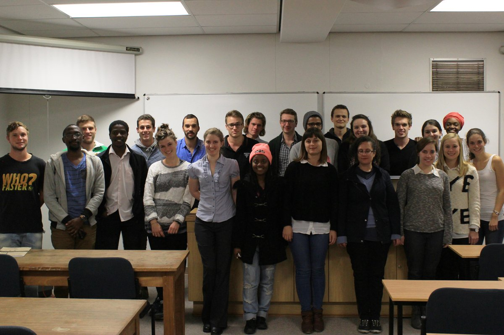
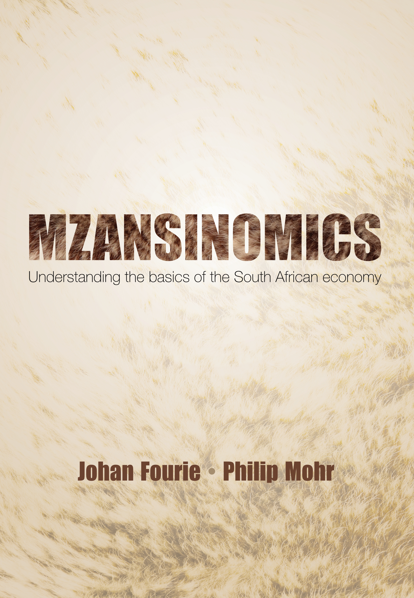

I think of teaching as two related tasks: giving students the core theories and methods of economics, while keeping them alert to why those tools matter in the world beyond the classroom; and then, at graduate level, treating students as researchers and inviting them into a process of co-discovery. In practice, this means building classes around well-posed questions, working from an African point of view, and using discussion and critique as the main teaching method rather than the last ten minutes of a lecture.

## Economics 281

At the undergraduate level, I am responsible for the first semester of Economics 281.

{style="float:left; width:300px; margin:0 2rem 1rem 0;" fig-alt="OLWTEF cover"} For almost a decade, I taught this course from slides. With the luxury of time during Covid, however, I converted the slides into chapters. The book was ultimately published in 2021 as Our Long Walk to Economic Freedom, first locally in South Africa by Tafelberg (a commercial publisher) and then, in the following year and with an additional chapter and some revisions, by Cambridge University Press. A revised version was published in 2025.

The book has received critical acclaim from leading economic historians:

> This is the first book to bring Africa in from the margins and place it centrally into the big narratives of world economic history. The subject will never be the same again. – James Robinson, University of Chicago and 2024 Nobel laureate

> Johan Fourie’s commitment to understanding the historical roots of prosperity and ensuring its wide distribution in the future makes this one of the most humane economic histories I have read. – Anne McCants, MIT

> In a brilliant tour de force, Johan Fourie turns history on its head and tells the story of the world economy from the perspective of Africa. A must read. – Jan Luiten van Zanden, Utrecht University

> Johan Fourie demonstrates that recent research in economic history can be both enlightening and fun. – Joel Mokyr, Northwestern University and 2025 Nobel laureate

The more intimate class setting for Economics 281, with fewer than 100 students, makes this a much more interactive course. This is also reflected in the student evaluations:

> “Economics 281 was my favourite module. It opened the world for me.”

> “Some of the content kept me interested enough that I felt a need to look for additional material outside of class.”

> “What I liked was the variety of history topics covered & the economic perspectives of these topics; the class discussions were intellectually stimulating.”

> “It wasn’t what I expected – I love it.”

## Economics 771 & 871

I first curated the graduate course in 2011. I use the term ‘curated’ deliberately, as I do very little conventional teaching. The course follows a distinctive format: a maximum of 16 students are selected and divided into four groups. Each group is assigned one paper per week, with one member presenting the paper. The remaining members prepare critiques of the other three papers scheduled for that week.

A typical two-hour session therefore involves a student from Group A presenting the first paper on the reading list for ten minutes, followed by critiques from randomly selected students in the other three groups for another ten minutes, and then a general discussion led by me and my teaching assistants for a further ten minutes. We cover four papers (one per group) per session.

{style="display:block; width:100%; height:auto; margin:0;" fig-alt="2015 class photo"}

I update the reading list every year. You can find the [2024](https://www.ourlongwalk.com/p/lets-read-60-papers), [2025](https://www.ourlongwalk.com/p/all-aboard-8dc) and 2026 reading lists on my blog. I no longer have a record of the first two reading lists, but [here](docs/Econ771_2013.pdf) is the 2013 one.

## Economics 381

A team within the Department is working on a new undergraduate course on economic policy in South Africa. Watch this space.

## Mzansinomics

{style="float:left; width:300px; margin:0 2rem 1rem 0;" fig-alt="Mzansinomics cover"}

A few years ago, I also co-authored *Mzansinomics* with Philip Mohr, a leading South African economist and experienced textbook author. Mzansinomics: Understanding the Basics of the South African Economy is an introductory text aimed at a South African readership. It explains core economic concepts and topical policy issues – including markets, inflation, budget deficits, collusion, inequality, and economic growth – in a clear, practical, and non-technical manner. The book is structured in a question-and-answer format and makes extensive use of examples and up-to-date statistics to engage with South Africa’s specific economic challenges and opportunities.

The book is intended as a reference for practitioners, as a resource for students seeking a foundational understanding of economics outside a formal degree programme, and as a guide for readers interested in the structure and development of the South African economy. It is currently prescribed at Stadio, a private South African university.
